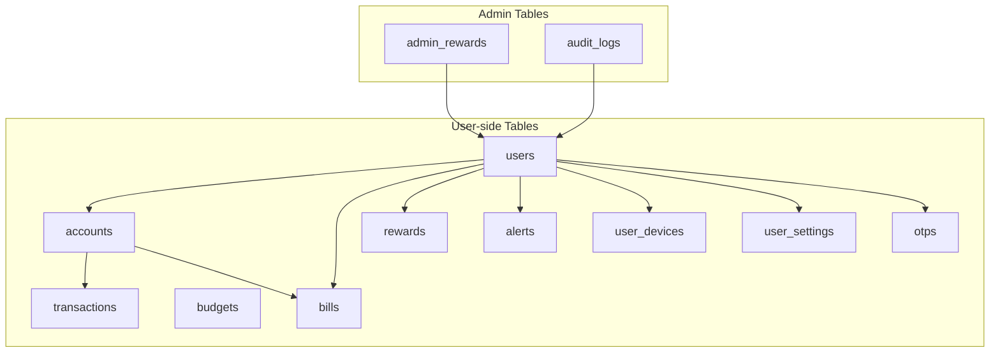
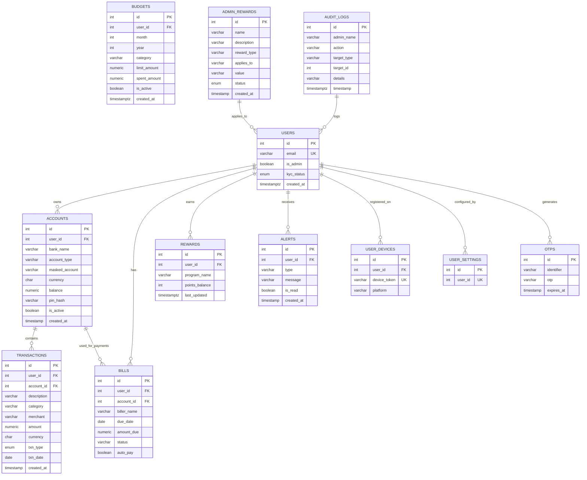
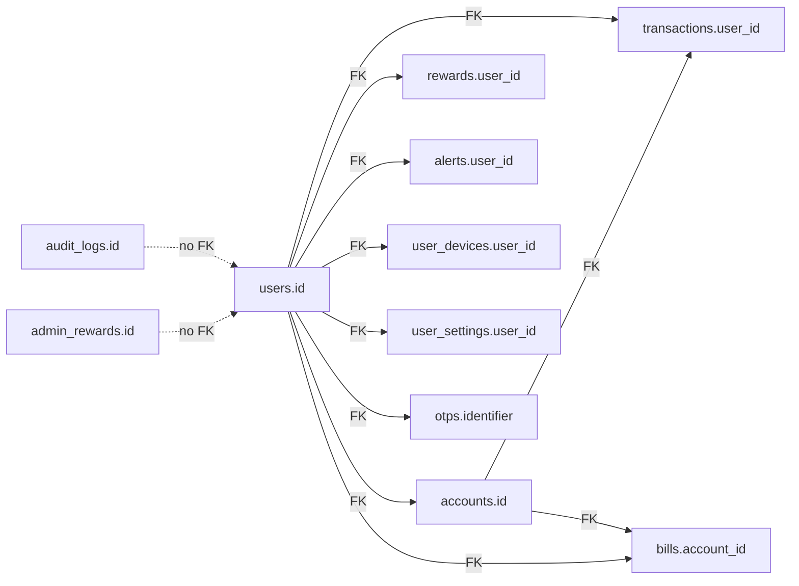

# Relationships and Constraints

<cite>
**Referenced Files in This Document**
- [user.py](file://backend/app/models/user.py)
- [account.py](file://backend/app/models/account.py)
- [transaction.py](file://backend/app/models/transaction.py)
- [bill.py](file://backend/app/models/bill.py)
- [alert.py](file://backend/app/models/alert.py)
- [reward.py](file://backend/app/models/reward.py)
- [admin_rewards.py](file://backend/app/models/admin_rewards.py)
- [audit_log.py](file://backend/app/models/audit_log.py)
- [user_device.py](file://backend/app/models/user_device.py)
- [user_settings.py](file://backend/app/models/user_settings.py)
- [otp.py](file://backend/app/models/otp.py)
- [budget_schema.py](file://backend/app/schemas/budget_schema.py)
- [schema.sql](file://docs/schema.sql)
</cite>

## Table of Contents
1. [Introduction](#introduction)
2. [Project Structure](#project-structure)
3. [Core Components](#core-components)
4. [Architecture Overview](#architecture-overview)
5. [Detailed Component Analysis](#detailed-component-analysis)
6. [Dependency Analysis](#dependency-analysis)
7. [Performance Considerations](#performance-considerations)
8. [Troubleshooting Guide](#troubleshooting-guide)
9. [Conclusion](#conclusion)
10. [Appendices](#appendices)

## Introduction
This document explains the database relationships and referential integrity constraints in the banking application. It focuses on how entities relate to each other, the primary keys, unique constraints, check constraints, and cascading behaviors enforced at the database level. It also documents cardinalities, referential actions on delete/update, and how these constraints ensure data consistency and enforce business rules.

## Project Structure
The database schema is primarily defined in SQL migration and schema documentation, with SQLAlchemy ORM models mirroring the schema and defining relationships and cascades. The most authoritative definition of constraints and relationships is in the schema documentation.

**Diagram sources**
- [schema.sql:34-229](file://docs/schema.sql#L34-L229)

**Section sources**
- [schema.sql:1-230](file://docs/schema.sql#L1-L230)

## Core Components
This section summarizes the entities and their constraints as defined in the schema documentation.

- Users
  - Primary key: id
  - Unique constraints: email
  - Check constraints: none explicitly defined
  - Notes: includes admin flag and KYC status enum

- Accounts
  - Primary key: id
  - Foreign keys: user_id → users(id) with ON DELETE CASCADE
  - Unique constraints: none
  - Check constraints: none explicitly defined
  - Additional: pin_hash stored for PIN verification

- Transactions
  - Primary key: id
  - Foreign keys: user_id → users(id), account_id → accounts(id)
  - Check constraints: amount > 0 implied by business rules; numeric precision defined
  - Notes: includes transaction type enum (debit/credit)

- Budgets
  - Primary key: id
  - Foreign keys: user_id → users(id)
  - Check constraints: month/year combination used for monthly budgets
  - Notes: limit and spent amounts tracked

- Bills
  - Primary key: id
  - Foreign keys: user_id → users(id), account_id → accounts(id)
  - Check constraints: amount_due > 0 implied by business rules
  - Notes: status defaults to upcoming; auto_pay flag supported

- Rewards
  - Primary key: id
  - Foreign keys: user_id → users(id)
  - Check constraints: points_balance >= 0 implied by business rules

- Alerts
  - Primary key: id
  - Foreign keys: user_id → users(id)
  - Check constraints: none explicitly defined

- User Devices
  - Primary key: id
  - Foreign keys: user_id → users(id)
  - Unique constraints: device_token

- User Settings
  - Primary key: id
  - Foreign keys: user_id → users(id) with unique constraint
  - Check constraints: none explicitly defined

- OTPs
  - Primary key: id
  - Indexes: identifier
  - Check constraints: none explicitly defined

- Admin Rewards
  - Primary key: id
  - Check constraints: status enum restricted to Pending/Active

- Audit Logs
  - Primary key: id
  - Check constraints: none explicitly defined

**Section sources**
- [schema.sql:34-229](file://docs/schema.sql#L34-L229)

## Architecture Overview
The application enforces referential integrity at the database level via foreign keys and cascading deletes. The ORM models reflect these relationships and define cascade behaviors for parent-child deletions.

**Diagram sources**
- [schema.sql:34-229](file://docs/schema.sql#L34-L229)

## Detailed Component Analysis

### Users and Accounts
- Relationship: One-to-Many (User → Accounts)
- Referential action on delete: CASCADE (deleting a user deletes all associated accounts)
- Referential action on update: Not specified (defaults to NO ACTION/RESTRICT depending on DB)
- Integrity enforcement:
  - Primary key on users.id
  - Unique constraint on users.email
  - Foreign key on accounts.user_id referencing users.id with ON DELETE CASCADE
- Cardinality: One user can own many accounts; one account belongs to one user
- Business impact: Ensures account ownership and prevents orphaned accounts when a user is removed

**Section sources**
- [schema.sql:34-73](file://docs/schema.sql#L34-L73)
- [user.py:60-64](file://backend/app/models/user.py#L60-L64)
- [account.py:36-40](file://backend/app/models/account.py#L36-L40)

### Accounts and Transactions
- Relationship: One-to-Many (Accounts → Transactions)
- Referential action on delete: Not specified (defaults to NO ACTION/RESTRICT)
- Referential action on update: Not specified (defaults to NO ACTION/RESTRICT)
- Integrity enforcement:
  - Primary key on accounts.id
  - Primary key on transactions.id
  - Foreign keys: transactions.user_id → users.id, transactions.account_id → accounts.id
- Cardinality: One account can have many transactions; one transaction belongs to one account
- Business impact: Ensures every transaction is tied to a valid account and user

**Section sources**
- [schema.sql:58-95](file://docs/schema.sql#L58-L95)
- [transaction.py:37-38](file://backend/app/models/transaction.py#L37-L38)

### Users and Bills
- Relationship: One-to-Many (Users → Bills)
- Referential action on delete: Not specified (defaults to NO ACTION/RESTRICT)
- Referential action on update: Not specified (defaults to NO ACTION/RESTRICT)
- Integrity enforcement:
  - Primary key on users.id
  - Primary key on bills.id
  - Foreign key: bills.user_id → users.id
- Cardinality: One user can have many bills; one bill belongs to one user
- Business impact: Ensures bill ownership and supports bill payment tracking

**Section sources**
- [schema.sql:118-129](file://docs/schema.sql#L118-L129)
- [bill.py](file://backend/app/models/bill.py#L23)

### Accounts and Bills
- Relationship: Many-to-One (Bills ← Accounts) with Many-to-One (Bills ← Users)
- Referential action on delete: Not specified (defaults to NO ACTION/RESTRICT)
- Referential action on update: Not specified (defaults to NO ACTION/RESTRICT)
- Integrity enforcement:
  - Primary key on bills.id
  - Foreign key: bills.account_id → accounts.id
- Cardinality: Multiple bills can reference the same account (payment method)
- Business impact: Supports linking bill payments to specific accounts

**Section sources**
- [schema.sql:118-129](file://docs/schema.sql#L118-L129)
- [bill.py:34-38](file://backend/app/models/bill.py#L34-L38)

### Users and Rewards
- Relationship: One-to-Many (Users → Rewards)
- Referential action on delete: Not specified (defaults to NO ACTION/RESTRICT)
- Referential action on update: Not specified (defaults to NO ACTION/RESTRICT)
- Integrity enforcement:
  - Primary key on rewards.id
  - Foreign key: rewards.user_id → users.id
- Cardinality: One user can have multiple reward records
- Business impact: Tracks user-specific reward programs and balances

**Section sources**
- [schema.sql:134-141](file://docs/schema.sql#L134-L141)
- [reward.py](file://backend/app/models/reward.py#L9)

### Users and Alerts
- Relationship: One-to-Many (Users → Alerts)
- Referential action on delete: Not specified (defaults to NO ACTION/RESTRICT)
- Referential action on update: Not specified (defaults to NO ACTION/RESTRICT)
- Integrity enforcement:
  - Primary key on alerts.id
  - Foreign key: alerts.user_id → users.id
- Cardinality: One user can receive many alerts
- Business impact: Enables targeted notifications and reminders

**Section sources**
- [schema.sql:146-155](file://docs/schema.sql#L146-L155)
- [alert.py](file://backend/app/models/alert.py#L21)

### Users and User Devices
- Relationship: One-to-Many (Users → User Devices)
- Referential action on delete: Not specified (defaults to NO ACTION/RESTRICT)
- Referential action on update: Not specified (defaults to NO ACTION/RESTRICT)
- Integrity enforcement:
  - Primary key on user_devices.id
  - Unique constraint on user_devices.device_token
  - Foreign key: user_devices.user_id → users.id
- Cardinality: One user can register many devices
- Business impact: Prevents duplicate device tokens per user

**Section sources**
- [schema.sql:170-176](file://docs/schema.sql#L170-L176)
- [user_device.py:8-10](file://backend/app/models/user_device.py#L8-L10)

### Users and User Settings
- Relationship: One-to-One (Users ↔ User Settings)
- Referential action on delete: Not specified (defaults to NO ACTION/RESTRICT)
- Referential action on update: Not specified (defaults to NO ACTION/RESTRICT)
- Integrity enforcement:
  - Primary key on user_settings.id
  - Unique constraint on user_settings.user_id
  - Foreign key: user_settings.user_id → users.id
- Cardinality: One user has one settings record
- Business impact: Centralizes user preferences and flags

**Section sources**
- [schema.sql:181-189](file://docs/schema.sql#L181-L189)
- [user_settings.py:7-8](file://backend/app/models/user_settings.py#L7-L8)

### OTPs
- Relationship: Independent entity
- Referential action on delete: Not specified (defaults to NO ACTION/RESTRICT)
- Referential action on update: Not specified (defaults to NO ACTION/RESTRICT)
- Integrity enforcement:
  - Primary key on otps.id
  - Index on otps.identifier
- Cardinality: One-time use records
- Business impact: Supports secure authentication flows with expiration

**Section sources**
- [schema.sql:160-165](file://docs/schema.sql#L160-L165)
- [otp.py:8-11](file://backend/app/models/otp.py#L8-L11)

### Admin Rewards
- Relationship: Independent entity
- Referential action on delete: Not specified (defaults to NO ACTION/RESTRICT)
- Referential action on update: Not specified (defaults to NO ACTION/RESTRICT)
- Integrity enforcement:
  - Primary key on admin_rewards.id
  - Enum constraint on status (Pending, Active)
- Cardinality: Independent of users
- Business impact: Manages admin-defined reward offers

**Section sources**
- [schema.sql:201-213](file://docs/schema.sql#L201-L213)
- [admin_rewards.py:6-27](file://backend/app/models/admin_rewards.py#L6-L27)

### Audit Logs
- Relationship: Independent entity
- Referential action on delete: Not specified (defaults to NO ACTION/RESTRICT)
- Referential action on update: Not specified (defaults to NO ACTION/RESTRICT)
- Integrity enforcement:
  - Primary key on audit_logs.id
- Cardinality: Independent of users
- Business impact: Records administrative actions and system events

**Section sources**
- [schema.sql:218-229](file://docs/schema.sql#L218-L229)
- [audit_log.py:9-18](file://backend/app/models/audit_log.py#L9-L18)

### Budgets
- Relationship: One-to-Many (Users → Budgets)
- Referential action on delete: Not specified (defaults to NO ACTION/RESTRICT)
- Referential action on update: Not specified (defaults to NO ACTION/RESTRICT)
- Integrity enforcement:
  - Primary key on budgets.id
  - Foreign key: budgets.user_id → users.id
- Cardinality: One user can define multiple budgets
- Business impact: Supports spending limits per category and time period

**Section sources**
- [schema.sql:100-113](file://docs/schema.sql#L100-L113)
- [budget_schema.py:4-15](file://backend/app/schemas/budget_schema.py#L4-L15)

## Dependency Analysis
This section maps foreign key dependencies and highlights potential cascading effects.

**Diagram sources**
- [schema.sql:34-229](file://docs/schema.sql#L34-L229)

**Section sources**
- [schema.sql:34-229](file://docs/schema.sql#L34-L229)

## Performance Considerations
- Indexes: The schema defines primary keys implicitly as clustered indexes in PostgreSQL and explicit indexes on frequently queried columns (e.g., users.email, otps.identifier). These indexes improve join and lookup performance for foreign key relations.
- Cascading deletes: The ON DELETE CASCADE on accounts.user_id ensures referential integrity but can lead to bulk deletions when a user is removed. Plan cleanup jobs or batch operations accordingly.
- Numeric precision: Amount fields use fixed precision types to avoid floating-point errors in financial computations.
- Enum types: Using enums reduces storage and improves query performance compared to arbitrary strings.

[No sources needed since this section provides general guidance]

## Troubleshooting Guide
Common issues and resolutions grounded in schema constraints:

- IntegrityError on insert/update
  - Cause: Violation of unique constraints (e.g., users.email, user_devices.device_token) or missing required foreign keys.
  - Resolution: Ensure uniqueness where required and provide valid parent identifiers before inserting child records.

- Orphaned records after user deletion
  - Cause: Missing or incorrect cascade behavior.
  - Resolution: Confirm ON DELETE CASCADE on accounts.user_id; verify that related child records are deleted as intended.

- Transaction/account mismatch
  - Cause: transactions.account_id does not match transactions.user_id ownership.
  - Resolution: Enforce application-level checks to ensure the account belongs to the user initiating the transaction.

- Duplicate device tokens
  - Cause: Inserting a new device token that already exists.
  - Resolution: Handle unique violation and either reuse existing registration or prompt for a different token.

- Budget limit exceeded
  - Cause: Spending exceeding budgets.limit_amount without validation.
  - Resolution: Implement application-level checks before recording transactions against a budget.

**Section sources**
- [schema.sql:34-229](file://docs/schema.sql#L34-L229)

## Conclusion
The banking application’s schema enforces robust referential integrity through foreign keys and unique constraints. Cascading deletes ensure clean removal of dependent records, while indexed columns optimize query performance. Together, these mechanisms uphold data consistency and support critical business rules such as user ownership, account validity, bill payment linkage, reward tracking, and administrative auditing.

[No sources needed since this section summarizes without analyzing specific files]

## Appendices

### Entity Relationship Diagram (ERD) with Constraints

**Diagram sources**
- [schema.sql:34-229](file://docs/schema.sql#L34-L229)