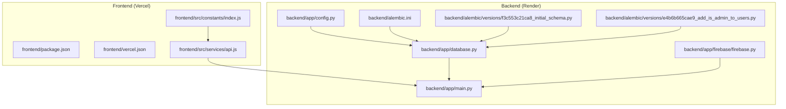
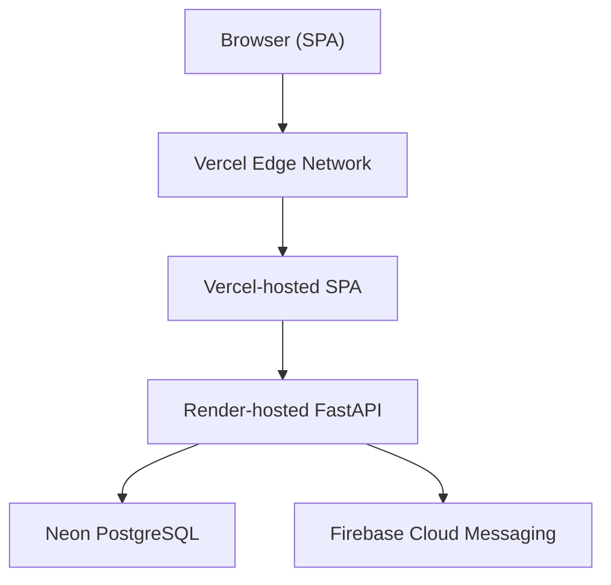
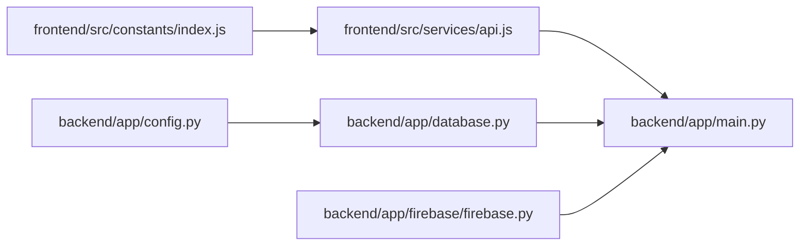

# Deployment Guide

<cite>
**Referenced Files in This Document**
- [backend/main.py](file://backend/app/main.py)
- [backend/config.py](file://backend/app/config.py)
- [backend/database.py](file://backend/app/database.py)
- [backend/alembic.ini](file://backend/alembic.ini)
- [backend/alembic/versions/f3c553c21ca8_initial_schema.py](file://backend/alembic/versions/f3c553c21ca8_initial_schema.py)
- [backend/alembic/versions/e4b6b665cae9_add_is_admin_to_users.py](file://backend/alembic/versions/e4b6b665cae9_add_is_admin_to_users.py)
- [backend/firebase/firebase.py](file://backend/app/firebase/firebase.py)
- [frontend/package.json](file://frontend/package.json)
- [frontend/vercel.json](file://frontend/vercel.json)
- [frontend/src/services/api.js](file://frontend/src/services/api.js)
- [frontend/src/constants/index.js](file://frontend/src/constants/index.js)
</cite>

## Table of Contents
1. [Introduction](#introduction)
2. [Project Structure](#project-structure)
3. [Core Components](#core-components)
4. [Architecture Overview](#architecture-overview)
5. [Detailed Component Analysis](#detailed-component-analysis)
6. [Dependency Analysis](#dependency-analysis)
7. [Performance Considerations](#performance-considerations)
8. [Troubleshooting Guide](#troubleshooting-guide)
9. [Conclusion](#conclusion)
10. [Appendices](#appendices)

## Introduction
This guide provides production-grade deployment instructions for the Modern Digital Banking Dashboard, covering:
- Backend: FastAPI application with PostgreSQL via Alembic migrations
- Frontend: React application built with Vite and deployed on Vercel
- Infrastructure: PostgreSQL hosted on Neon, Firebase Cloud Messaging integration
- Operations: Environment configuration, reverse proxy and SSL, CI/CD, scaling, monitoring, backups, and maintenance

## Project Structure
The repository follows a clear separation of concerns:
- Frontend: React SPA under frontend/
- Backend: FastAPI application under backend/

Key deployment touchpoints:
- Frontend build artifacts are served statically by Vercel
- Backend exposes REST endpoints consumed by the frontend
- Database migrations managed by Alembic
- CORS policy configured centrally in the backend

**Diagram sources**
- [frontend/package.json:1-37](file://frontend/package.json#L1-L37)
- [frontend/vercel.json:1-9](file://frontend/vercel.json#L1-L9)
- [frontend/src/services/api.js:1-73](file://frontend/src/services/api.js#L1-L73)
- [frontend/src/constants/index.js:1-229](file://frontend/src/constants/index.js#L1-L229)
- [backend/app/main.py:1-109](file://backend/app/main.py#L1-L109)
- [backend/app/config.py:1-72](file://backend/app/config.py#L1-L72)
- [backend/app/database.py:1-51](file://backend/app/database.py#L1-L51)
- [backend/alembic.ini:1-37](file://backend/alembic.ini#L1-L37)
- [backend/alembic/versions/f3c553c21ca8_initial_schema.py:1-79](file://backend/alembic/versions/f3c553c21ca8_initial_schema.py#L1-L79)
- [backend/alembic/versions/e4b6b665cae9_add_is_admin_to_users.py:1-151](file://backend/alembic/versions/e4b6b665cae9_add_is_admin_to_users.py#L1-L151)
- [backend/app/firebase/firebase.py:1-29](file://backend/app/firebase/firebase.py#L1-L29)

**Section sources**
- [frontend/package.json:1-37](file://frontend/package.json#L1-L37)
- [frontend/vercel.json:1-9](file://frontend/vercel.json#L1-L9)
- [backend/app/main.py:1-109](file://backend/app/main.py#L1-L109)
- [backend/app/config.py:1-72](file://backend/app/config.py#L1-L72)
- [backend/app/database.py:1-51](file://backend/app/database.py#L1-L51)
- [backend/alembic.ini:1-37](file://backend/alembic.ini#L1-L37)
- [backend/alembic/versions/f3c553c21ca8_initial_schema.py:1-79](file://backend/alembic/versions/f3c553c21ca8_initial_schema.py#L1-L79)
- [backend/alembic/versions/e4b6b665cae9_add_is_admin_to_users.py:1-151](file://backend/alembic/versions/e4b6b665cae9_add_is_admin_to_users.py#L1-L151)
- [backend/app/firebase/firebase.py:1-29](file://backend/app/firebase/firebase.py#L1-L29)

## Core Components
- Backend application entrypoint and routing are defined centrally, including CORS configuration and router registration.
- Environment-driven configuration for database connectivity and JWT secrets.
- SQLAlchemy engine and session management with connection pooling pre-ping enabled.
- Alembic-managed migrations define the initial schema and subsequent admin-related tables.
- Firebase initialization for push notifications.

**Section sources**
- [backend/app/main.py:56-109](file://backend/app/main.py#L56-L109)
- [backend/app/config.py:57-72](file://backend/app/config.py#L57-L72)
- [backend/app/database.py:24-51](file://backend/app/database.py#L24-L51)
- [backend/alembic/versions/f3c553c21ca8_initial_schema.py:18-66](file://backend/alembic/versions/f3c553c21ca8_initial_schema.py#L18-L66)
- [backend/alembic/versions/e4b6b665cae9_add_is_admin_to_users.py:18-126](file://backend/alembic/versions/e4b6b665cae9_add_is_admin_to_users.py#L18-L126)
- [backend/app/firebase/firebase.py:7-29](file://backend/app/firebase/firebase.py#L7-L29)

## Architecture Overview
High-level deployment architecture:
- Frontend: Static React application built with Vite and served via Vercel’s global CDN with SPA rewrites.
- Backend: FastAPI application deployed on Render with environment variables for database and JWT configuration.
- Database: PostgreSQL managed by Neon, provisioned via Alembic migrations.
- Push Notifications: Firebase Cloud Messaging initialized from environment credentials.

**Diagram sources**
- [frontend/vercel.json:1-9](file://frontend/vercel.json#L1-L9)
- [frontend/src/services/api.js:19-21](file://frontend/src/services/api.js#L19-L21)
- [backend/app/main.py:56-109](file://backend/app/main.py#L56-L109)
- [backend/app/database.py:29-34](file://backend/app/database.py#L29-L34)
- [backend/app/firebase/firebase.py:11-17](file://backend/app/firebase/firebase.py#L11-L17)

## Detailed Component Analysis

### Backend Deployment (FastAPI on Render)
- Application entrypoint registers routers and sets up CORS middleware. The CORS origins can be overridden via an environment variable, with sensible defaults embedded.
- Environment configuration loads .env early and normalizes legacy keys to canonical names, printing warnings when critical production secrets are missing.
- Database engine uses pre-ping for robust connection handling.
- Alembic logging configuration is provided for operational visibility.

Recommended production steps:
- Provision a PostgreSQL database on Neon and configure DATABASE_URL.
- Set JWT secrets and algorithm, token expirations, and refresh settings via environment variables.
- Configure CORS_ALLOWED_ORIGINS to include your Vercel domain(s).
- Enable HTTPS termination at the platform level; ensure reverse proxy preserves headers if applicable.

**Section sources**
- [backend/app/main.py:56-109](file://backend/app/main.py#L56-L109)
- [backend/app/config.py:26-56](file://backend/app/config.py#L26-L56)
- [backend/app/config.py:57-72](file://backend/app/config.py#L57-L72)
- [backend/app/database.py:29-34](file://backend/app/database.py#L29-L34)
- [backend/alembic.ini:1-37](file://backend/alembic.ini#L1-L37)

### Database Deployment (PostgreSQL on Neon)
- Initial schema migration defines users, accounts, and budgets tables with appropriate constraints and indexes.
- Subsequent migration adds admin-related tables (admin_rewards, audit_logs, otps, alerts, rewards, user_devices, user_settings, bills, transactions) and admin flags to users.
- Alembic configuration controls logging levels for operational diagnostics.

Operational guidance:
- Apply migrations automatically during deployment or via Render’s database migration step.
- Backups are managed by Neon; enable automated snapshots per your retention policy.
- Monitor connection limits and pool sizing based on expected concurrency.

**Section sources**
- [backend/alembic/versions/f3c553c21ca8_initial_schema.py:18-66](file://backend/alembic/versions/f3c553c21ca8_initial_schema.py#L18-L66)
- [backend/alembic/versions/e4b6b665cae9_add_is_admin_to_users.py:18-126](file://backend/alembic/versions/e4b6b665cae9_add_is_admin_to_users.py#L18-L126)
- [backend/alembic.ini:15-36](file://backend/alembic.ini#L15-L36)

### Frontend Deployment (React on Vercel)
- Build script produces optimized static assets.
- Vercel configuration enables SPA rewrites to index.html for client-side routing.
- API base URL is sourced from VITE_API_BASE_URL environment variable.

Production steps:
- Set VITE_API_BASE_URL to your Render-hosted backend endpoint.
- Configure environment variables in Vercel for API base URL and any feature flags.
- Enable HTTPS and enforce secure cookies on the backend.

**Section sources**
- [frontend/package.json:6-11](file://frontend/package.json#L6-L11)
- [frontend/vercel.json:1-9](file://frontend/vercel.json#L1-L9)
- [frontend/src/services/api.js:19-21](file://frontend/src/services/api.js#L19-L21)

### Firebase Integration
- Firebase credentials are loaded from an environment variable and used to initialize the admin SDK.
- A dedicated function sends push notifications to device tokens.

Production steps:
- Store FIREBASE_CREDENTIALS_JSON as a secret environment variable on Render.
- Ensure device tokens are stored securely and rotated as needed.

**Section sources**
- [backend/app/firebase/firebase.py:11-17](file://backend/app/firebase/firebase.py#L11-L17)
- [backend/app/firebase/firebase.py:20-29](file://backend/app/firebase/firebase.py#L20-L29)

### Reverse Proxy and SSL Management
- The backend supports configurable CORS origins via environment variables.
- For production, deploy behind a reverse proxy or CDN that terminates TLS and forwards requests to Render.
- Ensure X-Forwarded-Proto and related headers are preserved for accurate redirect handling.

[No sources needed since this section provides general guidance]

### CI/CD Pipeline Setup
Recommended stages:
- Build: Run frontend build and backend tests/linting.
- Deploy: Deploy frontend to Vercel and backend to Render.
- Migrate: Apply Alembic migrations after backend rollout.
- Validate: Smoke test API endpoints and SPA routing.

[No sources needed since this section provides general guidance]

### Scaling Considerations
- Backend: Use Render’s autoscaling tiers; monitor CPU/memory and adjust dyno size accordingly.
- Database: Choose Neon tier based on peak connections and throughput; enable read replicas if analytics queries increase load.
- Frontend: Rely on Vercel’s edge network; ensure caching headers are set appropriately.

[No sources needed since this section provides general guidance]

### Monitoring Setup
- Backend: Enable logs and metrics on Render; integrate with external monitoring if desired.
- Database: Use Neon’s observability dashboards; set up alerts for slow queries and connection saturation.
- Frontend: Track SPA errors via Vercel logs and Sentry if integrated.

[No sources needed since this section provides general guidance]

### Backup Strategies
- Database: Utilize Neon’s automated snapshots and point-in-time recovery; retain recent backups per compliance needs.
- Application: Version-control migrations and keep a record of environment variables in a secure secret manager.

[No sources needed since this section provides general guidance]

### Maintenance Procedures
- Regularly update dependencies and apply security patches.
- Rotate JWT secrets periodically and invalidate stale sessions.
- Review CORS origins and remove unused domains.

[No sources needed since this section provides general guidance]

## Dependency Analysis
The frontend communicates with the backend through a centralized API service that reads the base URL from environment configuration. The backend orchestrates routers and middleware, while the database layer encapsulates engine/session creation and dependency injection.

**Diagram sources**
- [frontend/src/constants/index.js:65-132](file://frontend/src/constants/index.js#L65-L132)
- [frontend/src/services/api.js:19-21](file://frontend/src/services/api.js#L19-L21)
- [backend/app/main.py:56-109](file://backend/app/main.py#L56-L109)
- [backend/app/config.py:57-72](file://backend/app/config.py#L57-L72)
- [backend/app/database.py:29-51](file://backend/app/database.py#L29-L51)
- [backend/app/firebase/firebase.py:7-29](file://backend/app/firebase/firebase.py#L7-L29)

**Section sources**
- [frontend/src/constants/index.js:65-132](file://frontend/src/constants/index.js#L65-L132)
- [frontend/src/services/api.js:19-21](file://frontend/src/services/api.js#L19-L21)
- [backend/app/main.py:56-109](file://backend/app/main.py#L56-L109)
- [backend/app/config.py:57-72](file://backend/app/config.py#L57-L72)
- [backend/app/database.py:29-51](file://backend/app/database.py#L29-L51)
- [backend/app/firebase/firebase.py:7-29](file://backend/app/firebase/firebase.py#L7-L29)

## Performance Considerations
- Connection pooling: The backend enables pre-ping to reduce broken connections under load.
- CORS: Keep allowed origins minimal to avoid unnecessary preflight overhead.
- Database: Use indexes defined in migrations; avoid N+1 queries in routes.
- Frontend: Leverage Vercel’s edge caching and minimize bundle size.

[No sources needed since this section provides general guidance]

## Troubleshooting Guide
Common deployment issues and resolutions:
- CORS errors: Verify CORS_ALLOWED_ORIGINS includes your Vercel domain(s); confirm environment variable precedence.
- Database connectivity: Ensure DATABASE_URL points to Neon and credentials are valid; check pool settings and connection limits.
- JWT secrets: Production environments must set JWT secrets; missing values fall back to development values and trigger warnings.
- Firebase initialization: FIREBASE_CREDENTIALS_JSON must be set as a secret; otherwise, initialization fails.
- SPA routing: Confirm Vercel rewrites target index.html for client-side routes.

**Section sources**
- [backend/app/main.py:91-109](file://backend/app/main.py#L91-L109)
- [backend/app/config.py:35-56](file://backend/app/config.py#L35-L56)
- [backend/app/database.py:29-34](file://backend/app/database.py#L29-L34)
- [backend/app/firebase/firebase.py:11-13](file://backend/app/firebase/firebase.py#L11-L13)
- [frontend/vercel.json:2-7](file://frontend/vercel.json#L2-L7)

## Conclusion
This guide outlines a production-ready deployment strategy for the Modern Digital Banking Dashboard. By aligning environment configuration, database migrations, reverse proxy and SSL handling, and CI/CD automation, teams can achieve reliable, scalable, and secure operations across frontend and backend components.

[No sources needed since this section summarizes without analyzing specific files]

## Appendices

### Environment Variables Reference
- Backend
  - DATABASE_URL: PostgreSQL connection string
  - JWT_SECRET_KEY: Secret for signing access tokens
  - JWT_REFRESH_SECRET_KEY: Secret for signing refresh tokens
  - JWT_ALGORITHM: Algorithm used for signing (default HS256)
  - ACCESS_TOKEN_EXPIRE_MINUTES: Access token lifetime
  - refresh_token_expire_days: Refresh token lifetime
  - CORS_ALLOWED_ORIGINS: Comma-separated list of allowed origins
  - FIREBASE_CREDENTIALS_JSON: JSON credentials for Firebase Admin SDK
- Frontend
  - VITE_API_BASE_URL: Backend API base URL

**Section sources**
- [backend/app/config.py:57-72](file://backend/app/config.py#L57-L72)
- [backend/app/main.py:91-109](file://backend/app/main.py#L91-L109)
- [backend/app/firebase/firebase.py:11-17](file://backend/app/firebase/firebase.py#L11-L17)
- [frontend/src/services/api.js:19-21](file://frontend/src/services/api.js#L19-L21)