# Development Guidelines

<cite>
**Referenced Files in This Document**
- [backend/README.md](file://backend/README.md)
- [frontend/README.md](file://frontend/README.md)
- [backend/app/main.py](file://backend/app/main.py)
- [backend/app/config.py](file://backend/app/config.py)
- [backend/app/database.py](file://backend/app/database.py)
- [backend/app/utils/jwt.py](file://backend/app/utils/jwt.py)
- [backend/requirements.txt](file://backend/requirements.txt)
- [backend/alembic.ini](file://backend/alembic.ini)
- [frontend/package.json](file://frontend/package.json)
- [frontend/eslint.config.js](file://frontend/eslint.config.js)
- [frontend/jest.config.json](file://frontend/jest.config.json)
- [frontend/tailwind.config.js](file://frontend/tailwind.config.js)
- [frontend/postcss.config.js](file://frontend/postcss.config.js)
- [frontend/vite.config.js](file://frontend/vite.config.js)
- [frontend/src/services/api.js](file://frontend/src/services/api.js)
- [frontend/src/hooks/useAuth.js](file://frontend/src/hooks/useAuth.js)
</cite>

## Table of Contents
1. [Introduction](#introduction)
2. [Project Structure](#project-structure)
3. [Core Components](#core-components)
4. [Architecture Overview](#architecture-overview)
5. [Detailed Component Analysis](#detailed-component-analysis)
6. [Dependency Analysis](#dependency-analysis)
7. [Performance Considerations](#performance-considerations)
8. [Troubleshooting Guide](#troubleshooting-guide)
9. [Conclusion](#conclusion)
10. [Appendices](#appendices)

## Introduction
This document provides comprehensive development guidelines for contributing to the Modern Digital Banking Dashboard. It covers coding standards for the React/Vite frontend and Python/FastAPI backend, testing practices, code review processes, and development workflow. It also documents ESLint and Prettier configurations, component development guidelines, API development standards, database migration practices, and security coding practices. Guidance is included for feature development, bug fixing, performance optimization, and maintaining code quality across the full-stack application.

## Project Structure
The project is organized into two primary directories:
- backend: FastAPI application with routers, services, models, schemas, utilities, and Alembic migrations.
- frontend: React application built with Vite, using Tailwind CSS, Axios for API calls, and Jest for tests.

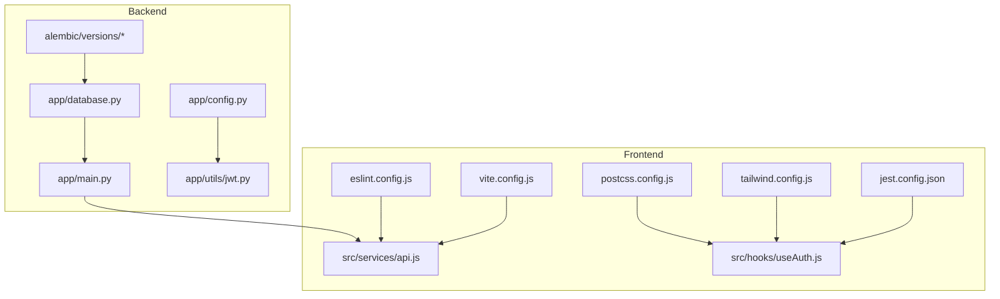

**Diagram sources**
- [backend/app/main.py:56-108](file://backend/app/main.py#L56-L108)
- [backend/app/config.py:57-72](file://backend/app/config.py#L57-L72)
- [backend/app/database.py:24-50](file://backend/app/database.py#L24-L50)
- [backend/app/utils/jwt.py:1-26](file://backend/app/utils/jwt.py#L1-L26)
- [frontend/vite.config.js:15-31](file://frontend/vite.config.js#L15-L31)
- [frontend/eslint.config.js:7-43](file://frontend/eslint.config.js#L7-L43)
- [frontend/jest.config.json:1-20](file://frontend/jest.config.json#L1-L20)
- [frontend/tailwind.config.js:1-26](file://frontend/tailwind.config.js#L1-L26)
- [frontend/postcss.config.js:1-7](file://frontend/postcss.config.js#L1-L7)
- [frontend/src/services/api.js:19-41](file://frontend/src/services/api.js#L19-L41)
- [frontend/src/hooks/useAuth.js:22-63](file://frontend/src/hooks/useAuth.js#L22-L63)

**Section sources**
- [backend/README.md:27-44](file://backend/README.md#L27-L44)
- [frontend/README.md:37-49](file://frontend/README.md#L37-L49)

## Core Components
- Backend entry point and router registration: [backend/app/main.py:56-108](file://backend/app/main.py#L56-L108)
- Configuration and environment variables: [backend/app/config.py:57-72](file://backend/app/config.py#L57-L72)
- Database engine and session management: [backend/app/database.py:24-50](file://backend/app/database.py#L24-L50)
- JWT utilities for tokens: [backend/app/utils/jwt.py:1-26](file://backend/app/utils/jwt.py#L1-L26)
- Frontend API client and interceptors: [frontend/src/services/api.js:19-41](file://frontend/src/services/api.js#L19-L41)
- Frontend authentication hook: [frontend/src/hooks/useAuth.js:22-63](file://frontend/src/hooks/useAuth.js#L22-L63)

**Section sources**
- [backend/app/main.py:56-108](file://backend/app/main.py#L56-L108)
- [backend/app/config.py:57-72](file://backend/app/config.py#L57-L72)
- [backend/app/database.py:24-50](file://backend/app/database.py#L24-L50)
- [backend/app/utils/jwt.py:1-26](file://backend/app/utils/jwt.py#L1-L26)
- [frontend/src/services/api.js:19-41](file://frontend/src/services/api.js#L19-L41)
- [frontend/src/hooks/useAuth.js:22-63](file://frontend/src/hooks/useAuth.js#L22-L63)

## Architecture Overview
The frontend communicates with the backend via Axios using a centralized API service. The backend exposes FastAPI routes grouped by domain (authentication, accounts, transactions, etc.) and enforces CORS policies. Authentication tokens are managed by the frontend and attached automatically to requests. The backend uses SQLAlchemy for ORM and Alembic for migrations.

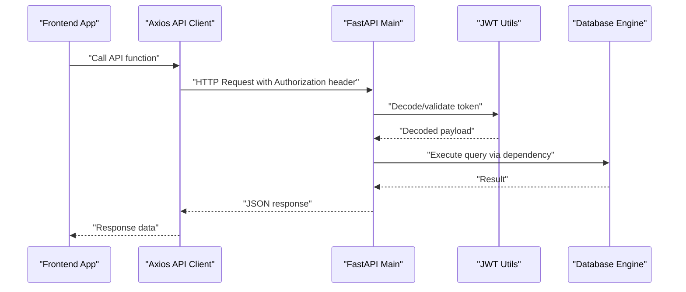

**Diagram sources**
- [frontend/src/services/api.js:19-41](file://frontend/src/services/api.js#L19-L41)
- [backend/app/main.py:56-108](file://backend/app/main.py#L56-L108)
- [backend/app/utils/jwt.py:21-25](file://backend/app/utils/jwt.py#L21-L25)
- [backend/app/database.py:45-50](file://backend/app/database.py#L45-L50)

## Detailed Component Analysis

### Frontend: API Client and Interceptors
- Centralized Axios instance with base URL from environment.
- Automatic Authorization header injection using access token from storage.
- Convenience methods for GET, POST, PATCH, DELETE.
- Exported named functions for specific endpoints.

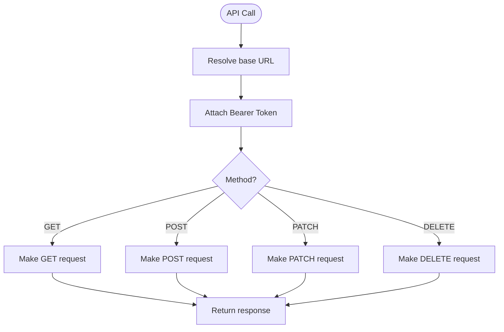

**Diagram sources**
- [frontend/src/services/api.js:19-41](file://frontend/src/services/api.js#L19-L41)

**Section sources**
- [frontend/src/services/api.js:19-41](file://frontend/src/services/api.js#L19-L41)

### Frontend: Authentication Hook
- Manages login, logout, and user state.
- Persists tokens and user data in storage.
- Exposes helpers to check admin role and update user info.

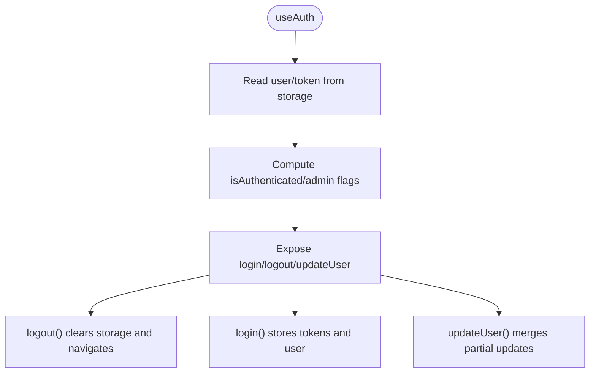

**Diagram sources**
- [frontend/src/hooks/useAuth.js:22-63](file://frontend/src/hooks/useAuth.js#L22-L63)

**Section sources**
- [frontend/src/hooks/useAuth.js:22-63](file://frontend/src/hooks/useAuth.js#L22-L63)

### Backend: Entry Point and Routers
- FastAPI app creation and CORS middleware configuration.
- Includes routers for auth, accounts, transfers, transactions, budgets, bills, exports, alerts, rewards, insights, devices, settings, and admin routes.
- Startup event initializes Firebase.

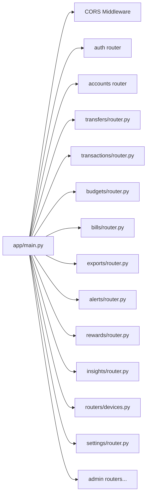

**Diagram sources**
- [backend/app/main.py:29-85](file://backend/app/main.py#L29-L85)

**Section sources**
- [backend/app/main.py:56-108](file://backend/app/main.py#L56-L108)

### Backend: Configuration and Environment Variables
- Loads environment variables from a .env file located at backend/.env.
- Defines Settings class with database URL, JWT secrets, algorithms, and token expiry.
- Prints warnings for missing production-grade secrets.

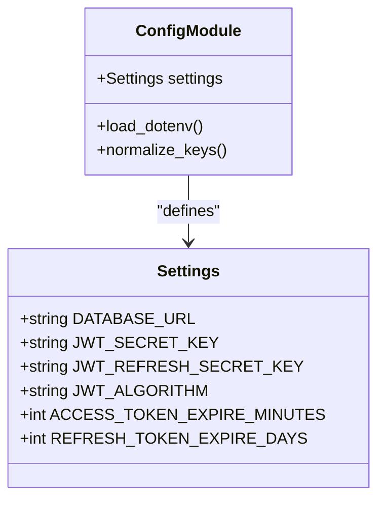

**Diagram sources**
- [backend/app/config.py:57-72](file://backend/app/config.py#L57-L72)

**Section sources**
- [backend/app/config.py:32-56](file://backend/app/config.py#L32-L56)
- [backend/app/config.py:57-72](file://backend/app/config.py#L57-L72)

### Backend: Database Layer
- Creates SQLAlchemy engine with pre-ping.
- Provides session factory and declarative base.
- Dependency function yields database sessions for route handlers.

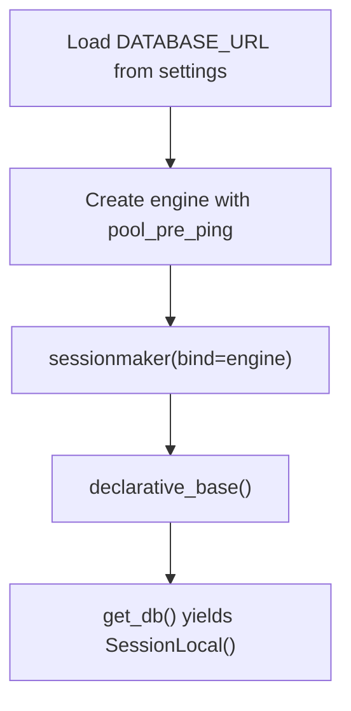

**Diagram sources**
- [backend/app/database.py:29-50](file://backend/app/database.py#L29-L50)

**Section sources**
- [backend/app/database.py:24-50](file://backend/app/database.py#L24-L50)

### Backend: JWT Utilities
- Encodes/decodes access and refresh tokens with configurable algorithm and expiry.
- Uses secrets from configuration.

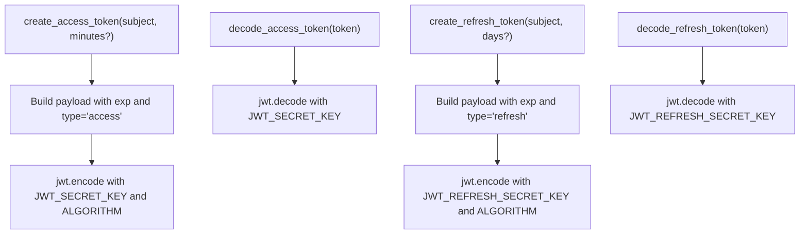

**Diagram sources**
- [backend/app/utils/jwt.py:11-25](file://backend/app/utils/jwt.py#L11-L25)

**Section sources**
- [backend/app/utils/jwt.py:1-26](file://backend/app/utils/jwt.py#L1-L26)

### Frontend: ESLint and Testing Configuration
- ESLint flat config with recommended rules, React Hooks, and React Refresh presets.
- Ignores dist, .vite, node_modules, public; excludes test files from linting.
- Jest configuration for jsdom, module name mapping, babel-jest transform, and coverage collection.

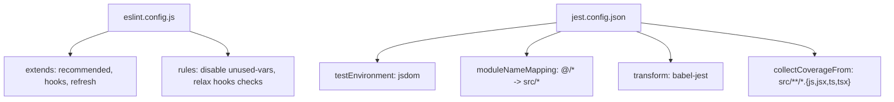

**Diagram sources**
- [frontend/eslint.config.js:7-43](file://frontend/eslint.config.js#L7-L43)
- [frontend/jest.config.json:1-20](file://frontend/jest.config.json#L1-L20)

**Section sources**
- [frontend/eslint.config.js:7-43](file://frontend/eslint.config.js#L7-L43)
- [frontend/jest.config.json:1-20](file://frontend/jest.config.json#L1-L20)

### Frontend: Build and Dev Tooling
- Vite configuration with React plugin, path alias @ -> src, and proxy to backend.
- Tailwind and PostCSS configuration for styling pipeline.

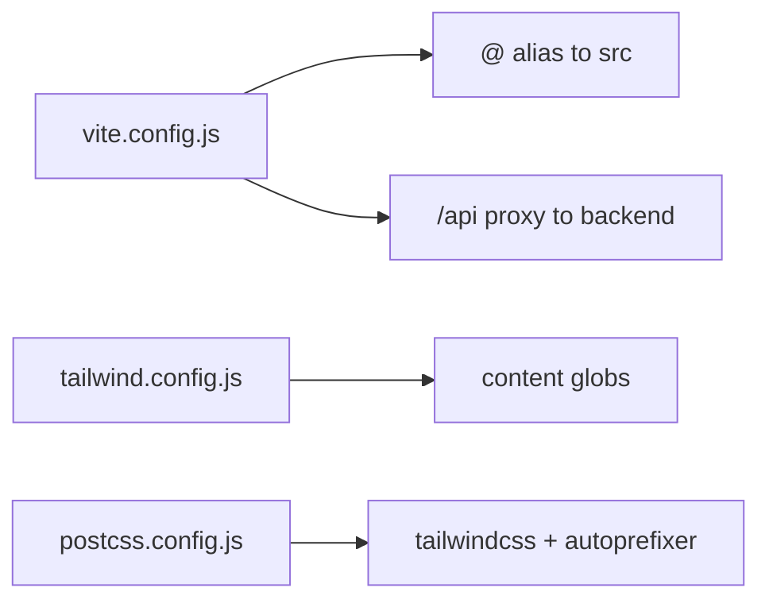

**Diagram sources**
- [frontend/vite.config.js:15-31](file://frontend/vite.config.js#L15-L31)
- [frontend/tailwind.config.js:1-26](file://frontend/tailwind.config.js#L1-L26)
- [frontend/postcss.config.js:1-7](file://frontend/postcss.config.js#L1-L7)

**Section sources**
- [frontend/vite.config.js:15-31](file://frontend/vite.config.js#L15-L31)
- [frontend/tailwind.config.js:1-26](file://frontend/tailwind.config.js#L1-L26)
- [frontend/postcss.config.js:1-7](file://frontend/postcss.config.js#L1-L7)

### Backend: Database Migrations
- Alembic configuration logging levels and handler/formatter setup.
- Migration versions under alembic/versions.

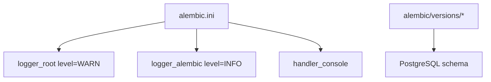

**Diagram sources**
- [backend/alembic.ini:1-37](file://backend/alembic.ini#L1-L37)

**Section sources**
- [backend/alembic.ini:1-37](file://backend/alembic.ini#L1-L37)

## Dependency Analysis
- Frontend depends on Axios for HTTP, React Router for navigation, and Tailwind for styling.
- Backend depends on FastAPI, SQLAlchemy, Alembic, Pydantic, and Uvicorn.
- Both layers rely on environment variables for configuration.

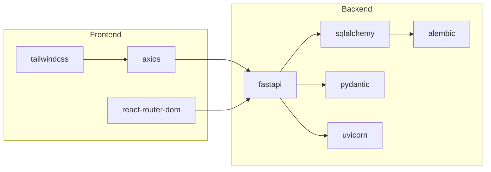

**Diagram sources**
- [frontend/package.json:12-35](file://frontend/package.json#L12-L35)
- [backend/requirements.txt:1-69](file://backend/requirements.txt#L1-L69)

**Section sources**
- [frontend/package.json:12-35](file://frontend/package.json#L12-L35)
- [backend/requirements.txt:1-69](file://backend/requirements.txt#L1-L69)

## Performance Considerations
- Frontend
  - Prefer lazy loading and code splitting for large pages.
  - Minimize re-renders by memoizing props and using React.memo/useMemo/useCallback judiciously.
  - Use efficient chart libraries and virtualize long lists.
  - Keep Axios interceptors lightweight and avoid unnecessary work in request/response transforms.
- Backend
  - Use connection pooling and pre-ping to maintain robust DB connections.
  - Apply pagination and filtering on the server side for large datasets.
  - Cache infrequent reads using appropriate caching layers.
  - Keep route handlers thin; delegate business logic to services.

## Troubleshooting Guide
- CORS Issues
  - Ensure allowed origins include development and deployment domains.
  - Override via environment variable if needed.
  - Reference: [backend/app/main.py:91-108](file://backend/app/main.py#L91-L108)
- Missing Environment Variables
  - Secrets fall back to development values with warnings; configure .env for production.
  - Reference: [backend/app/config.py:32-56](file://backend/app/config.py#L32-L56)
- Database Connectivity
  - Verify DATABASE_URL and engine settings.
  - Reference: [backend/app/database.py:29-40](file://backend/app/database.py#L29-L40)
- API Requests Not Authorized
  - Confirm Authorization header is present and token is valid.
  - Reference: [frontend/src/services/api.js:23-29](file://frontend/src/services/api.js#L23-L29)
- Authentication State
  - Check token storage and useAuth hook state computation.
  - Reference: [frontend/src/hooks/useAuth.js:22-63](file://frontend/src/hooks/useAuth.js#L22-L63)

**Section sources**
- [backend/app/main.py:91-108](file://backend/app/main.py#L91-L108)
- [backend/app/config.py:32-56](file://backend/app/config.py#L32-L56)
- [backend/app/database.py:29-40](file://backend/app/database.py#L29-L40)
- [frontend/src/services/api.js:23-29](file://frontend/src/services/api.js#L23-L29)
- [frontend/src/hooks/useAuth.js:22-63](file://frontend/src/hooks/useAuth.js#L22-L63)

## Conclusion
These guidelines establish a consistent development process across the Modern Digital Banking Dashboard. By adhering to the outlined standards for frontend and backend, testing, code review, and operational practices, contributors can deliver secure, maintainable, and performant features while preserving a cohesive user experience.

## Appendices

### Coding Standards and Linting
- Frontend
  - ESLint configuration: [frontend/eslint.config.js:7-43](file://frontend/eslint.config.js#L7-L43)
  - Jest configuration: [frontend/jest.config.json:1-20](file://frontend/jest.config.json#L1-L20)
  - Build tooling: [frontend/vite.config.js:15-31](file://frontend/vite.config.js#L15-L31), [frontend/tailwind.config.js:1-26](file://frontend/tailwind.config.js#L1-L26), [frontend/postcss.config.js:1-7](file://frontend/postcss.config.js#L1-L7)
- Backend
  - Dependencies: [backend/requirements.txt:1-69](file://backend/requirements.txt#L1-L69)

**Section sources**
- [frontend/eslint.config.js:7-43](file://frontend/eslint.config.js#L7-L43)
- [frontend/jest.config.json:1-20](file://frontend/jest.config.json#L1-L20)
- [frontend/vite.config.js:15-31](file://frontend/vite.config.js#L15-L31)
- [frontend/tailwind.config.js:1-26](file://frontend/tailwind.config.js#L1-L26)
- [frontend/postcss.config.js:1-7](file://frontend/postcss.config.js#L1-L7)
- [backend/requirements.txt:1-69](file://backend/requirements.txt#L1-L69)

### Component Development Guidelines
- Frontend
  - Use reusable components and pass data via props.
  - Keep components functional and stateless where possible; introduce hooks for side effects.
  - Validate inputs early and provide clear error messages.
  - Use Tailwind utilities for responsive design; follow existing breakpoints.
- Backend
  - Keep routers thin; move logic to services.
  - Use Pydantic schemas for request/response validation.
  - Centralize shared utilities in app/utils.

**Section sources**
- [frontend/README.md:166-175](file://frontend/README.md#L166-L175)
- [backend/README.md:15-24](file://backend/README.md#L15-L24)

### API Development Standards
- Use RESTful paths and HTTP semantics.
- Return standardized JSON responses; include appropriate status codes.
- Enforce authentication and authorization via dependencies.
- Document endpoints using OpenAPI/Swagger (available at /docs).

**Section sources**
- [backend/app/main.py:56-89](file://backend/app/main.py#L56-L89)

### Database Migration Practices
- Generate new revisions with Alembic; keep migrations small and focused.
- Test migrations locally before merging.
- Use environment-specific databases for development and staging.

**Section sources**
- [backend/alembic.ini:1-37](file://backend/alembic.ini#L1-L37)

### Security Coding Practices
- Never log secrets; use environment variables.
- Validate and sanitize all inputs; enforce strong password policies.
- Use HTTPS and secure cookies; rotate JWT secrets regularly.
- Limit exposed origins and headers in CORS.

**Section sources**
- [backend/app/config.py:57-72](file://backend/app/config.py#L57-L72)
- [backend/app/main.py:91-108](file://backend/app/main.py#L91-L108)

### Testing Practices
- Frontend
  - Write unit tests for hooks, utilities, and components using Jest and jsdom.
  - Mock API calls and external dependencies.
- Backend
  - Add unit tests for services and routers.
  - Use pytest fixtures and test database isolation.

**Section sources**
- [frontend/jest.config.json:1-20](file://frontend/jest.config.json#L1-L20)
- [backend/README.md:15-24](file://backend/README.md#L15-L24)

### Code Review Process
- Open pull requests with clear descriptions and linked issues.
- Ensure CI passes and tests are updated or added.
- Reviewer feedback should focus on correctness, readability, performance, and security.

### Development Workflow
- Branch by feature; keep commits small and atomic.
- Run linters and tests locally before pushing.
- Use semantic commit messages and update CHANGELOG entries as needed.