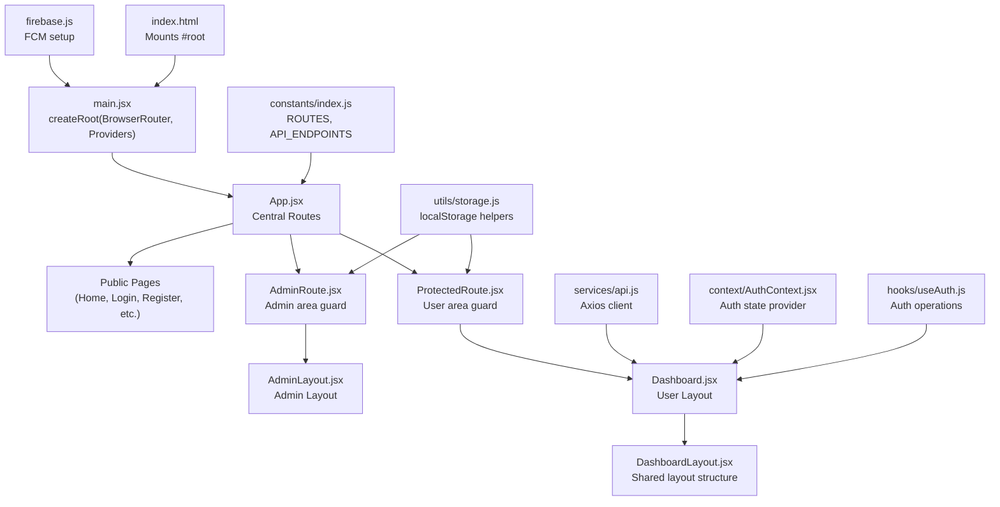
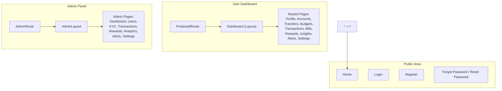
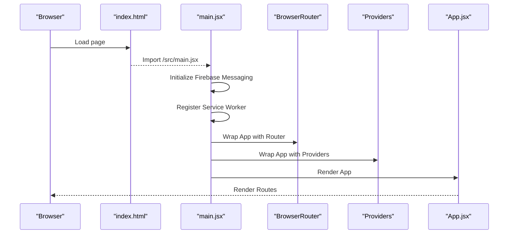
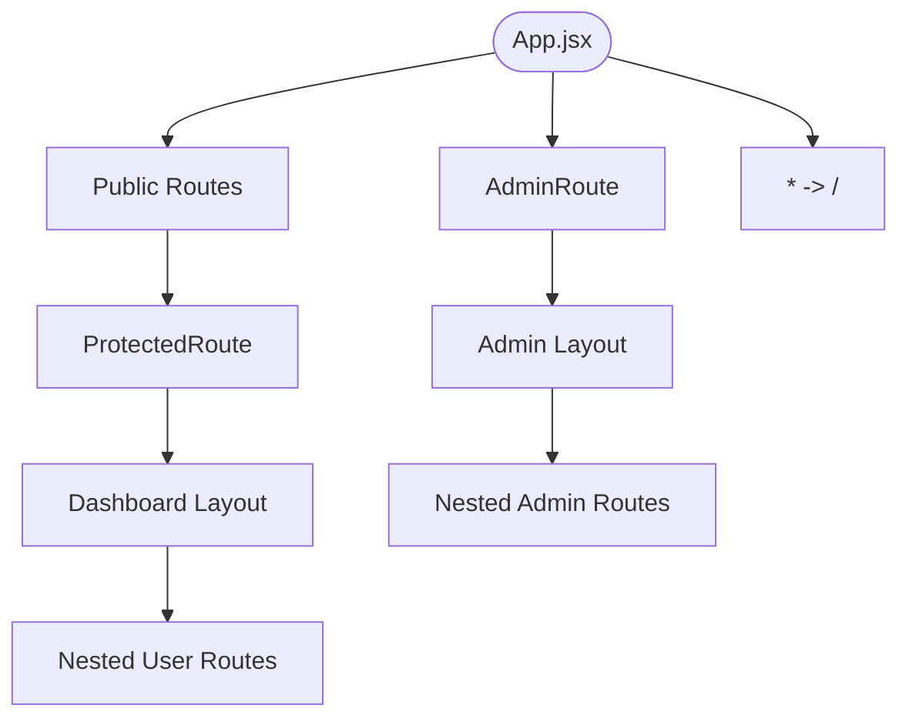
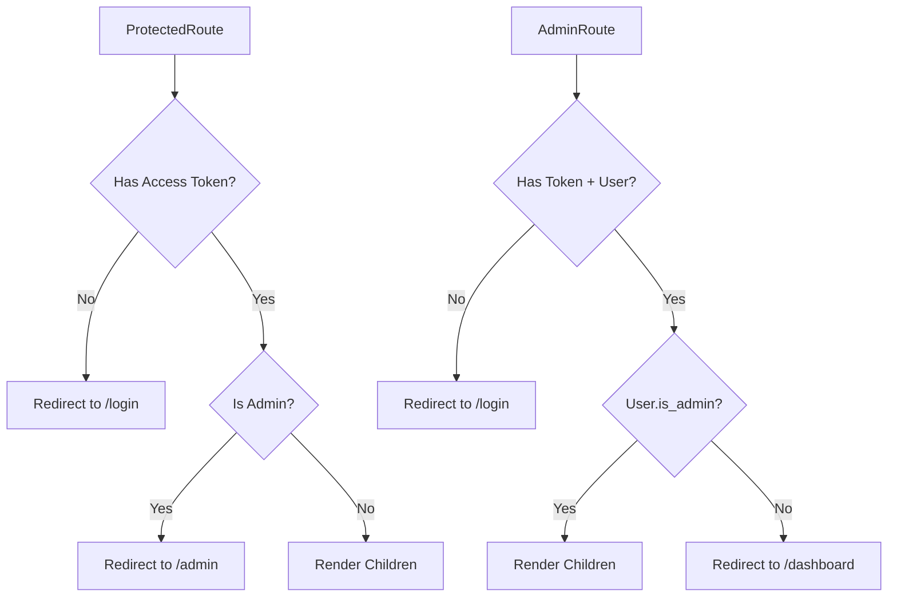
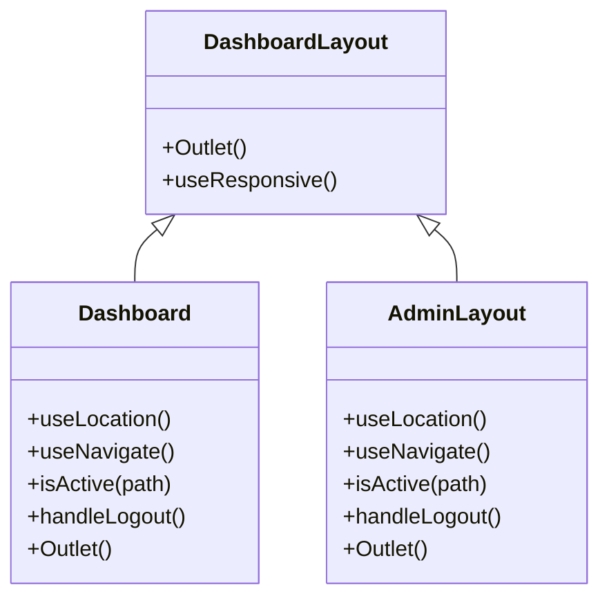
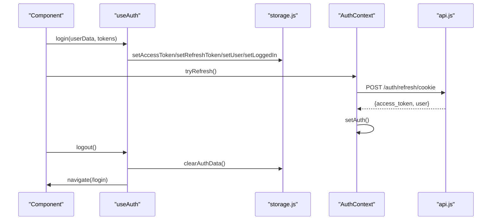
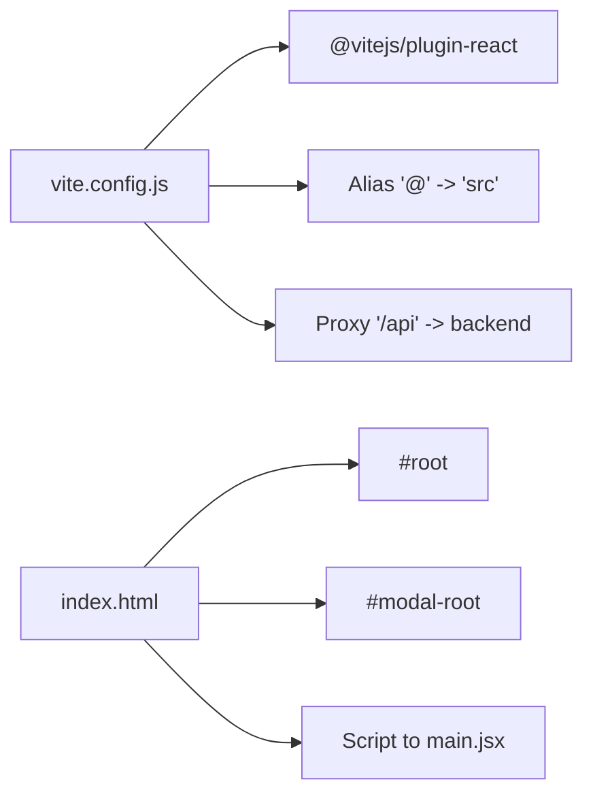
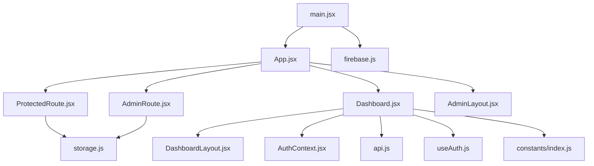

# Application Structure

<cite>
**Referenced Files in This Document**
- [main.jsx](file://frontend/src/main.jsx)
- [App.jsx](file://frontend/src/App.jsx)
- [vite.config.js](file://frontend/vite.config.js)
- [index.html](file://frontend/index.html)
- [package.json](file://frontend/package.json)
- [ProtectedRoute.jsx](file://frontend/src/components/auth/ProtectedRoute.jsx)
- [AdminRoute.jsx](file://frontend/src/components/auth/AdminRoute.jsx)
- [DashboardLayout.jsx](file://frontend/src/layouts/DashboardLayout.jsx)
- [AdminLayout.jsx](file://frontend/src/pages/admin/AdminLayout.jsx)
- [Dashboard.jsx](file://frontend/src/pages/user/Dashboard.jsx)
- [Home.jsx](file://frontend/src/pages/user/Home.jsx)
- [AuthContext.jsx](file://frontend/src/context/AuthContext.jsx)
- [AuthContext.jsx](file://frontend/src/context/AuthContext.jsx)
- [useAuth.js](file://frontend/src/hooks/useAuth.js)
- [storage.js](file://frontend/src/utils/storage.js)
- [constants/index.js](file://frontend/src/constants/index.js)
- [api.js](file://frontend/src/services/api.js)
- [firebase.js](file://frontend/src/firebase.js)
</cite>

## Table of Contents
1. [Introduction](#introduction)
2. [Project Structure](#project-structure)
3. [Core Components](#core-components)
4. [Architecture Overview](#architecture-overview)
5. [Detailed Component Analysis](#detailed-component-analysis)
6. [Dependency Analysis](#dependency-analysis)
7. [Performance Considerations](#performance-considerations)
8. [Troubleshooting Guide](#troubleshooting-guide)
9. [Conclusion](#conclusion)

## Introduction
This document explains the React application structure and initialization for the Modern Digital Banking Dashboard. It covers the application entry point, routing configuration with React Router, layout-based routing, component organization patterns, Vite build configuration, HTML template setup, and bootstrapping process. It also documents the route hierarchy, nested routing patterns, fallback handling, route guards for protected and admin-only routes, and practical guidance for performance and optimization.

## Project Structure
The frontend is organized around a clear separation of concerns:
- Entry point initializes providers, router, and mounts the app.
- Routing is centralized in a single file with layout-based nesting.
- Guards protect user/admin areas.
- Shared constants, utilities, and services live under dedicated folders.
- Vite handles development, proxying, and production builds.

**Diagram sources**
- [index.html:14-18](file://frontend/index.html#L14-L18)
- [main.jsx:37-45](file://frontend/src/main.jsx#L37-L45)
- [App.jsx:83-167](file://frontend/src/App.jsx#L83-L167)
- [ProtectedRoute.jsx:27-37](file://frontend/src/components/auth/ProtectedRoute.jsx#L27-L37)
- [AdminRoute.jsx:12-22](file://frontend/src/components/auth/AdminRoute.jsx#L12-L22)
- [Dashboard.jsx:58-522](file://frontend/src/pages/user/Dashboard.jsx#L58-L522)
- [AdminLayout.jsx:20-300](file://frontend/src/pages/admin/AdminLayout.jsx#L20-L300)
- [DashboardLayout.jsx:14-47](file://frontend/src/layouts/DashboardLayout.jsx#L14-L47)
- [constants/index.js:6-62](file://frontend/src/constants/index.js#L6-L62)
- [utils/storage.js:81-99](file://frontend/src/utils/storage.js#L81-L99)
- [services/api.js:19-31](file://frontend/src/services/api.js#L19-L31)
- [context/AuthContext.jsx:23-46](file://frontend/src/context/AuthContext.jsx#L23-L46)
- [hooks/useAuth.js:22-63](file://frontend/src/hooks/useAuth.js#L22-L63)
- [firebase.js:1-24](file://frontend/src/firebase.js#L1-L24)

**Section sources**
- [main.jsx:10-45](file://frontend/src/main.jsx#L10-L45)
- [App.jsx:83-167](file://frontend/src/App.jsx#L83-L167)
- [index.html:14-18](file://frontend/index.html#L14-L18)
- [vite.config.js:15-31](file://frontend/vite.config.js#L15-L31)
- [package.json:6-11](file://frontend/package.json#L6-L11)

## Core Components
- Application entry point: Initializes React, Router, providers, and registers service workers and Firebase messaging.
- Central routing: Declares public, user dashboard, and admin routes with nested routes and guards.
- Layouts: DashboardLayout and AdminLayout provide shared UI scaffolding and responsive behavior.
- Guards: ProtectedRoute and AdminRoute enforce authentication and role checks.
- State and utilities: AuthContext, useAuth hook, storage helpers, constants, and API service.

**Section sources**
- [main.jsx:10-45](file://frontend/src/main.jsx#L10-L45)
- [App.jsx:78-167](file://frontend/src/App.jsx#L78-L167)
- [ProtectedRoute.jsx:27-37](file://frontend/src/components/auth/ProtectedRoute.jsx#L27-L37)
- [AdminRoute.jsx:12-22](file://frontend/src/components/auth/AdminRoute.jsx#L12-L22)
- [DashboardLayout.jsx:14-47](file://frontend/src/layouts/DashboardLayout.jsx#L14-L47)
- [AdminLayout.jsx:20-300](file://frontend/src/pages/admin/AdminLayout.jsx#L20-L300)
- [AuthContext.jsx:23-46](file://frontend/src/context/AuthContext.jsx#L23-L46)
- [useAuth.js:22-63](file://frontend/src/hooks/useAuth.js#L22-L63)
- [storage.js:81-99](file://frontend/src/utils/storage.js#L81-L99)
- [constants/index.js:6-62](file://frontend/src/constants/index.js#L6-L62)
- [api.js:19-31](file://frontend/src/services/api.js#L19-L31)

## Architecture Overview
The application follows a layout-based routing pattern with guards:
- Public routes are accessible without authentication.
- User dashboard routes are protected and rendered inside a shared layout.
- Admin routes are protected and rendered inside an admin-specific layout.
- A fallback route redirects unmatched paths to the home page.

**Diagram sources**
- [App.jsx:88-165](file://frontend/src/App.jsx#L88-L165)
- [ProtectedRoute.jsx:27-37](file://frontend/src/components/auth/ProtectedRoute.jsx#L27-L37)
- [AdminRoute.jsx:12-22](file://frontend/src/components/auth/AdminRoute.jsx#L12-L22)
- [Dashboard.jsx:58-522](file://frontend/src/pages/user/Dashboard.jsx#L58-L522)
- [AdminLayout.jsx:20-300](file://frontend/src/pages/admin/AdminLayout.jsx#L20-L300)

## Detailed Component Analysis

### Application Entry Point and Bootstrapping
- Initializes StrictMode, BrowserRouter, BudgetProvider, and renders App.
- Registers a service worker for Firebase Messaging and sets up onMessage handler.
- Mounts the app into the DOM via index.html.

**Diagram sources**
- [index.html:14-18](file://frontend/index.html#L14-L18)
- [main.jsx:19-45](file://frontend/src/main.jsx#L19-L45)
- [App.jsx:78-167](file://frontend/src/App.jsx#L78-L167)

**Section sources**
- [main.jsx:10-45](file://frontend/src/main.jsx#L10-L45)
- [index.html:14-18](file://frontend/index.html#L14-L18)

### Routing Configuration and Layout-Based Routing
- Public routes: Home, Login, Register, Forgot Password, Reset Password, Verify OTP.
- User dashboard: Protected by a route guard and nested routes for all user features.
- Admin panel: Guarded by an admin-only route guard and nested routes for admin features.
- Fallback: Unmatched routes redirect to Home.

**Diagram sources**
- [App.jsx:88-165](file://frontend/src/App.jsx#L88-L165)
- [ProtectedRoute.jsx:27-37](file://frontend/src/components/auth/ProtectedRoute.jsx#L27-L37)
- [AdminRoute.jsx:12-22](file://frontend/src/components/auth/AdminRoute.jsx#L12-L22)

**Section sources**
- [App.jsx:88-165](file://frontend/src/App.jsx#L88-L165)

### Route Guards: ProtectedRoute and AdminRoute
- ProtectedRoute enforces authentication and redirects authenticated admins to the admin area.
- AdminRoute enforces admin role and redirects non-admins to the user dashboard.

**Diagram sources**
- [ProtectedRoute.jsx:27-37](file://frontend/src/components/auth/ProtectedRoute.jsx#L27-L37)
- [AdminRoute.jsx:12-22](file://frontend/src/components/auth/AdminRoute.jsx#L12-L22)
- [storage.js:81-99](file://frontend/src/utils/storage.js#L81-L99)

**Section sources**
- [ProtectedRoute.jsx:27-37](file://frontend/src/components/auth/ProtectedRoute.jsx#L27-L37)
- [AdminRoute.jsx:12-22](file://frontend/src/components/auth/AdminRoute.jsx#L12-L22)
- [storage.js:81-99](file://frontend/src/utils/storage.js#L81-L99)

### Layout Components
- DashboardLayout: Provides a responsive layout container with an outlet for nested routes.
- Dashboard: Implements a responsive sidebar, notifications badge, and nested navigation; integrates with the shared layout.
- AdminLayout: Implements a responsive admin sidebar with active state tracking and logout flow.

**Diagram sources**
- [DashboardLayout.jsx:14-47](file://frontend/src/layouts/DashboardLayout.jsx#L14-L47)
- [Dashboard.jsx:58-522](file://frontend/src/pages/user/Dashboard.jsx#L58-L522)
- [AdminLayout.jsx:20-300](file://frontend/src/pages/admin/AdminLayout.jsx#L20-L300)

**Section sources**
- [DashboardLayout.jsx:14-47](file://frontend/src/layouts/DashboardLayout.jsx#L14-L47)
- [Dashboard.jsx:58-522](file://frontend/src/pages/user/Dashboard.jsx#L58-L522)
- [AdminLayout.jsx:20-300](file://frontend/src/pages/admin/AdminLayout.jsx#L20-L300)

### Authentication State and Utilities
- AuthContext: Provides a refresh mechanism and exposes current auth state.
- useAuth: Encapsulates login, logout, and user updates with storage helpers.
- storage.js: Safe localStorage wrappers for tokens, user data, and flags.
- constants/index.js: Centralized route and API endpoint definitions.

**Diagram sources**
- [useAuth.js:22-63](file://frontend/src/hooks/useAuth.js#L22-L63)
- [storage.js:81-99](file://frontend/src/utils/storage.js#L81-L99)
- [AuthContext.jsx:23-46](file://frontend/src/context/AuthContext.jsx#L23-L46)
- [api.js:19-31](file://frontend/src/services/api.js#L19-L31)

**Section sources**
- [AuthContext.jsx:23-46](file://frontend/src/context/AuthContext.jsx#L23-L46)
- [useAuth.js:22-63](file://frontend/src/hooks/useAuth.js#L22-L63)
- [storage.js:81-99](file://frontend/src/utils/storage.js#L81-L99)
- [constants/index.js:6-62](file://frontend/src/constants/index.js#L6-L62)
- [api.js:19-31](file://frontend/src/services/api.js#L19-L31)

### Vite Build Configuration and HTML Template
- Vite configuration:
  - React plugin enabled.
  - Path alias "@": src for concise imports.
  - Dev server proxy configured to forward "/api" to the backend.
- HTML template:
  - Minimal template with #root and #modal-root.
  - Script tag loads the entry module.

**Diagram sources**
- [vite.config.js:15-31](file://frontend/vite.config.js#L15-L31)
- [index.html:14-18](file://frontend/index.html#L14-L18)

**Section sources**
- [vite.config.js:15-31](file://frontend/vite.config.js#L15-L31)
- [index.html:14-18](file://frontend/index.html#L14-L18)
- [package.json:6-11](file://frontend/package.json#L6-L11)

### Public Pages and Home Landing
- Home page composes reusable components for navigation, hero, features, how-it-works, FAQ, reviews, and footer.
- Other public pages include Login, Register, Forgot Password, Reset Password, and Verify OTP.

**Section sources**
- [Home.jsx:40-54](file://frontend/src/pages/user/Home.jsx#L40-L54)
- [App.jsx:16-21](file://frontend/src/App.jsx#L16-L21)

## Dependency Analysis
- Entry point depends on React, ReactDOM, React Router, providers, and Firebase.
- App depends on route guards, layouts, and page components.
- Guards depend on storage utilities and constants.
- Dashboard/Admin layouts depend on constants, icons, and responsive hooks.
- API service depends on constants and storage for auth headers.

**Diagram sources**
- [main.jsx:10-45](file://frontend/src/main.jsx#L10-L45)
- [App.jsx:78-167](file://frontend/src/App.jsx#L78-L167)
- [ProtectedRoute.jsx:27-37](file://frontend/src/components/auth/ProtectedRoute.jsx#L27-L37)
- [AdminRoute.jsx:12-22](file://frontend/src/components/auth/AdminRoute.jsx#L12-L22)
- [storage.js:81-99](file://frontend/src/utils/storage.js#L81-L99)
- [Dashboard.jsx:58-522](file://frontend/src/pages/user/Dashboard.jsx#L58-L522)
- [DashboardLayout.jsx:14-47](file://frontend/src/layouts/DashboardLayout.jsx#L14-L47)
- [AdminLayout.jsx:20-300](file://frontend/src/pages/admin/AdminLayout.jsx#L20-L300)
- [AuthContext.jsx:23-46](file://frontend/src/context/AuthContext.jsx#L23-L46)
- [useAuth.js:22-63](file://frontend/src/hooks/useAuth.js#L22-L63)
- [api.js:19-31](file://frontend/src/services/api.js#L19-L31)
- [constants/index.js:6-62](file://frontend/src/constants/index.js#L6-L62)
- [firebase.js:1-24](file://frontend/src/firebase.js#L1-L24)

**Section sources**
- [main.jsx:10-45](file://frontend/src/main.jsx#L10-L45)
- [App.jsx:78-167](file://frontend/src/App.jsx#L78-L167)
- [ProtectedRoute.jsx:27-37](file://frontend/src/components/auth/ProtectedRoute.jsx#L27-L37)
- [AdminRoute.jsx:12-22](file://frontend/src/components/auth/AdminRoute.jsx#L12-L22)
- [storage.js:81-99](file://frontend/src/utils/storage.js#L81-L99)
- [Dashboard.jsx:58-522](file://frontend/src/pages/user/Dashboard.jsx#L58-L522)
- [DashboardLayout.jsx:14-47](file://frontend/src/layouts/DashboardLayout.jsx#L14-L47)
- [AdminLayout.jsx:20-300](file://frontend/src/pages/admin/AdminLayout.jsx#L20-L300)
- [AuthContext.jsx:23-46](file://frontend/src/context/AuthContext.jsx#L23-L46)
- [useAuth.js:22-63](file://frontend/src/hooks/useAuth.js#L22-L63)
- [api.js:19-31](file://frontend/src/services/api.js#L19-L31)
- [constants/index.js:6-62](file://frontend/src/constants/index.js#L6-L62)
- [firebase.js:1-24](file://frontend/src/firebase.js#L1-L24)

## Performance Considerations
- Code splitting and lazy loading:
  - Replace static imports in App.jsx with dynamic imports to split bundles by route.
  - Example pattern: import(/* webpackChunkName: "dashboard" */ "./pages/user/Dashboard").
- Route-level lazy loading:
  - Wrap route elements with React.lazy and Suspense boundaries around the main routing area.
- Vite optimizations:
  - Keep plugins minimal; ensure React plugin is present.
  - Use environment variables for API base URL and feature flags.
- Bundle analysis:
  - Run build with analyzer to identify large dependencies and optimize imports.
- Storage and caching:
  - Avoid unnecessary localStorage writes; batch updates where possible.
- Network requests:
  - Debounce or cancel requests on route changes to prevent wasted work.
- Rendering:
  - Memoize expensive computations and avoid re-renders by using proper keys and state scoping.

[No sources needed since this section provides general guidance]

## Troubleshooting Guide
- Authentication loops:
  - Ensure tokens and user data are persisted correctly; verify storage helpers and AuthContext refresh flow.
- Admin redirection issues:
  - Confirm is_admin flag presence and accuracy in stored user data.
- API requests failing:
  - Verify Authorization header injection and base URL configuration.
- Service worker and notifications:
  - Check service worker registration and messaging permissions.
- Build errors:
  - Validate Vite configuration and alias resolution.

**Section sources**
- [storage.js:8-72](file://frontend/src/utils/storage.js#L8-L72)
- [AuthContext.jsx:26-42](file://frontend/src/context/AuthContext.jsx#L26-L42)
- [AdminRoute.jsx:6-10](file://frontend/src/components/auth/AdminRoute.jsx#L6-L10)
- [api.js:23-31](file://frontend/src/services/api.js#L23-L31)
- [main.jsx:23-34](file://frontend/src/main.jsx#L23-L34)
- [vite.config.js:15-31](file://frontend/vite.config.js#L15-L31)

## Conclusion
The application employs a clean, layout-based routing architecture with robust guards for user and admin areas. The entry point and providers bootstrap the app, while Vite streamlines development and build processes. By adopting lazy loading, optimizing network requests, and maintaining centralized constants and utilities, the system remains scalable and maintainable.