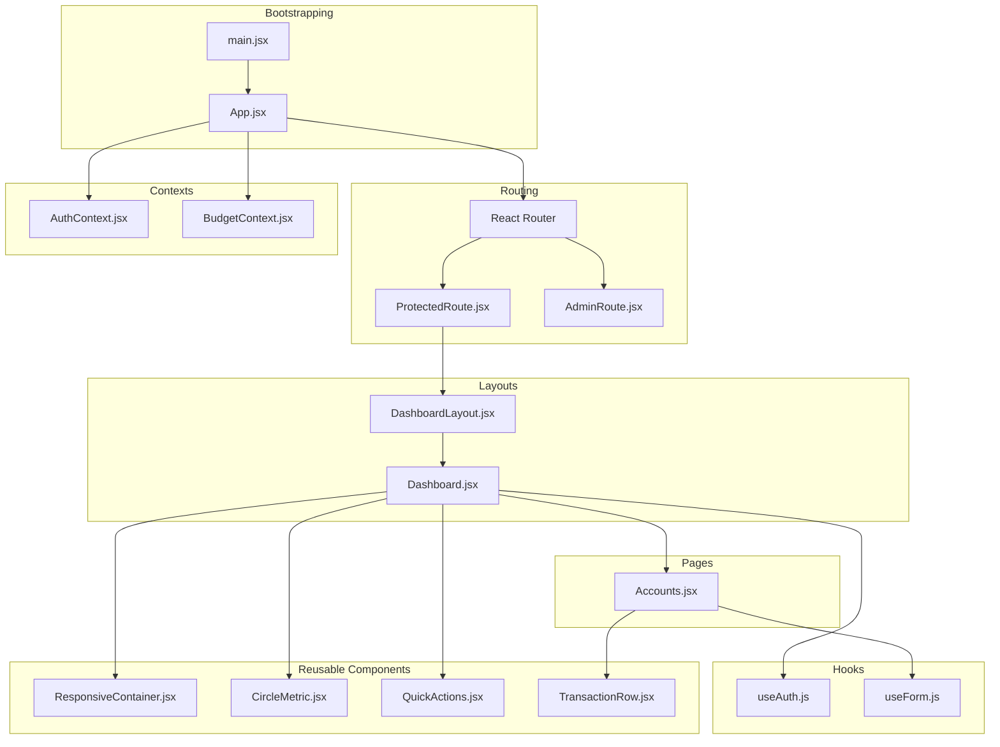
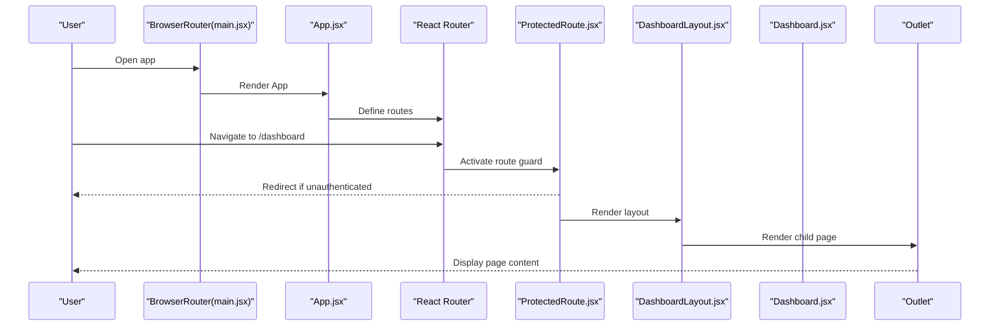
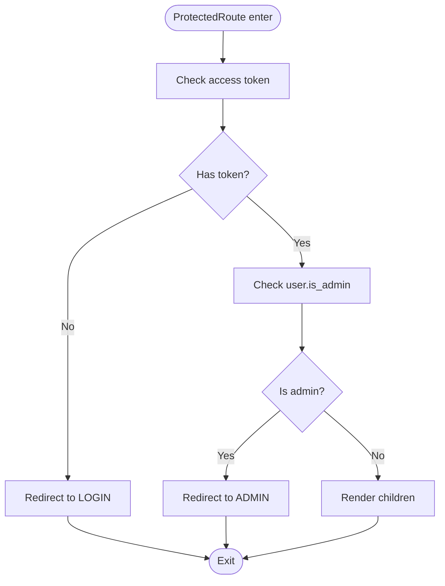
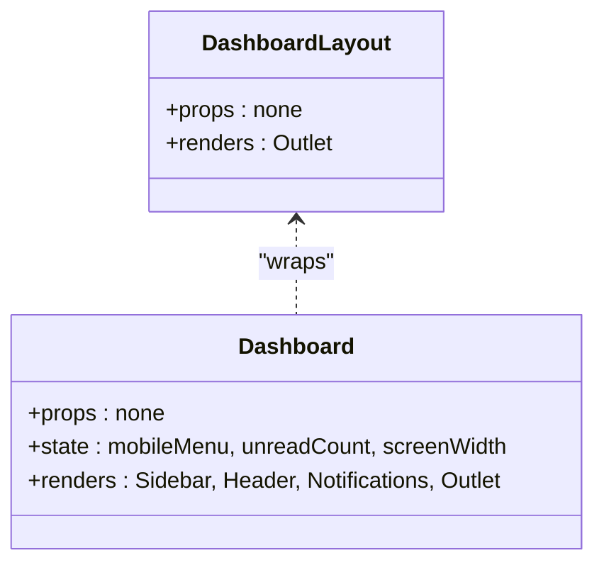
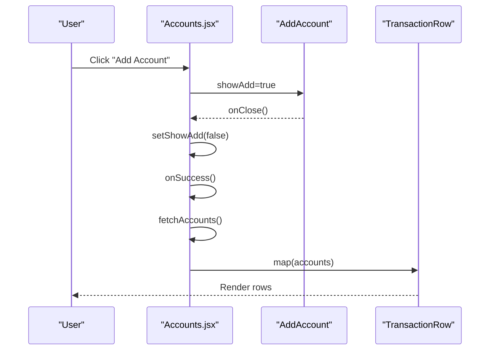
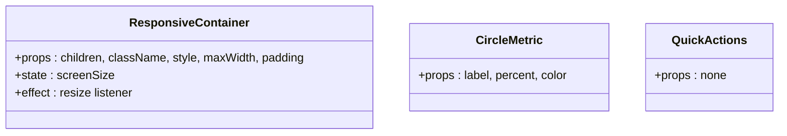
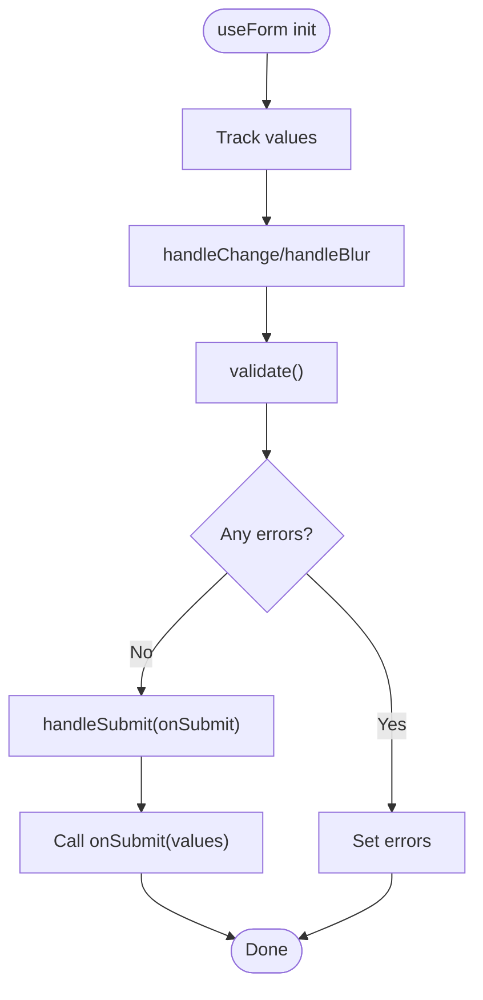
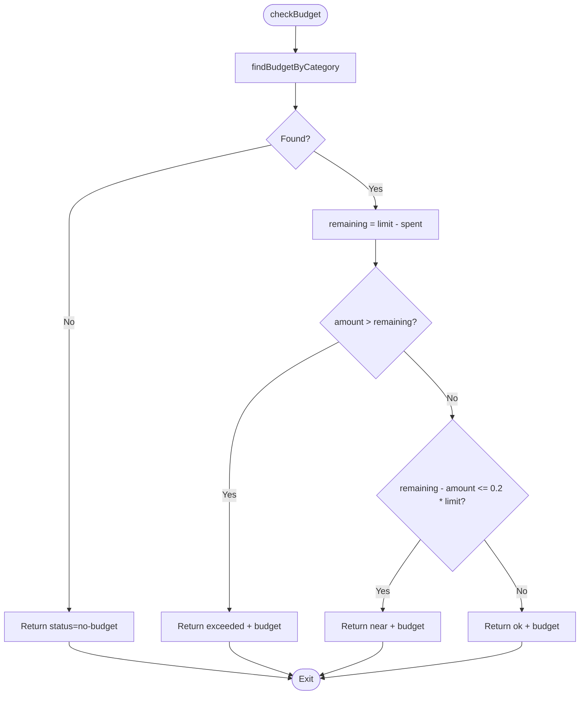
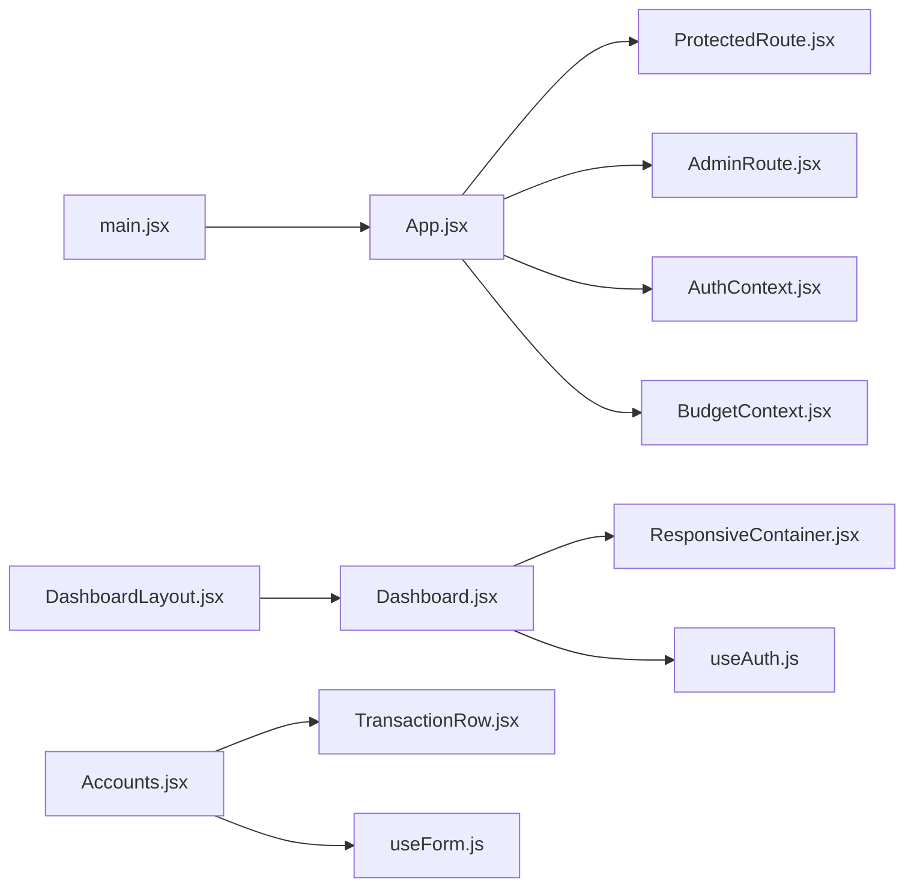

# Component Architecture

<cite>
**Referenced Files in This Document**
- [App.jsx](file://frontend/src/App.jsx)
- [main.jsx](file://frontend/src/main.jsx)
- [DashboardLayout.jsx](file://frontend/src/layouts/DashboardLayout.jsx)
- [Dashboard.jsx](file://frontend/src/pages/user/Dashboard.jsx)
- [Accounts.jsx](file://frontend/src/pages/user/Accounts.jsx)
- [ProtectedRoute.jsx](file://frontend/src/components/auth/ProtectedRoute.jsx)
- [AdminRoute.jsx](file://frontend/src/components/auth/AdminRoute.jsx)
- [AuthContext.jsx](file://frontend/src/context/AuthContext.jsx)
- [BudgetContext.jsx](file://frontend/src/context/BudgetContext.jsx)
- [useAuth.js](file://frontend/src/hooks/useAuth.js)
- [useForm.js](file://frontend/src/hooks/useForm.js)
- [ResponsiveContainer.jsx](file://frontend/src/components/common/ResponsiveContainer.jsx)
- [CircleMetric.jsx](file://frontend/src/components/user/dashboard/CircleMetric.jsx)
- [QuickActions.jsx](file://frontend/src/components/user/dashboard/QuickActions.jsx)
- [TransactionRow.jsx](file://frontend/src/components/user/transactions/TransactionRow.jsx)
</cite>

## Table of Contents
1. [Introduction](#introduction)
2. [Project Structure](#project-structure)
3. [Core Components](#core-components)
4. [Architecture Overview](#architecture-overview)
5. [Detailed Component Analysis](#detailed-component-analysis)
6. [Dependency Analysis](#dependency-analysis)
7. [Performance Considerations](#performance-considerations)
8. [Troubleshooting Guide](#troubleshooting-guide)
9. [Conclusion](#conclusion)
10. [Appendices](#appendices)

## Introduction
This document describes the component architecture and reusable component library of the Modern Digital Banking Dashboard. It explains the component hierarchy, prop interfaces, composition patterns, and how user-specific and authentication-related components interact. It also covers lifecycle management, event handling, inter-component communication, reusability strategies, testing approaches, performance optimization, memoization, and accessibility considerations.

## Project Structure
The frontend is a React application bootstrapped in main.jsx and routed via App.jsx. Layouts wrap page components, while contexts and hooks encapsulate cross-cutting concerns like authentication and budgets. Reusable components live under shared directories and are composed by user/admin pages.

**Diagram sources**
- [main.jsx:37-45](file://frontend/src/main.jsx#L37-L45)
- [App.jsx:78-168](file://frontend/src/App.jsx#L78-L168)
- [ProtectedRoute.jsx:27-37](file://frontend/src/components/auth/ProtectedRoute.jsx#L27-L37)
- [AdminRoute.jsx:12-22](file://frontend/src/components/auth/AdminRoute.jsx#L12-L22)
- [DashboardLayout.jsx:14-46](file://frontend/src/layouts/DashboardLayout.jsx#L14-L46)
- [Dashboard.jsx:58-520](file://frontend/src/pages/user/Dashboard.jsx#L58-L520)
- [Accounts.jsx:16-414](file://frontend/src/pages/user/Accounts.jsx#L16-L414)
- [AuthContext.jsx:23-46](file://frontend/src/context/AuthContext.jsx#L23-L46)
- [BudgetContext.jsx:22-60](file://frontend/src/context/BudgetContext.jsx#L22-L60)
- [useAuth.js:22-63](file://frontend/src/hooks/useAuth.js#L22-L63)
- [useForm.js:19-106](file://frontend/src/hooks/useForm.js#L19-L106)
- [ResponsiveContainer.jsx:11-69](file://frontend/src/components/common/ResponsiveContainer.jsx#L11-L69)
- [CircleMetric.jsx:9-53](file://frontend/src/components/user/dashboard/CircleMetric.jsx#L9-L53)
- [QuickActions.jsx:13-73](file://frontend/src/components/user/dashboard/QuickActions.jsx#L13-L73)
- [TransactionRow.jsx:4-95](file://frontend/src/components/user/transactions/TransactionRow.jsx#L4-L95)

**Section sources**
- [main.jsx:37-45](file://frontend/src/main.jsx#L37-L45)
- [App.jsx:78-168](file://frontend/src/App.jsx#L78-L168)

## Core Components
- Routing and guards:
  - App.jsx defines public, user dashboard, and admin routes and uses ProtectedRoute and AdminRoute wrappers.
  - ProtectedRoute enforces authentication and redirects unauthenticated or admin users accordingly.
  - AdminRoute enforces admin-only access.
- Layouts:
  - DashboardLayout provides a responsive main content area with Outlet for nested routes.
  - Dashboard wraps the layout and renders the sidebar, header, notifications, and outlet.
- Contexts:
  - AuthContext manages global auth state and refreshes tokens on mount.
  - BudgetContext exposes budgets and helpers to check and apply spending against limits.
- Hooks:
  - useAuth centralizes login/logout/update and exposes computed flags.
  - useForm provides form state, validation, and submission handling.
- Reusable components:
  - ResponsiveContainer standardizes responsive padding/max-width.
  - CircleMetric renders percentage-based metrics with chart visuals.
  - QuickActions provides quick-access cards to common flows.
  - TransactionRow displays a single transaction row with responsive styling.

**Section sources**
- [App.jsx:78-168](file://frontend/src/App.jsx#L78-L168)
- [ProtectedRoute.jsx:27-37](file://frontend/src/components/auth/ProtectedRoute.jsx#L27-L37)
- [AdminRoute.jsx:12-22](file://frontend/src/components/auth/AdminRoute.jsx#L12-L22)
- [DashboardLayout.jsx:14-46](file://frontend/src/layouts/DashboardLayout.jsx#L14-L46)
- [Dashboard.jsx:58-520](file://frontend/src/pages/user/Dashboard.jsx#L58-L520)
- [AuthContext.jsx:23-46](file://frontend/src/context/AuthContext.jsx#L23-L46)
- [BudgetContext.jsx:22-60](file://frontend/src/context/BudgetContext.jsx#L22-L60)
- [useAuth.js:22-63](file://frontend/src/hooks/useAuth.js#L22-L63)
- [useForm.js:19-106](file://frontend/src/hooks/useForm.js#L19-L106)
- [ResponsiveContainer.jsx:11-69](file://frontend/src/components/common/ResponsiveContainer.jsx#L11-L69)
- [CircleMetric.jsx:9-53](file://frontend/src/components/user/dashboard/CircleMetric.jsx#L9-L53)
- [QuickActions.jsx:13-73](file://frontend/src/components/user/dashboard/QuickActions.jsx#L13-L73)
- [TransactionRow.jsx:4-95](file://frontend/src/components/user/transactions/TransactionRow.jsx#L4-L95)

## Architecture Overview
The application follows a layout-driven routing pattern:
- main.jsx initializes providers and router.
- App.jsx defines routes and wraps protected/admin sections.
- ProtectedRoute/AdminRoute enforce permissions.
- DashboardLayout and Dashboard provide the authenticated shell.
- Pages (e.g., Accounts) render inside the dashboard outlet.
- Contexts and hooks enable state and logic reuse across components.

**Diagram sources**
- [main.jsx:37-45](file://frontend/src/main.jsx#L37-L45)
- [App.jsx:98-139](file://frontend/src/App.jsx#L98-L139)
- [ProtectedRoute.jsx:27-37](file://frontend/src/components/auth/ProtectedRoute.jsx#L27-L37)
- [DashboardLayout.jsx:14-46](file://frontend/src/layouts/DashboardLayout.jsx#L14-L46)
- [Dashboard.jsx:58-520](file://frontend/src/pages/user/Dashboard.jsx#L58-L520)

## Detailed Component Analysis

### Authentication and Route Guards
- ProtectedRoute:
  - Props: children (element to render if authorized).
  - Behavior: checks token and user role; redirects to login/admin dashboard if missing or admin.
- AdminRoute:
  - Props: children.
  - Behavior: ensures token and admin flag; otherwise redirects to login or user dashboard.
- AuthContext:
  - Exposes auth state and refresh mechanism; memoized provider value prevents unnecessary re-renders.
- useAuth hook:
  - Returns user flags and actions; memoizes return object to avoid churn.

**Diagram sources**
- [ProtectedRoute.jsx:27-37](file://frontend/src/components/auth/ProtectedRoute.jsx#L27-L37)

**Section sources**
- [ProtectedRoute.jsx:27-37](file://frontend/src/components/auth/ProtectedRoute.jsx#L27-L37)
- [AdminRoute.jsx:12-22](file://frontend/src/components/auth/AdminRoute.jsx#L12-L22)
- [AuthContext.jsx:23-46](file://frontend/src/context/AuthContext.jsx#L23-L46)
- [useAuth.js:22-63](file://frontend/src/hooks/useAuth.js#L22-L63)

### Dashboard Shell and Layout
- DashboardLayout:
  - Props: none (uses Outlet).
  - Behavior: responsive flex layout; delegates to children via Outlet.
- Dashboard:
  - Props: none.
  - Behavior: renders sidebar, header, notifications, and outlet; manages mobile menu, unread alerts, and responsive styles.

**Diagram sources**
- [DashboardLayout.jsx:14-46](file://frontend/src/layouts/DashboardLayout.jsx#L14-L46)
- [Dashboard.jsx:58-520](file://frontend/src/pages/user/Dashboard.jsx#L58-L520)

**Section sources**
- [DashboardLayout.jsx:14-46](file://frontend/src/layouts/DashboardLayout.jsx#L14-L46)
- [Dashboard.jsx:58-520](file://frontend/src/pages/user/Dashboard.jsx#L58-L520)

### User-Specific Components and Composition Patterns
- Accounts page composes:
  - Responsive layout and state.
  - AddAccount modal (composition via props onClose/onSuccess).
  - Delete confirmation modal with PIN entry (composition via props and internal state).
  - TransactionRow for list rendering.
- Composition patterns:
  - Props for callbacks (onClose, onSuccess).
  - Internal state for UI toggles and user input.
  - Conditional rendering for modals and empty states.

**Diagram sources**
- [Accounts.jsx:16-414](file://frontend/src/pages/user/Accounts.jsx#L16-L414)
- [TransactionRow.jsx:4-95](file://frontend/src/components/user/transactions/TransactionRow.jsx#L4-L95)

**Section sources**
- [Accounts.jsx:16-414](file://frontend/src/pages/user/Accounts.jsx#L16-L414)
- [TransactionRow.jsx:4-95](file://frontend/src/components/user/transactions/TransactionRow.jsx#L4-L95)

### Reusable Components Library
- ResponsiveContainer:
  - Props: children, className, style, maxWidth, padding.
  - Behavior: computes responsive padding/max-width and cleans up listeners.
- CircleMetric:
  - Props: label, percent, color.
  - Behavior: renders a circular chart with hover effects.
- QuickActions:
  - Props: none.
  - Behavior: renders four quick-action cards; navigates on click.

**Diagram sources**
- [ResponsiveContainer.jsx:11-69](file://frontend/src/components/common/ResponsiveContainer.jsx#L11-L69)
- [CircleMetric.jsx:9-53](file://frontend/src/components/user/dashboard/CircleMetric.jsx#L9-L53)
- [QuickActions.jsx:13-73](file://frontend/src/components/user/dashboard/QuickActions.jsx#L13-L73)

**Section sources**
- [ResponsiveContainer.jsx:11-69](file://frontend/src/components/common/ResponsiveContainer.jsx#L11-L69)
- [CircleMetric.jsx:9-53](file://frontend/src/components/user/dashboard/CircleMetric.jsx#L9-L53)
- [QuickActions.jsx:13-73](file://frontend/src/components/user/dashboard/QuickActions.jsx#L13-L73)

### Form Handling and Validation
- useForm:
  - Props: initialValues, validationRules.
  - Behavior: manages values, errors, touched, isSubmitting; supports handleChange, handleBlur, handleSubmit, reset, and setters.

**Diagram sources**
- [useForm.js:19-106](file://frontend/src/hooks/useForm.js#L19-L106)

**Section sources**
- [useForm.js:19-106](file://frontend/src/hooks/useForm.js#L19-L106)

### Budget Context and Business Logic
- BudgetContext:
  - State: budgets array.
  - Helpers: findBudgetByCategory, getRemainingBudget, isNearBudgetThreshold.
  - Methods: checkBudget(category, amount), applyPaymentToBudget(category, amount).

**Diagram sources**
- [BudgetContext.jsx:14-53](file://frontend/src/context/BudgetContext.jsx#L14-L53)

**Section sources**
- [BudgetContext.jsx:22-60](file://frontend/src/context/BudgetContext.jsx#L22-L60)

## Dependency Analysis
- Providers and bootstrap:
  - main.jsx wraps the app with BrowserRouter and BudgetProvider; App.jsx composes AuthContext via route guards/providers.
- Routing dependencies:
  - App.jsx depends on ProtectedRoute/AdminRoute; DashboardLayout depends on Outlet.
- Component dependencies:
  - Dashboard depends on ResponsiveContainer and navigation; Accounts composes TransactionRow and modals.
- Context and hook dependencies:
  - AuthContext and BudgetContext are consumed by pages and components; useAuth and useForm are used by forms and pages.

**Diagram sources**
- [main.jsx:37-45](file://frontend/src/main.jsx#L37-L45)
- [App.jsx:78-168](file://frontend/src/App.jsx#L78-L168)
- [ProtectedRoute.jsx:27-37](file://frontend/src/components/auth/ProtectedRoute.jsx#L27-L37)
- [AdminRoute.jsx:12-22](file://frontend/src/components/auth/AdminRoute.jsx#L12-L22)
- [AuthContext.jsx:23-46](file://frontend/src/context/AuthContext.jsx#L23-L46)
- [BudgetContext.jsx:22-60](file://frontend/src/context/BudgetContext.jsx#L22-L60)
- [DashboardLayout.jsx:14-46](file://frontend/src/layouts/DashboardLayout.jsx#L14-L46)
- [Dashboard.jsx:58-520](file://frontend/src/pages/user/Dashboard.jsx#L58-L520)
- [Accounts.jsx:16-414](file://frontend/src/pages/user/Accounts.jsx#L16-L414)
- [TransactionRow.jsx:4-95](file://frontend/src/components/user/transactions/TransactionRow.jsx#L4-L95)
- [useAuth.js:22-63](file://frontend/src/hooks/useAuth.js#L22-L63)
- [useForm.js:19-106](file://frontend/src/hooks/useForm.js#L19-L106)

**Section sources**
- [main.jsx:37-45](file://frontend/src/main.jsx#L37-L45)
- [App.jsx:78-168](file://frontend/src/App.jsx#L78-L168)

## Performance Considerations
- Memoization:
  - AuthContext memoizes provider value to prevent downstream re-renders.
  - useAuth memoizes returned object to avoid unnecessary prop churn.
- Event cleanup:
  - ResponsiveContainer and Dashboard remove event listeners on unmount.
- Rendering:
  - QuickActions and CircleMetric rely on external libraries; ensure stable props to minimize re-renders.
- State locality:
  - Prefer local component state for UI toggles (e.g., modals) and derived state from contexts/hooks.

[No sources needed since this section provides general guidance]

## Troubleshooting Guide
- Authentication issues:
  - ProtectedRoute/AdminRoute redirect loops often indicate missing tokens or incorrect user roles; verify storage and AuthContext initialization.
- Context not available:
  - Ensure providers are mounted in main.jsx and App.jsx route wrappers.
- Form validation errors:
  - useForm requires validationRules; ensure rules return { valid, error } shape.
- Budget checks:
  - checkBudget returns explicit statuses; handle no-budget, exceeded, near, ok cases in consumers.

**Section sources**
- [ProtectedRoute.jsx:27-37](file://frontend/src/components/auth/ProtectedRoute.jsx#L27-L37)
- [AdminRoute.jsx:12-22](file://frontend/src/components/auth/AdminRoute.jsx#L12-L22)
- [AuthContext.jsx:23-46](file://frontend/src/context/AuthContext.jsx#L23-L46)
- [useForm.js:19-106](file://frontend/src/hooks/useForm.js#L19-L106)
- [BudgetContext.jsx:35-53](file://frontend/src/context/BudgetContext.jsx#L35-L53)

## Conclusion
The component architecture emphasizes:
- Clear separation of concerns via contexts and hooks.
- Layout-driven routing with robust guards.
- Reusable components for responsiveness and common UI patterns.
- Composable pages that delegate to smaller, focused components.
Adhering to memoization, event cleanup, and stable props improves performance and reliability.

[No sources needed since this section summarizes without analyzing specific files]

## Appendices

### Component Lifecycle Management
- Mounting:
  - AuthContext tries token refresh on mount.
  - Dashboard initializes responsive state and fetches alerts.
  - Accounts fetches data on mount and sets up resize handlers.
- Updating:
  - useAuth memoizes return object; useForm normalizes updates via setters.
- Unmounting:
  - Dashboard removes window listeners; ResponsiveContainer removes resize listeners.

**Section sources**
- [AuthContext.jsx:40-42](file://frontend/src/context/AuthContext.jsx#L40-L42)
- [Dashboard.jsx:91-116](file://frontend/src/pages/user/Dashboard.jsx#L91-L116)
- [Accounts.jsx:35-43](file://frontend/src/pages/user/Accounts.jsx#L35-L43)
- [ResponsiveContainer.jsx:23-33](file://frontend/src/components/common/ResponsiveContainer.jsx#L23-L33)

### Event Handling Patterns
- Navigation:
  - useNavigate used in Dashboard and Accounts for programmatic routing.
- UI toggles:
  - Controlled via component state (e.g., mobile menu, modals).
- Input handling:
  - useForm manages controlled inputs and validation on blur/change.

**Section sources**
- [Dashboard.jsx:222-226](file://frontend/src/pages/user/Dashboard.jsx#L222-L226)
- [Accounts.jsx:73-90](file://frontend/src/pages/user/Accounts.jsx#L73-L90)
- [useForm.js:25-44](file://frontend/src/hooks/useForm.js#L25-L44)

### Component Communication Strategies
- Parent-to-child:
  - Props (e.g., onClose/onSuccess in Accounts).
- Child-to-parent:
  - Callback props and state lifting (e.g., modal toggles).
- Cross-component:
  - Contexts (AuthContext, BudgetContext) and hooks (useAuth, useForm).

**Section sources**
- [Accounts.jsx:287-295](file://frontend/src/pages/user/Accounts.jsx#L287-L295)
- [AuthContext.jsx:23-46](file://frontend/src/context/AuthContext.jsx#L23-L46)
- [BudgetContext.jsx:22-60](file://frontend/src/context/BudgetContext.jsx#L22-L60)
- [useAuth.js:22-63](file://frontend/src/hooks/useAuth.js#L22-L63)
- [useForm.js:19-106](file://frontend/src/hooks/useForm.js#L19-L106)

### Examples of Component Reusability
- ResponsiveContainer: reusable across pages for consistent spacing.
- CircleMetric: reusable metric card with configurable percent/color.
- QuickActions: reusable action cards with navigation.
- TransactionRow: reusable list item for transaction lists.

**Section sources**
- [ResponsiveContainer.jsx:11-69](file://frontend/src/components/common/ResponsiveContainer.jsx#L11-L69)
- [CircleMetric.jsx:9-53](file://frontend/src/components/user/dashboard/CircleMetric.jsx#L9-L53)
- [QuickActions.jsx:13-73](file://frontend/src/components/user/dashboard/QuickActions.jsx#L13-L73)
- [TransactionRow.jsx:4-95](file://frontend/src/components/user/transactions/TransactionRow.jsx#L4-L95)

### Prop Drilling Alternatives
- Contexts:
  - AuthContext and BudgetContext eliminate deep prop passing for auth and budgets.
- Hooks:
  - useAuth and useForm encapsulate state/logic to reduce prop depth.

**Section sources**
- [AuthContext.jsx:23-46](file://frontend/src/context/AuthContext.jsx#L23-L46)
- [BudgetContext.jsx:22-60](file://frontend/src/context/BudgetContext.jsx#L22-L60)
- [useAuth.js:22-63](file://frontend/src/hooks/useAuth.js#L22-L63)
- [useForm.js:19-106](file://frontend/src/hooks/useForm.js#L19-L106)

### Component Testing Approaches
- Unit tests for hooks:
  - useAuth and useForm can be tested by mocking navigation and storage.
- Component snapshot tests:
  - DashboardLayout, CircleMetric, QuickActions, TransactionRow can be rendered with minimal props.
- Integration tests:
  - ProtectedRoute/AdminRoute can be tested by simulating token/user presence and route transitions.

[No sources needed since this section provides general guidance]

### Accessibility Considerations
- Semantic structure:
  - Use of native buttons and links; ensure focus order is logical.
- Keyboard navigation:
  - Interactive elements should be reachable via Tab; consider focus traps for modals.
- ARIA and labeling:
  - Provide titles and labels for interactive elements (e.g., notifications badge).
- Color contrast:
  - Ensure sufficient contrast for text and indicators (e.g., credit/debit colors).
- Responsive behavior:
  - Ensure touch targets are adequately sized and readable across breakpoints.

[No sources needed since this section provides general guidance]