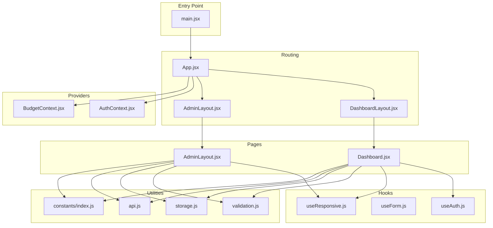
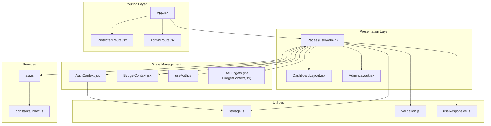
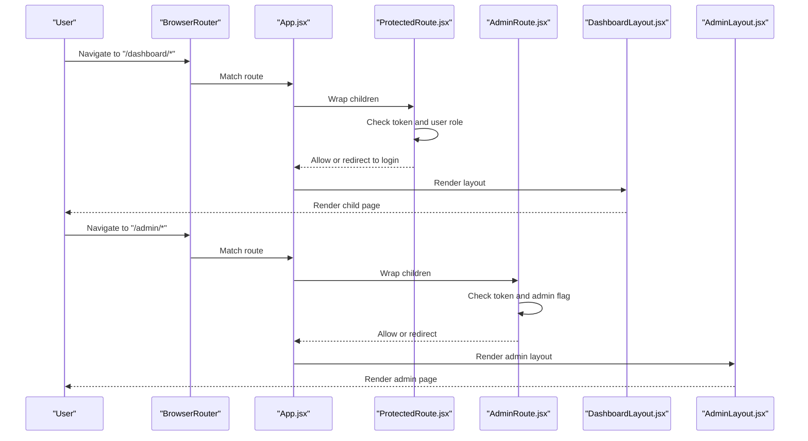
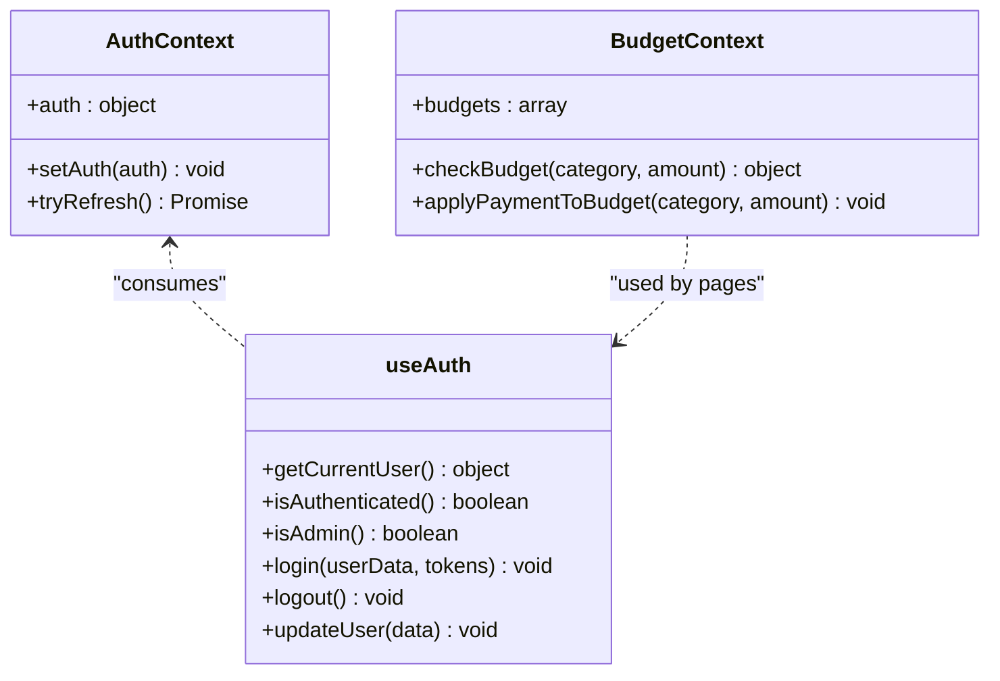
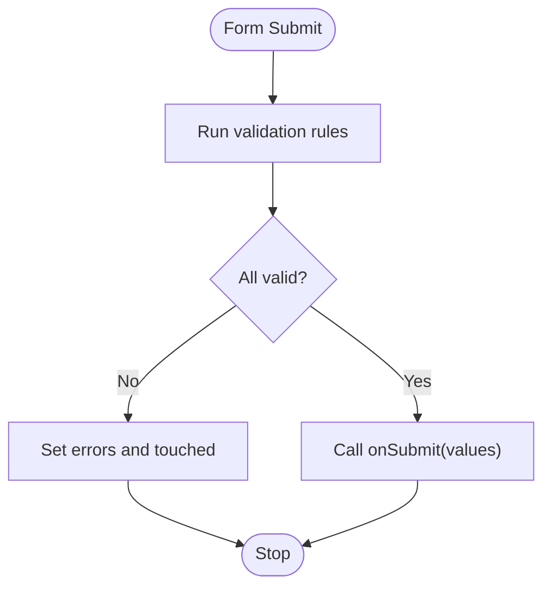
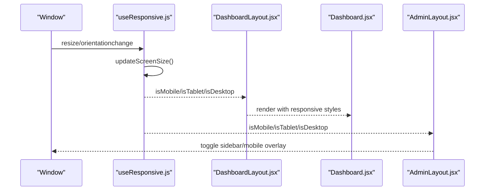
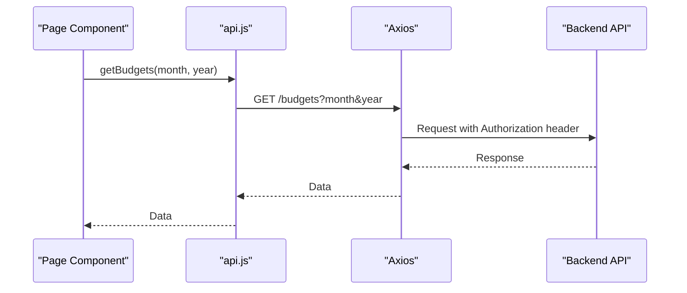
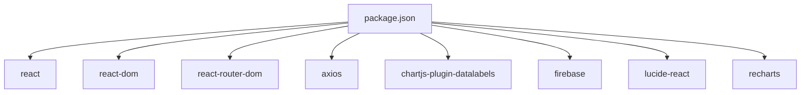

# Frontend Architecture

<cite>
**Referenced Files in This Document**
- [main.jsx](file://frontend/src/main.jsx)
- [App.jsx](file://frontend/src/App.jsx)
- [DashboardLayout.jsx](file://frontend/src/layouts/DashboardLayout.jsx)
- [Dashboard.jsx](file://frontend/src/pages/user/Dashboard.jsx)
- [AdminLayout.jsx](file://frontend/src/pages/admin/AdminLayout.jsx)
- [ProtectedRoute.jsx](file://frontend/src/components/auth/ProtectedRoute.jsx)
- [AdminRoute.jsx](file://frontend/src/components/auth/AdminRoute.jsx)
- [AuthContext.jsx](file://frontend/src/context/AuthContext.jsx)
- [BudgetContext.jsx](file://frontend/src/context/BudgetContext.jsx)
- [useAuth.js](file://frontend/src/hooks/useAuth.js)
- [useForm.js](file://frontend/src/hooks/useForm.js)
- [useResponsive.js](file://frontend/src/hooks/useResponsive.js)
- [validation.js](file://frontend/src/utils/validation.js)
- [storage.js](file://frontend/src/utils/storage.js)
- [api.js](file://frontend/src/services/api.js)
- [constants/index.js](file://frontend/src/constants/index.js)
- [tailwind.config.js](file://frontend/tailwind.config.js)
- [package.json](file://frontend/package.json)
</cite>

## Table of Contents
1. [Introduction](#introduction)
2. [Project Structure](#project-structure)
3. [Core Components](#core-components)
4. [Architecture Overview](#architecture-overview)
5. [Detailed Component Analysis](#detailed-component-analysis)
6. [Dependency Analysis](#dependency-analysis)
7. [Performance Considerations](#performance-considerations)
8. [Troubleshooting Guide](#troubleshooting-guide)
9. [Conclusion](#conclusion)

## Introduction
This document describes the frontend architecture of a React-based digital banking application. It covers the application bootstrap, routing configuration, layout system, context-based state management, reusable hooks, form handling and validation, styling and responsive design, and integration with backend APIs. The goal is to provide a clear understanding of how components are organized, how data flows through the system, and how global state is managed for both authentication and budget-related features.

## Project Structure
The frontend is structured around a classic React application with:
- Entry point mounting the application with routing and providers
- Centralized routing with nested routes and layout wrappers
- Context providers for global state (authentication and budgets)
- Reusable hooks for forms, auth, and responsive behavior
- Utility modules for API communication, storage, and validation
- Tailwind CSS for styling and responsive design

**Diagram sources**
- [main.jsx:37-45](file://frontend/src/main.jsx#L37-L45)
- [App.jsx:78-167](file://frontend/src/App.jsx#L78-L167)
- [DashboardLayout.jsx:14-46](file://frontend/src/layouts/DashboardLayout.jsx#L14-L46)
- [AdminLayout.jsx:20-300](file://frontend/src/pages/admin/AdminLayout.jsx#L20-L300)
- [AuthContext.jsx:23-46](file://frontend/src/context/AuthContext.jsx#L23-L46)
- [BudgetContext.jsx:22-62](file://frontend/src/context/BudgetContext.jsx#L22-L62)
- [Dashboard.jsx:58-522](file://frontend/src/pages/user/Dashboard.jsx#L58-L522)
- [AdminLayout.jsx:20-300](file://frontend/src/pages/admin/AdminLayout.jsx#L20-L300)
- [useAuth.js:22-63](file://frontend/src/hooks/useAuth.js#L22-L63)
- [useForm.js:19-106](file://frontend/src/hooks/useForm.js#L19-L106)
- [useResponsive.js:25-113](file://frontend/src/hooks/useResponsive.js#L25-L113)
- [validation.js:11-177](file://frontend/src/utils/validation.js#L11-L177)
- [storage.js:81-99](file://frontend/src/utils/storage.js#L81-L99)
- [api.js:19-72](file://frontend/src/services/api.js#L19-L72)
- [constants/index.js:64-229](file://frontend/src/constants/index.js#L64-L229)

**Section sources**
- [main.jsx:10-46](file://frontend/src/main.jsx#L10-L46)
- [App.jsx:9-171](file://frontend/src/App.jsx#L9-L171)
- [DashboardLayout.jsx:10-50](file://frontend/src/layouts/DashboardLayout.jsx#L10-L50)
- [AdminLayout.jsx:1-301](file://frontend/src/pages/admin/AdminLayout.jsx#L1-L301)
- [constants/index.js:6-62](file://frontend/src/constants/index.js#L6-L62)

## Core Components
- Application entry point initializes routing, providers, and Firebase messaging.
- Central routing defines public, user dashboard, transfers, payment results, admin routes, and nested layouts.
- Layouts provide shared UI scaffolding for dashboard and admin sections.
- Context providers manage global authentication and budget state.
- Hooks encapsulate reusable logic for authentication, form handling, and responsive behavior.
- Utilities centralize API requests, local storage operations, and validation rules.

Key implementation references:
- [Application bootstrap and providers:37-45](file://frontend/src/main.jsx#L37-L45)
- [Routing configuration and nested routes:78-167](file://frontend/src/App.jsx#L78-L167)
- [Dashboard layout wrapper:14-46](file://frontend/src/layouts/DashboardLayout.jsx#L14-L46)
- [Admin layout with responsive sidebar:20-300](file://frontend/src/pages/admin/AdminLayout.jsx#L20-L300)
- [Authentication context provider:23-46](file://frontend/src/context/AuthContext.jsx#L23-L46)
- [Budget context provider and helpers:22-62](file://frontend/src/context/BudgetContext.jsx#L22-L62)
- [Authentication hook:22-63](file://frontend/src/hooks/useAuth.js#L22-L63)
- [Reusable form hook:19-106](file://frontend/src/hooks/useForm.js#L19-L106)
- [Responsive hook:25-113](file://frontend/src/hooks/useResponsive.js#L25-L113)
- [Validation utilities:11-177](file://frontend/src/utils/validation.js#L11-L177)
- [Storage utilities:81-99](file://frontend/src/utils/storage.js#L81-L99)
- [API service:19-72](file://frontend/src/services/api.js#L19-L72)

**Section sources**
- [main.jsx:10-46](file://frontend/src/main.jsx#L10-L46)
- [App.jsx:78-167](file://frontend/src/App.jsx#L78-L167)
- [DashboardLayout.jsx:14-46](file://frontend/src/layouts/DashboardLayout.jsx#L14-L46)
- [AdminLayout.jsx:20-300](file://frontend/src/pages/admin/AdminLayout.jsx#L20-L300)
- [AuthContext.jsx:23-46](file://frontend/src/context/AuthContext.jsx#L23-L46)
- [BudgetContext.jsx:22-62](file://frontend/src/context/BudgetContext.jsx#L22-L62)
- [useAuth.js:22-63](file://frontend/src/hooks/useAuth.js#L22-L63)
- [useForm.js:19-106](file://frontend/src/hooks/useForm.js#L19-L106)
- [useResponsive.js:25-113](file://frontend/src/hooks/useResponsive.js#L25-L113)
- [validation.js:11-177](file://frontend/src/utils/validation.js#L11-L177)
- [storage.js:81-99](file://frontend/src/utils/storage.js#L81-L99)
- [api.js:19-72](file://frontend/src/services/api.js#L19-L72)

## Architecture Overview
The application follows a layered architecture:
- Presentation layer: Pages and components organized by feature and role (user/admin).
- Routing layer: Centralized routes with protected and admin route guards.
- State management layer: Context providers for auth and budgets; custom hooks for domain-specific logic.
- Services layer: Axios-based API client with interceptors and convenience methods.
- Utilities layer: Storage abstraction, validation helpers, and constants.

**Diagram sources**
- [App.jsx:78-167](file://frontend/src/App.jsx#L78-L167)
- [ProtectedRoute.jsx:27-37](file://frontend/src/components/auth/ProtectedRoute.jsx#L27-L37)
- [AdminRoute.jsx:12-22](file://frontend/src/components/auth/AdminRoute.jsx#L12-L22)
- [AuthContext.jsx:23-46](file://frontend/src/context/AuthContext.jsx#L23-L46)
- [BudgetContext.jsx:22-62](file://frontend/src/context/BudgetContext.jsx#L22-L62)
- [useAuth.js:22-63](file://frontend/src/hooks/useAuth.js#L22-L63)
- [api.js:19-72](file://frontend/src/services/api.js#L19-L72)
- [constants/index.js:64-229](file://frontend/src/constants/index.js#L64-L229)
- [storage.js:81-99](file://frontend/src/utils/storage.js#L81-L99)
- [validation.js:11-177](file://frontend/src/utils/validation.js#L11-L177)
- [useResponsive.js:25-113](file://frontend/src/hooks/useResponsive.js#L25-L113)

## Detailed Component Analysis

### Routing and Guards
- Central route configuration organizes public, user dashboard, transfers, payment results, bills, rewards, insights, alerts, settings, and admin sections.
- ProtectedRoute ensures only authenticated non-admin users can access dashboard routes.
- AdminRoute enforces admin-only access for admin routes.

**Diagram sources**
- [App.jsx:78-167](file://frontend/src/App.jsx#L78-L167)
- [ProtectedRoute.jsx:27-37](file://frontend/src/components/auth/ProtectedRoute.jsx#L27-L37)
- [AdminRoute.jsx:12-22](file://frontend/src/components/auth/AdminRoute.jsx#L12-L22)
- [DashboardLayout.jsx:14-46](file://frontend/src/layouts/DashboardLayout.jsx#L14-L46)
- [AdminLayout.jsx:20-300](file://frontend/src/pages/admin/AdminLayout.jsx#L20-L300)

**Section sources**
- [App.jsx:78-167](file://frontend/src/App.jsx#L78-L167)
- [ProtectedRoute.jsx:27-37](file://frontend/src/components/auth/ProtectedRoute.jsx#L27-L37)
- [AdminRoute.jsx:12-22](file://frontend/src/components/auth/AdminRoute.jsx#L12-L22)

### Context-Based State Management
- AuthContext manages authentication state and refresh flow via API.
- BudgetContext provides budget data, checks limits, and updates spending after payments.

**Diagram sources**
- [AuthContext.jsx:23-46](file://frontend/src/context/AuthContext.jsx#L23-L46)
- [BudgetContext.jsx:22-62](file://frontend/src/context/BudgetContext.jsx#L22-L62)
- [useAuth.js:22-63](file://frontend/src/hooks/useAuth.js#L22-L63)

**Section sources**
- [AuthContext.jsx:23-46](file://frontend/src/context/AuthContext.jsx#L23-L46)
- [BudgetContext.jsx:22-62](file://frontend/src/context/BudgetContext.jsx#L22-L62)
- [useAuth.js:22-63](file://frontend/src/hooks/useAuth.js#L22-L63)

### Form Handling and Validation
- useForm provides centralized form state, validation, touch tracking, and submission handling.
- Validation utilities enforce email, phone, identifier, password, PIN, amount, and required-field rules.

**Diagram sources**
- [useForm.js:60-75](file://frontend/src/hooks/useForm.js#L60-L75)
- [validation.js:11-177](file://frontend/src/utils/validation.js#L11-L177)

**Section sources**
- [useForm.js:19-106](file://frontend/src/hooks/useForm.js#L19-L106)
- [validation.js:11-177](file://frontend/src/utils/validation.js#L11-L177)

### Layouts and Responsive Design
- DashboardLayout wraps child routes with a responsive main area and outlet rendering.
- Dashboard and Admin layouts implement responsive sidebars, mobile overlays, and dynamic styling based on viewport size.
- useResponsive provides breakpoints and responsive helpers for consistent UI scaling.

**Diagram sources**
- [useResponsive.js:25-113](file://frontend/src/hooks/useResponsive.js#L25-L113)
- [DashboardLayout.jsx:14-46](file://frontend/src/layouts/DashboardLayout.jsx#L14-L46)
- [Dashboard.jsx:58-522](file://frontend/src/pages/user/Dashboard.jsx#L58-L522)
- [AdminLayout.jsx:20-300](file://frontend/src/pages/admin/AdminLayout.jsx#L20-L300)

**Section sources**
- [DashboardLayout.jsx:14-46](file://frontend/src/layouts/DashboardLayout.jsx#L14-L46)
- [Dashboard.jsx:58-522](file://frontend/src/pages/user/Dashboard.jsx#L58-L522)
- [AdminLayout.jsx:20-300](file://frontend/src/pages/admin/AdminLayout.jsx#L20-L300)
- [useResponsive.js:25-113](file://frontend/src/hooks/useResponsive.js#L25-L113)

### API Integration and Data Flow
- api.js configures Axios with base URL and attaches Authorization headers using tokens from storage.
- Pages consume API functions for budgets, rewards, insights, transactions, and bills.
- Constants define endpoints and messages for centralized configuration.

**Diagram sources**
- [api.js:19-72](file://frontend/src/services/api.js#L19-L72)
- [constants/index.js:64-132](file://frontend/src/constants/index.js#L64-L132)

**Section sources**
- [api.js:19-72](file://frontend/src/services/api.js#L19-L72)
- [constants/index.js:64-132](file://frontend/src/constants/index.js#L64-L132)

## Dependency Analysis
External dependencies include React, React Router, Axios, Chart.js, Recharts, Lucide icons, and Tailwind CSS. Internal dependencies connect routing, contexts, hooks, utilities, and services.

**Diagram sources**
- [package.json:12-35](file://frontend/package.json#L12-L35)

**Section sources**
- [package.json:12-35](file://frontend/package.json#L12-L35)

## Performance Considerations
- Memoization: AuthContext uses memoized context value to prevent unnecessary re-renders.
- Responsive hooks debounce resize events using requestAnimationFrame to avoid layout thrashing.
- Conditional rendering: Layouts and modals only render when needed (e.g., mobile overlays).
- API caching: Consider adding caching strategies for repeated queries (e.g., recent transactions).
- Bundle size: Keep external dependencies minimal and lazy-load heavy components where appropriate.

[No sources needed since this section provides general guidance]

## Troubleshooting Guide
Common issues and resolutions:
- Authentication failures: Verify token presence and refresh flow in AuthContext; confirm storage keys and API refresh endpoint.
- Route guard redirects: Ensure ProtectedRoute and AdminRoute check both token and user role flags.
- Form validation errors: Confirm validation rules match useForm expectations and that touched state is handled properly.
- Responsive layout glitches: Check useResponsive hook event listeners and ensure cleanup on unmount.
- API errors: Inspect Axios interceptor attaching Authorization headers and verify backend CORS and base URL configuration.

**Section sources**
- [AuthContext.jsx:23-46](file://frontend/src/context/AuthContext.jsx#L23-L46)
- [ProtectedRoute.jsx:27-37](file://frontend/src/components/auth/ProtectedRoute.jsx#L27-L37)
- [AdminRoute.jsx:12-22](file://frontend/src/components/auth/AdminRoute.jsx#L12-L22)
- [useForm.js:19-106](file://frontend/src/hooks/useForm.js#L19-L106)
- [useResponsive.js:25-113](file://frontend/src/hooks/useResponsive.js#L25-L113)
- [api.js:19-31](file://frontend/src/services/api.js#L19-L31)

## Conclusion
The frontend architecture employs a clear separation of concerns with centralized routing, layout-based page organization, and context-based state management. Reusable hooks and utilities streamline form handling, validation, and responsive behavior. The API service and constants provide a consistent integration surface with the backend. Together, these patterns enable maintainable, scalable development for the banking application’s user and admin experiences.