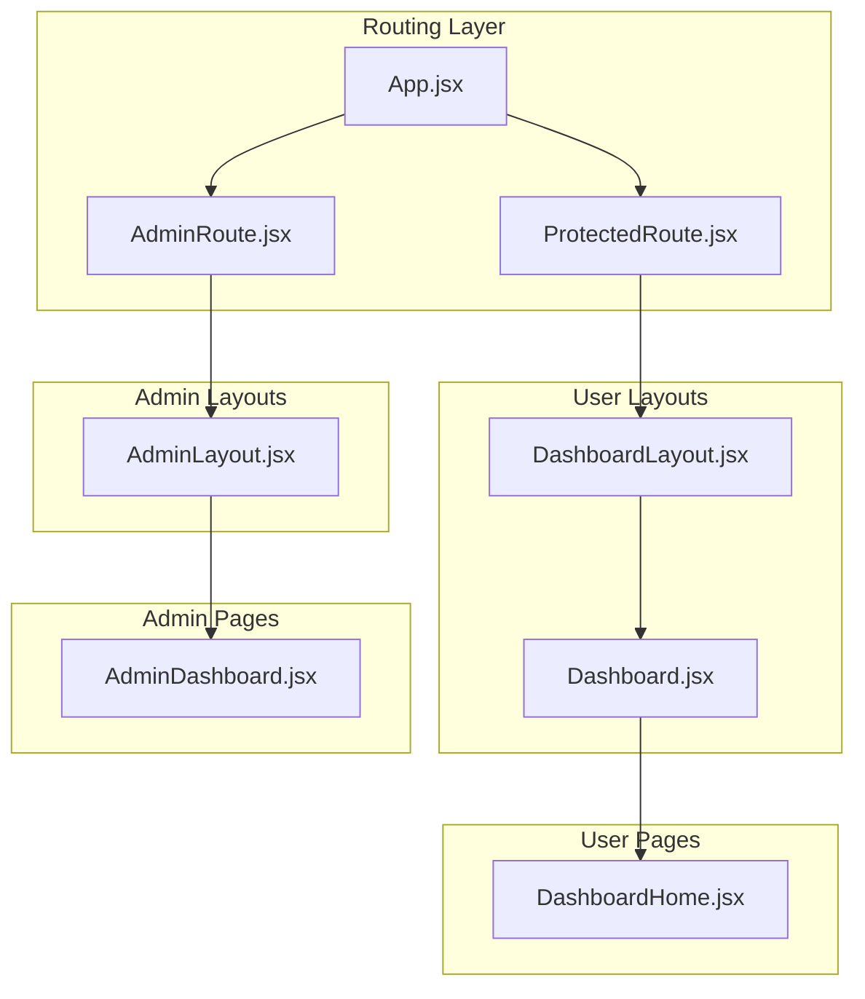
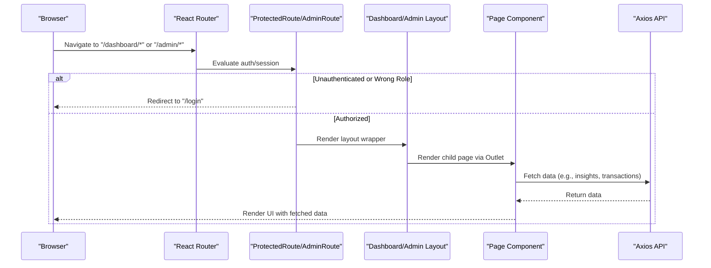
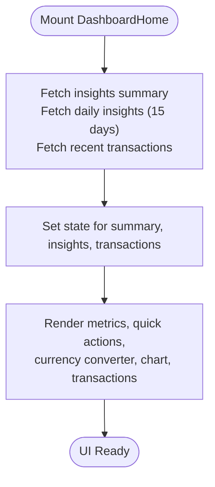
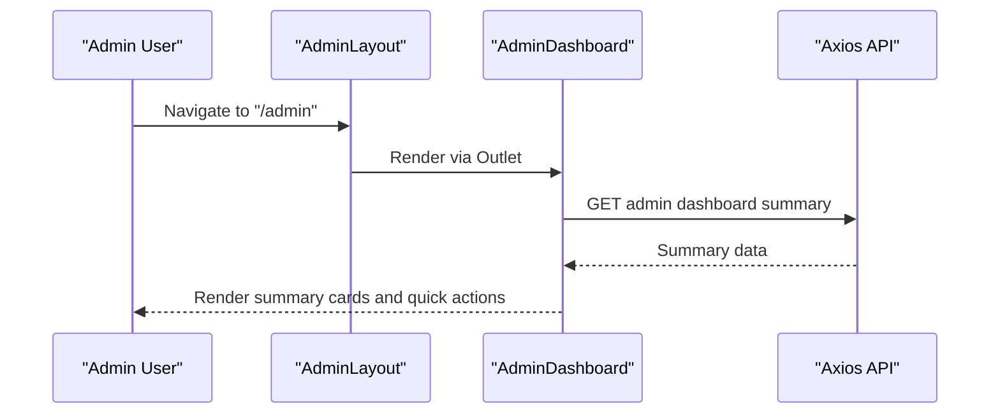
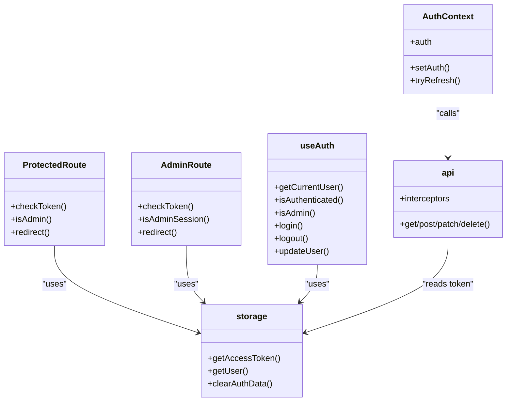
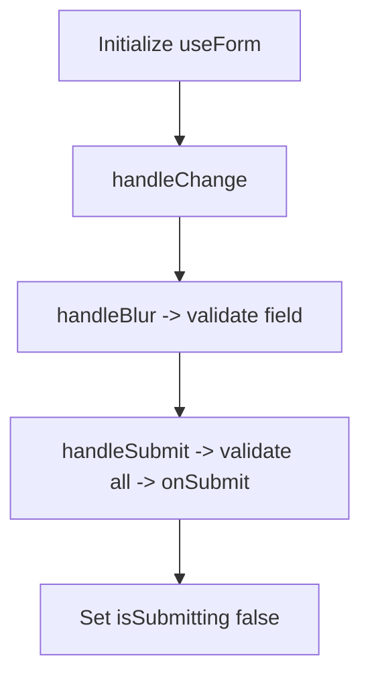
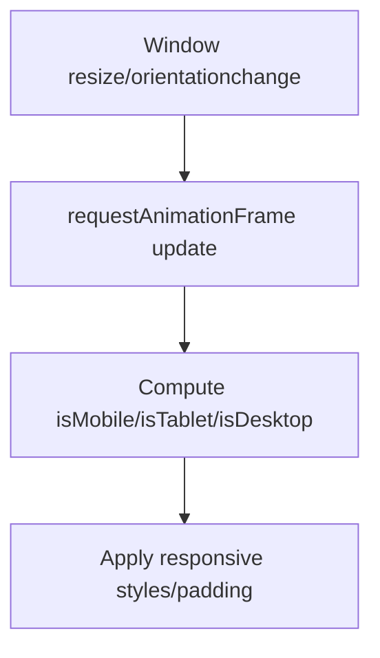
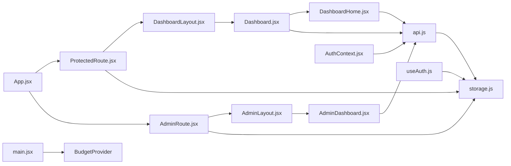

# Page Components

<cite>
**Referenced Files in This Document**
- [App.jsx](file://frontend/src/App.jsx)
- [Dashboard.jsx](file://frontend/src/pages/user/Dashboard.jsx)
- [DashboardHome.jsx](file://frontend/src/pages/user/DashboardHome.jsx)
- [DashboardLayout.jsx](file://frontend/src/layouts/DashboardLayout.jsx)
- [AdminDashboard.jsx](file://frontend/src/pages/admin/AdminDashboard.jsx)
- [AdminLayout.jsx](file://frontend/src/pages/admin/AdminLayout.jsx)
- [ProtectedRoute.jsx](file://frontend/src/components/auth/ProtectedRoute.jsx)
- [AdminRoute.jsx](file://frontend/src/components/auth/AdminRoute.jsx)
- [AuthContext.jsx](file://frontend/src/context/AuthContext.jsx)
- [useAuth.js](file://frontend/src/hooks/useAuth.js)
- [api.js](file://frontend/src/services/api.js)
- [index.js](file://frontend/src/constants/index.js)
- [storage.js](file://frontend/src/utils/storage.js)
- [useForm.js](file://frontend/src/hooks/useForm.js)
- [useResponsive.js](file://frontend/src/hooks/useResponsive.js)
- [main.jsx](file://frontend/src/main.jsx)
</cite>

## Table of Contents
1. [Introduction](#introduction)
2. [Project Structure](#project-structure)
3. [Core Components](#core-components)
4. [Architecture Overview](#architecture-overview)
5. [Detailed Component Analysis](#detailed-component-analysis)
6. [Dependency Analysis](#dependency-analysis)
7. [Performance Considerations](#performance-considerations)
8. [Troubleshooting Guide](#troubleshooting-guide)
9. [Conclusion](#conclusion)
10. [Appendices](#appendices)

## Introduction
This document explains the page-level components organized by user role and functionality. It covers:
- User dashboard pages and admin panel components
- Layout structures and routing guards
- Responsibilities of page components, data fetching patterns, and state management integration
- Dashboard layout system, responsive design, and page transitions
- Examples of page-specific state management, form handling, and API integration patterns
- Performance optimization, SEO considerations, and UX patterns

## Project Structure
The frontend uses layout-based routing with protected routes for user dashboards and admin panels. Pages are grouped under user and admin namespaces, each with dedicated layouts and route guards.

**Diagram sources**
- [App.jsx:78-167](file://frontend/src/App.jsx#L78-L167)
- [ProtectedRoute.jsx:27-36](file://frontend/src/components/auth/ProtectedRoute.jsx#L27-L36)
- [AdminRoute.jsx:12-21](file://frontend/src/components/auth/AdminRoute.jsx#L12-L21)
- [DashboardLayout.jsx:14-47](file://frontend/src/layouts/DashboardLayout.jsx#L14-L47)
- [Dashboard.jsx:58-312](file://frontend/src/pages/user/Dashboard.jsx#L58-L312)
- [DashboardHome.jsx:19-118](file://frontend/src/pages/user/DashboardHome.jsx#L19-L118)
- [AdminLayout.jsx:20-298](file://frontend/src/pages/admin/AdminLayout.jsx#L20-L298)
- [AdminDashboard.jsx:19-173](file://frontend/src/pages/admin/AdminDashboard.jsx#L19-L173)

**Section sources**
- [App.jsx:78-167](file://frontend/src/App.jsx#L78-L167)

## Core Components
- Routing and Guards
  - ProtectedRoute enforces authentication and redirects admin users away from user routes.
  - AdminRoute enforces admin-only access and redirects unauthorized users.
- Layouts
  - DashboardLayout provides a responsive container for user pages.
  - Dashboard wraps user pages with sidebar, header, notifications, and outlet rendering.
  - AdminLayout mirrors the dashboard layout for admin pages with admin-specific navigation.
- Pages
  - DashboardHome is the user dashboard landing page, loading metrics, charts, and recent transactions.
  - AdminDashboard displays system summaries, quick actions, and health cards.

**Section sources**
- [ProtectedRoute.jsx:27-36](file://frontend/src/components/auth/ProtectedRoute.jsx#L27-L36)
- [AdminRoute.jsx:12-21](file://frontend/src/components/auth/AdminRoute.jsx#L12-L21)
- [DashboardLayout.jsx:14-47](file://frontend/src/layouts/DashboardLayout.jsx#L14-L47)
- [Dashboard.jsx:58-312](file://frontend/src/pages/user/Dashboard.jsx#L58-L312)
- [AdminLayout.jsx:20-298](file://frontend/src/pages/admin/AdminLayout.jsx#L20-L298)
- [DashboardHome.jsx:19-118](file://frontend/src/pages/user/DashboardHome.jsx#L19-L118)
- [AdminDashboard.jsx:19-173](file://frontend/src/pages/admin/AdminDashboard.jsx#L19-L173)

## Architecture Overview
The application uses React Router with nested routes and layout wrappers. Authentication state is centralized via storage and optional AuthContext. API requests are handled through a shared Axios service with automatic bearer token injection.

**Diagram sources**
- [App.jsx:98-160](file://frontend/src/App.jsx#L98-L160)
- [ProtectedRoute.jsx:27-36](file://frontend/src/components/auth/ProtectedRoute.jsx#L27-L36)
- [AdminRoute.jsx:12-21](file://frontend/src/components/auth/AdminRoute.jsx#L12-L21)
- [Dashboard.jsx:119-131](file://frontend/src/pages/user/Dashboard.jsx#L119-L131)
- [AdminLayout.jsx:31-43](file://frontend/src/pages/admin/AdminLayout.jsx#L31-L43)
- [api.js:19-31](file://frontend/src/services/api.js#L19-L31)

## Detailed Component Analysis

### User Dashboard Pages
- Dashboard (layout wrapper)
  - Responsibilities:
    - Renders sidebar with navigation items and active state detection
    - Handles mobile menu toggle and overlay
    - Displays floating profile menu and notifications with unread count
    - Integrates responsive behavior and dynamic sidebar widths
  - Data fetching:
    - Fetches unread alerts count on mount
  - State management:
    - Local state for profile menu visibility, unread alerts, mobile menu, and screen width
    - Uses constants for routes and icons
  - Integration:
    - Uses API service for alerts
    - Uses storage utilities for user and auth data
    - Uses constants for routes and endpoints

- DashboardHome (child page)
  - Responsibilities:
    - Renders user dashboard home with metrics, quick actions, currency converter, chart, and recent transactions
  - Data fetching:
    - Concurrently loads insights summary, daily insights for last 15 days, and recent transactions
  - State management:
    - Manages loading state and screen width for responsiveness
  - Integration:
    - Uses API service for insights and transactions
    - Uses constants for endpoints

- DashboardLayout (shared layout)
  - Responsibilities:
    - Provides a responsive container with padding and outlet rendering
  - Integration:
    - Uses responsive hook for device-aware layout

**Diagram sources**
- [DashboardHome.jsx:32-52](file://frontend/src/pages/user/DashboardHome.jsx#L32-L52)

**Section sources**
- [Dashboard.jsx:58-312](file://frontend/src/pages/user/Dashboard.jsx#L58-L312)
- [DashboardHome.jsx:19-118](file://frontend/src/pages/user/DashboardHome.jsx#L19-L118)
- [DashboardLayout.jsx:14-47](file://frontend/src/layouts/DashboardLayout.jsx#L14-L47)

### Admin Panel Components
- AdminLayout (layout wrapper)
  - Responsibilities:
    - Renders admin sidebar with navigation items and active state detection
    - Handles mobile menu toggle and overlay
    - Provides logout action and responsive styles
  - State management:
    - Local state for mobile menu visibility and screen width
  - Integration:
    - Uses constants for routes and icons

- AdminDashboard (child page)
  - Responsibilities:
    - Renders system overview with summary cards, quick actions, and system health cards
  - Data fetching:
    - Loads admin dashboard summary on mount
  - State management:
    - Manages summary state for cards

**Diagram sources**
- [AdminLayout.jsx:20-298](file://frontend/src/pages/admin/AdminLayout.jsx#L20-L298)
- [AdminDashboard.jsx:23-34](file://frontend/src/pages/admin/AdminDashboard.jsx#L23-L34)

**Section sources**
- [AdminLayout.jsx:20-298](file://frontend/src/pages/admin/AdminLayout.jsx#L20-L298)
- [AdminDashboard.jsx:19-173](file://frontend/src/pages/admin/AdminDashboard.jsx#L19-L173)

### Routing Guards and Authentication
- ProtectedRoute
  - Enforces authentication and redirects admin users away from user routes
- AdminRoute
  - Enforces admin-only access and redirects unauthorized users
- AuthContext and useAuth
  - AuthContext provides refresh flow and global auth state
  - useAuth encapsulates login, logout, and user updates with storage helpers
- Storage utilities
  - Centralized localStorage operations for tokens, user, and flags
- API service
  - Axios instance with automatic Authorization header injection

**Diagram sources**
- [ProtectedRoute.jsx:27-36](file://frontend/src/components/auth/ProtectedRoute.jsx#L27-L36)
- [AdminRoute.jsx:12-21](file://frontend/src/components/auth/AdminRoute.jsx#L12-L21)
- [AuthContext.jsx:23-46](file://frontend/src/context/AuthContext.jsx#L23-L46)
- [useAuth.js:22-62](file://frontend/src/hooks/useAuth.js#L22-L62)
- [storage.js:81-99](file://frontend/src/utils/storage.js#L81-L99)
- [api.js:19-31](file://frontend/src/services/api.js#L19-L31)

**Section sources**
- [ProtectedRoute.jsx:27-36](file://frontend/src/components/auth/ProtectedRoute.jsx#L27-L36)
- [AdminRoute.jsx:12-21](file://frontend/src/components/auth/AdminRoute.jsx#L12-L21)
- [AuthContext.jsx:23-46](file://frontend/src/context/AuthContext.jsx#L23-L46)
- [useAuth.js:22-62](file://frontend/src/hooks/useAuth.js#L22-L62)
- [storage.js:81-99](file://frontend/src/utils/storage.js#L81-L99)
- [api.js:19-31](file://frontend/src/services/api.js#L19-L31)

### Form Handling and Validation
- useForm
  - Manages form values, errors, touched flags, and submission lifecycle
  - Supports field-level validation and submit-time validation
  - Provides helpers to reset, set field values, and set field errors

**Diagram sources**
- [useForm.js:19-106](file://frontend/src/hooks/useForm.js#L19-L106)

**Section sources**
- [useForm.js:19-106](file://frontend/src/hooks/useForm.js#L19-L106)

### Responsive Design Implementation
- useResponsive
  - Tracks viewport size and exposes breakpoint booleans and helpers
  - Debounces resize events using requestAnimationFrame
- DashboardLayout
  - Adapts padding and orientation based on device type
- Dashboard and AdminLayout
  - Apply responsive styles and mobile overlays for navigation

**Diagram sources**
- [useResponsive.js:25-52](file://frontend/src/hooks/useResponsive.js#L25-L52)
- [DashboardLayout.jsx:14-47](file://frontend/src/layouts/DashboardLayout.jsx#L14-L47)
- [Dashboard.jsx:68-116](file://frontend/src/pages/user/Dashboard.jsx#L68-L116)
- [AdminLayout.jsx:24-43](file://frontend/src/pages/admin/AdminLayout.jsx#L24-L43)

**Section sources**
- [useResponsive.js:25-52](file://frontend/src/hooks/useResponsive.js#L25-L52)
- [DashboardLayout.jsx:14-47](file://frontend/src/layouts/DashboardLayout.jsx#L14-L47)
- [Dashboard.jsx:68-116](file://frontend/src/pages/user/Dashboard.jsx#L68-L116)
- [AdminLayout.jsx:24-43](file://frontend/src/pages/admin/AdminLayout.jsx#L24-L43)

### Page Transition Handling
- Layout-based routing ensures smooth transitions between pages within the same layout.
- Outlet renders child routes without remounting the layout, preserving scroll position and minimizing re-renders.
- Navigation guards redirect appropriately to prevent unnecessary mounts.

**Section sources**
- [App.jsx:98-160](file://frontend/src/App.jsx#L98-L160)

## Dependency Analysis
- Routing depends on route guards and layout wrappers
- Layouts depend on responsive hooks and constants
- Pages depend on API service and constants
- Auth utilities depend on storage and API service
- Global providers (BudgetProvider) wrap the app for shared state

**Diagram sources**
- [App.jsx:78-167](file://frontend/src/App.jsx#L78-L167)
- [ProtectedRoute.jsx:27-36](file://frontend/src/components/auth/ProtectedRoute.jsx#L27-L36)
- [AdminRoute.jsx:12-21](file://frontend/src/components/auth/AdminRoute.jsx#L12-L21)
- [DashboardLayout.jsx:14-47](file://frontend/src/layouts/DashboardLayout.jsx#L14-L47)
- [AdminLayout.jsx:20-298](file://frontend/src/pages/admin/AdminLayout.jsx#L20-L298)
- [Dashboard.jsx:58-312](file://frontend/src/pages/user/Dashboard.jsx#L58-L312)
- [DashboardHome.jsx:19-118](file://frontend/src/pages/user/DashboardHome.jsx#L19-L118)
- [AdminDashboard.jsx:19-173](file://frontend/src/pages/admin/AdminDashboard.jsx#L19-L173)
- [api.js:19-31](file://frontend/src/services/api.js#L19-L31)
- [storage.js:81-99](file://frontend/src/utils/storage.js#L81-L99)
- [AuthContext.jsx:23-46](file://frontend/src/context/AuthContext.jsx#L23-L46)
- [useAuth.js:22-62](file://frontend/src/hooks/useAuth.js#L22-L62)
- [main.jsx:37-45](file://frontend/src/main.jsx#L37-L45)

**Section sources**
- [App.jsx:78-167](file://frontend/src/App.jsx#L78-L167)

## Performance Considerations
- Concurrent data fetching
  - DashboardHome uses concurrent requests for insights, daily data, and recent transactions to reduce total load time.
- Debounced resize handling
  - useResponsive leverages requestAnimationFrame to minimize layout thrashing during resize.
- Conditional rendering and overlays
  - Mobile overlays and menus are conditionally rendered only when needed.
- API interceptor reuse
  - Single Axios instance with interceptors avoids redundant header setup across pages.
- Provider scope
  - BudgetProvider wraps the app to avoid unnecessary re-renders outside its scope.

**Section sources**
- [DashboardHome.jsx:32-52](file://frontend/src/pages/user/DashboardHome.jsx#L32-L52)
- [useResponsive.js:29-52](file://frontend/src/hooks/useResponsive.js#L29-L52)
- [api.js:19-31](file://frontend/src/services/api.js#L19-L31)
- [main.jsx:37-45](file://frontend/src/main.jsx#L37-L45)

## Troubleshooting Guide
- Authentication redirection loops
  - Ensure tokens and user data are persisted correctly; verify storage keys and getters.
  - ProtectedRoute/AdminRoute rely on token presence and user role flags.
- API failures
  - Confirm Authorization header is attached; check interceptor setup and token validity.
- Responsive layout issues
  - Validate breakpoint thresholds and media queries in layout components.
- Form submission errors
  - Use useForm to track touched fields and errors; ensure validation rules match field names.

**Section sources**
- [ProtectedRoute.jsx:27-36](file://frontend/src/components/auth/ProtectedRoute.jsx#L27-L36)
- [AdminRoute.jsx:12-21](file://frontend/src/components/auth/AdminRoute.jsx#L12-L21)
- [storage.js:81-99](file://frontend/src/utils/storage.js#L81-L99)
- [api.js:19-31](file://frontend/src/services/api.js#L19-L31)
- [useResponsive.js:54-56](file://frontend/src/hooks/useResponsive.js#L54-L56)
- [useForm.js:46-75](file://frontend/src/hooks/useForm.js#L46-L75)

## Conclusion
The page components are structured around layout-based routing with robust guards, centralized authentication utilities, and a shared API service. User and admin dashboards share similar responsive patterns and data-fetching strategies, while maintaining role-specific navigation and responsibilities. The design emphasizes performance, maintainability, and a consistent user experience across devices.

## Appendices
- Constants and endpoints
  - Centralized routes and API endpoints for consistent navigation and requests
- Entry point
  - App bootstrapped with providers and Firebase messaging initialization

**Section sources**
- [index.js:6-132](file://frontend/src/constants/index.js#L6-L132)
- [main.jsx:37-45](file://frontend/src/main.jsx#L37-L45)