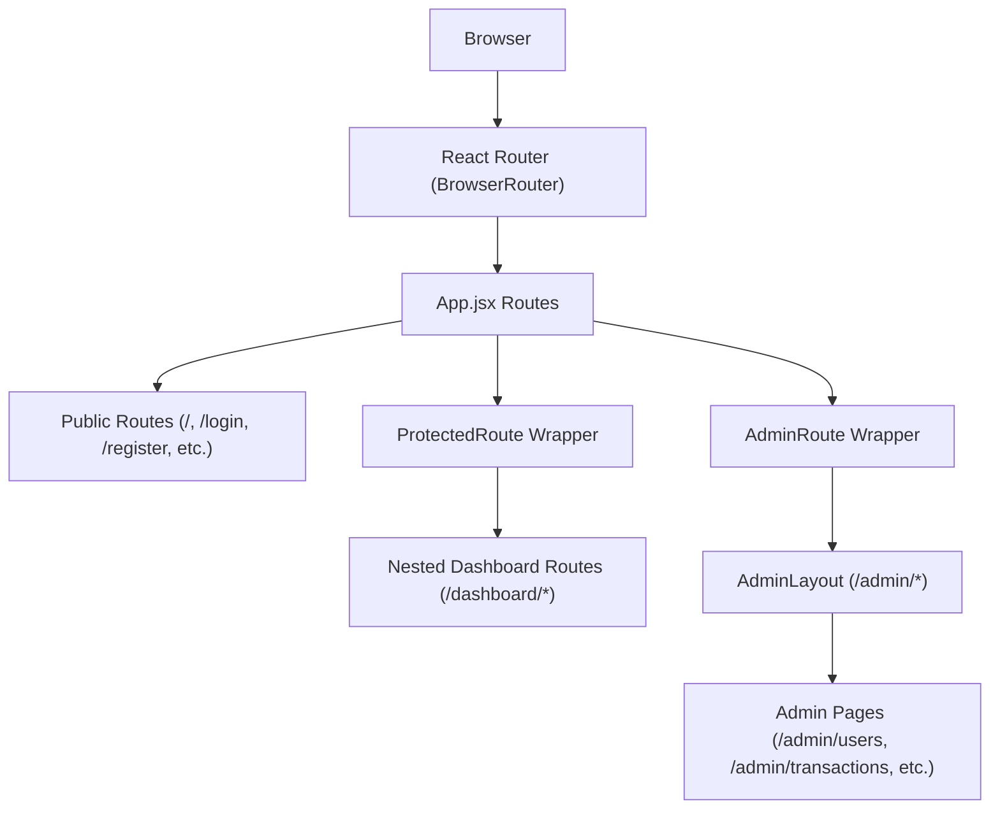
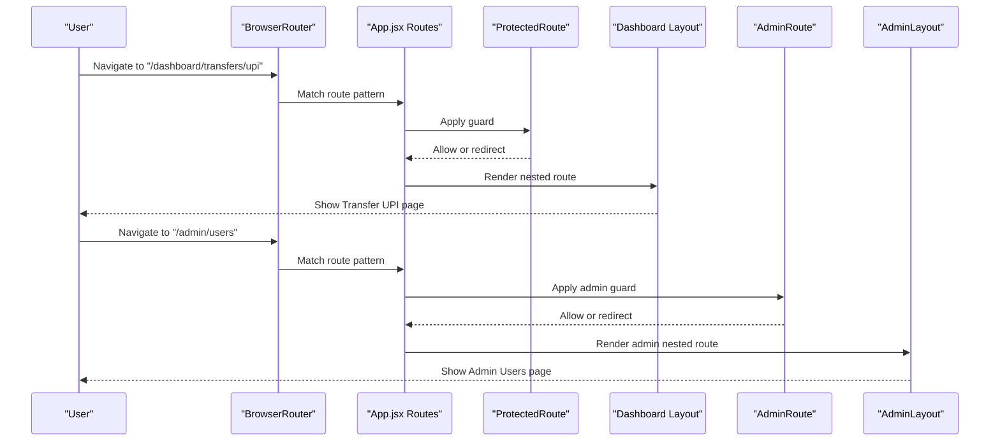
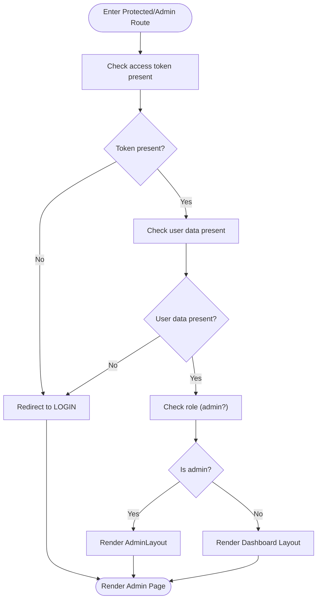
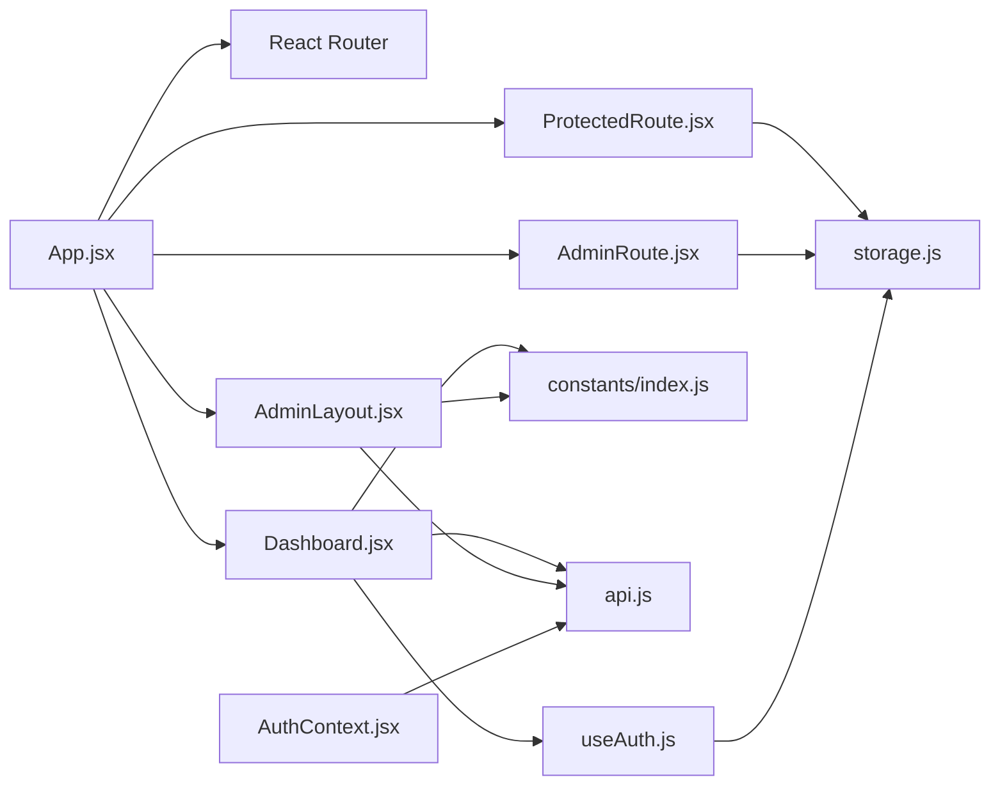

# Routing & Navigation

<cite>
**Referenced Files in This Document**
- [App.jsx](file://frontend/src/App.jsx)
- [main.jsx](file://frontend/src/main.jsx)
- [ProtectedRoute.jsx](file://frontend/src/components/auth/ProtectedRoute.jsx)
- [AdminRoute.jsx](file://frontend/src/components/auth/AdminRoute.jsx)
- [Dashboard.jsx](file://frontend/src/pages/user/Dashboard.jsx)
- [AdminLayout.jsx](file://frontend/src/pages/admin/AdminLayout.jsx)
- [AdminDashboard.jsx](file://frontend/src/pages/admin/AdminDashboard.jsx)
- [Breadcrumbs.jsx](file://frontend/src/components/user/dashboard/Breadcrumbs.jsx)
- [DashboardLayout.jsx](file://frontend/src/layouts/DashboardLayout.jsx)
- [index.js](file://frontend/src/constants/index.js)
- [storage.js](file://frontend/src/utils/storage.js)
- [AuthContext.jsx](file://frontend/src/context/AuthContext.jsx)
- [useAuth.js](file://frontend/src/hooks/useAuth.js)
- [api.js](file://frontend/src/services/api.js)
</cite>

## Table of Contents
1. [Introduction](#introduction)
2. [Project Structure](#project-structure)
3. [Core Components](#core-components)
4. [Architecture Overview](#architecture-overview)
5. [Detailed Component Analysis](#detailed-component-analysis)
6. [Dependency Analysis](#dependency-analysis)
7. [Performance Considerations](#performance-considerations)
8. [Troubleshooting Guide](#troubleshooting-guide)
9. [Conclusion](#conclusion)

## Introduction
This document explains the routing system and navigation patterns used in the frontend application. It covers route configuration, nested routing, route guards, protected and admin-only routes, permission-based navigation, breadcrumbs, parameter handling, programmatic navigation, transitions, navigation state management, performance optimization, and accessibility considerations. The goal is to help developers understand how navigation works and how to extend or maintain it effectively.

## Project Structure
The routing system is defined centrally in the application shell and composed of:
- A top-level router that declares public, user dashboard, and admin routes
- Nested routes under the dashboard and admin layouts
- Route guards that enforce authentication and role-based access
- Shared constants for route paths and API endpoints
- Utility modules for storage and authentication state

**Diagram sources**
- [main.jsx:37-45](file://frontend/src/main.jsx#L37-L45)
- [App.jsx:83-167](file://frontend/src/App.jsx#L83-L167)

**Section sources**
- [main.jsx:10-45](file://frontend/src/main.jsx#L10-L45)
- [App.jsx:8-171](file://frontend/src/App.jsx#L8-L171)

## Core Components
- App.jsx: Declares all routes, nested routes, and wraps protected sections with route guards.
- ProtectedRoute.jsx: Ensures only authenticated users can access dashboard routes; redirects admins to admin routes.
- AdminRoute.jsx: Ensures only authenticated admin users can access admin routes; redirects non-admins to dashboard.
- Dashboard.jsx: Provides the authenticated user’s main layout with sidebar navigation and outlet for nested pages.
- AdminLayout.jsx: Provides the admin panel layout with sidebar navigation and outlet for admin pages.
- Breadcrumbs.jsx: Renders a breadcrumb trail based on the current route.
- Constants: Centralized route and API endpoint definitions.
- Storage utilities: Access tokens, user data, and login state persisted in local storage.
- AuthContext and useAuth hook: Manage authentication state and operations.
- API service: Centralized HTTP client with automatic auth header injection.

**Section sources**
- [App.jsx:75-76](file://frontend/src/App.jsx#L75-L76)
- [ProtectedRoute.jsx:1-40](file://frontend/src/components/auth/ProtectedRoute.jsx#L1-L40)
- [AdminRoute.jsx:1-25](file://frontend/src/components/auth/AdminRoute.jsx#L1-L25)
- [Dashboard.jsx:58-311](file://frontend/src/pages/user/Dashboard.jsx#L58-L311)
- [AdminLayout.jsx:20-142](file://frontend/src/pages/admin/AdminLayout.jsx#L20-L142)
- [Breadcrumbs.jsx:28-82](file://frontend/src/components/user/dashboard/Breadcrumbs.jsx#L28-L82)
- [index.js:7-62](file://frontend/src/constants/index.js#L7-L62)
- [storage.js:81-99](file://frontend/src/utils/storage.js#L81-L99)
- [AuthContext.jsx:23-46](file://frontend/src/context/AuthContext.jsx#L23-L46)
- [useAuth.js:22-63](file://frontend/src/hooks/useAuth.js#L22-L63)
- [api.js:19-31](file://frontend/src/services/api.js#L19-L31)

## Architecture Overview
The routing architecture enforces:
- Public routes for authentication and landing pages
- A protected dashboard area guarded by a route guard
- An admin area guarded by an admin route guard
- Nested routes under each layout for sub-pages
- Programmatic navigation via React Router APIs and constants
- Centralized constants for route paths and API endpoints

**Diagram sources**
- [App.jsx:98-139](file://frontend/src/App.jsx#L98-L139)
- [App.jsx:144-160](file://frontend/src/App.jsx#L144-L160)
- [ProtectedRoute.jsx:27-37](file://frontend/src/components/auth/ProtectedRoute.jsx#L27-L37)
- [AdminRoute.jsx:12-22](file://frontend/src/components/auth/AdminRoute.jsx#L12-L22)
- [Dashboard.jsx:58-311](file://frontend/src/pages/user/Dashboard.jsx#L58-L311)
- [AdminLayout.jsx:20-142](file://frontend/src/pages/admin/AdminLayout.jsx#L20-L142)

## Detailed Component Analysis

### Route Configuration and Nested Routing
- Public routes: Landing, login, register, forgot password, reset password, OTP verification.
- Dashboard routes: Nested under a protected layout with index route and multiple sub-routes for accounts, transfers, transactions, budgets, bills, rewards, insights, alerts, and settings.
- Admin routes: Nested under an admin layout with index route and sub-routes for users, KYC, transactions, rewards, analytics, alerts, and settings.
- Fallback route: Redirects unmatched paths to the home page.

Key behaviors:
- Nested routes render into an outlet within their respective layouts.
- Index route renders the dashboard home page when visiting the dashboard base path.

**Section sources**
- [App.jsx:88-94](file://frontend/src/App.jsx#L88-L94)
- [App.jsx:98-139](file://frontend/src/App.jsx#L98-L139)
- [App.jsx:144-160](file://frontend/src/App.jsx#L144-L160)
- [App.jsx:165](file://frontend/src/App.jsx#L165)

### Route Guards Implementation
- ProtectedRoute: Checks for a valid access token and user data. Non-authenticated users are redirected to the login route. Admin users are redirected to the admin base path.
- AdminRoute: Requires both token and user data, and verifies the user is an admin. Non-admin users are redirected to the dashboard base path.

**Diagram sources**
- [ProtectedRoute.jsx:27-37](file://frontend/src/components/auth/ProtectedRoute.jsx#L27-L37)
- [AdminRoute.jsx:12-22](file://frontend/src/components/auth/AdminRoute.jsx#L12-L22)

**Section sources**
- [ProtectedRoute.jsx:24-36](file://frontend/src/components/auth/ProtectedRoute.jsx#L24-L36)
- [AdminRoute.jsx:6-21](file://frontend/src/components/auth/AdminRoute.jsx#L6-L21)

### Protected Route Components and Permission-Based Navigation
- ProtectedRoute ensures only authenticated users can enter the dashboard area.
- AdminRoute ensures only admin users can enter the admin area.
- The system redirects based on constants for route paths, ensuring consistency across guards and navigations.

Permissions:
- User-level access: Controlled by ProtectedRoute.
- Admin-level access: Controlled by AdminRoute.
- Cross-role redirection prevents users from accessing admin routes and vice versa.

**Section sources**
- [ProtectedRoute.jsx:19-37](file://frontend/src/components/auth/ProtectedRoute.jsx#L19-L37)
- [AdminRoute.jsx:3-22](file://frontend/src/components/auth/AdminRoute.jsx#L3-L22)
- [index.js:7-62](file://frontend/src/constants/index.js#L7-L62)

### Navigation Patterns and Programmatic Navigation
- Constants-driven navigation: All navigation targets are defined in constants and imported where needed.
- Programmatic navigation: Components use React Router’s navigation APIs to move between routes after actions (e.g., logout, quick actions).
- Dashboard and Admin layouts include navigation helpers to switch between sections.

Examples of programmatic navigation:
- Logout actions clear auth data and navigate to the login route.
- Quick action cards in admin dashboard trigger navigation to relevant admin pages.
- Sidebar items in both dashboard and admin layouts use Link and navigation APIs.

**Section sources**
- [Dashboard.jsx:86-89](file://frontend/src/pages/user/Dashboard.jsx#L86-L89)
- [AdminDashboard.jsx:103](file://frontend/src/pages/admin/AdminDashboard.jsx#L103)
- [AdminDashboard.jsx:112](file://frontend/src/pages/admin/AdminDashboard.jsx#L112)
- [AdminDashboard.jsx:121](file://frontend/src/pages/admin/AdminDashboard.jsx#L121)
- [AdminDashboard.jsx:130](file://frontend/src/pages/admin/AdminDashboard.jsx#L130)
- [index.js:7-62](file://frontend/src/constants/index.js#L7-L62)

### Breadcrumb Implementation
- Breadcrumbs.jsx builds a hierarchical trail from the root to the current page.
- It splits the path, filters empty segments, and renders clickable links for parent segments and the current page as text.
- This improves navigation clarity within nested dashboard routes.

**Section sources**
- [Breadcrumbs.jsx:28-82](file://frontend/src/components/user/dashboard/Breadcrumbs.jsx#L28-L82)

### Route Parameter Handling
- The current routing configuration uses static paths without dynamic route parameters.
- If future needs arise, parameters can be introduced using React Router’s path syntax and accessed via navigation hooks. This document focuses on the existing static path structure.

[No sources needed since this section summarizes the current implementation]

### Route Transitions and Navigation State Management
- Transitions: The application relies on React Router’s default transitions. No custom transition animations are implemented.
- Navigation state: Active navigation indicators are handled by checking the current location against route constants in both dashboard and admin layouts.
- Global auth state: AuthContext refreshes tokens and maintains user/access tokens in memory. Local storage utilities manage persistence.

**Section sources**
- [Dashboard.jsx:78-83](file://frontend/src/pages/user/Dashboard.jsx#L78-L83)
- [AdminLayout.jsx:47-50](file://frontend/src/pages/admin/AdminLayout.jsx#L47-L50)
- [AuthContext.jsx:26-42](file://frontend/src/context/AuthContext.jsx#L26-L42)
- [storage.js:81-99](file://frontend/src/utils/storage.js#L81-L99)

### Accessibility Features
- Keyboard-friendly navigation: Links and buttons are focusable and operable via keyboard.
- Semantic markup: Breadcrumb links use anchor elements for navigation.
- Screen reader support: Icons are accompanied by descriptive titles and labels where applicable.
- Responsive behavior: Both dashboard and admin layouts adapt to mobile and desktop screen sizes, improving usability across devices.

**Section sources**
- [Dashboard.jsx:137-175](file://frontend/src/pages/user/Dashboard.jsx#L137-L175)
- [AdminLayout.jsx:71-101](file://frontend/src/pages/admin/AdminLayout.jsx#L71-L101)
- [Breadcrumbs.jsx:43-76](file://frontend/src/components/user/dashboard/Breadcrumbs.jsx#L43-L76)

## Dependency Analysis
The routing system depends on:
- React Router for declarative routing and programmatic navigation
- Constants for centralized route definitions
- Storage utilities for authentication state checks
- AuthContext and hooks for global auth state and operations
- API service for authenticated requests

**Diagram sources**
- [App.jsx:75-76](file://frontend/src/App.jsx#L75-L76)
- [ProtectedRoute.jsx:21-22](file://frontend/src/components/auth/ProtectedRoute.jsx#L21-L22)
- [AdminRoute.jsx:3-4](file://frontend/src/components/auth/AdminRoute.jsx#L3-L4)
- [Dashboard.jsx:39](file://frontend/src/pages/user/Dashboard.jsx#L39)
- [AdminLayout.jsx:17](file://frontend/src/pages/admin/AdminLayout.jsx#L17)
- [index.js:7-62](file://frontend/src/constants/index.js#L7-L62)
- [storage.js:81-99](file://frontend/src/utils/storage.js#L81-L99)
- [useAuth.js:9](file://frontend/src/hooks/useAuth.js#L9)
- [AuthContext.jsx:16-17](file://frontend/src/context/AuthContext.jsx#L16-L17)
- [api.js:16-17](file://frontend/src/services/api.js#L16-L17)

**Section sources**
- [App.jsx:9-171](file://frontend/src/App.jsx#L9-L171)
- [index.js:7-62](file://frontend/src/constants/index.js#L7-L62)
- [storage.js:81-99](file://frontend/src/utils/storage.js#L81-L99)
- [AuthContext.jsx:23-46](file://frontend/src/context/AuthContext.jsx#L23-L46)
- [useAuth.js:22-63](file://frontend/src/hooks/useAuth.js#L22-L63)
- [api.js:19-31](file://frontend/src/services/api.js#L19-L31)

## Performance Considerations
- Current implementation: Static imports and straightforward nested routes without code splitting.
- Recommendations:
  - Lazy-load route components using React.lazy and Suspense to reduce initial bundle size.
  - Group related routes under lazy-loaded chunks to improve perceived performance.
  - Defer heavy computations in route guards to background threads or memoize where possible.
  - Use React Router’s preloading strategies for frequently visited routes.

[No sources needed since this section provides general guidance]

## Troubleshooting Guide
Common issues and resolutions:
- Unauthenticated access to dashboard:
  - Symptom: Redirect loop to login.
  - Cause: Missing or invalid access token.
  - Resolution: Ensure tokens are stored and refreshed; verify storage keys and AuthContext refresh logic.
- Admin user routed to dashboard:
  - Symptom: Admin user lands on dashboard instead of admin panel.
  - Cause: Admin flag not set or mismatched user data.
  - Resolution: Confirm user data includes admin flag and storage utilities are consistent.
- Navigation not working:
  - Symptom: Clicking links does not change route.
  - Cause: Incorrect route constants or missing Link wrappers.
  - Resolution: Verify constants and imports; ensure components use Link or navigate programmatically.
- Active navigation highlighting incorrect:
  - Symptom: Wrong menu item highlighted.
  - Resolution: Confirm isActive logic matches route constants and nested paths.

**Section sources**
- [ProtectedRoute.jsx:24-36](file://frontend/src/components/auth/ProtectedRoute.jsx#L24-L36)
- [AdminRoute.jsx:6-21](file://frontend/src/components/auth/AdminRoute.jsx#L6-L21)
- [Dashboard.jsx:78-83](file://frontend/src/pages/user/Dashboard.jsx#L78-L83)
- [AdminLayout.jsx:47-50](file://frontend/src/pages/admin/AdminLayout.jsx#L47-L50)
- [index.js:7-62](file://frontend/src/constants/index.js#L7-L62)

## Conclusion
The routing system uses a clean, constants-driven approach with route guards to secure user and admin areas. Nested routes provide a structured layout for dashboard and admin pages, while programmatic navigation and breadcrumbs enhance usability. For scalability, consider lazy-loading route components and optimizing route guards. The current architecture balances simplicity and security, enabling straightforward maintenance and extension.