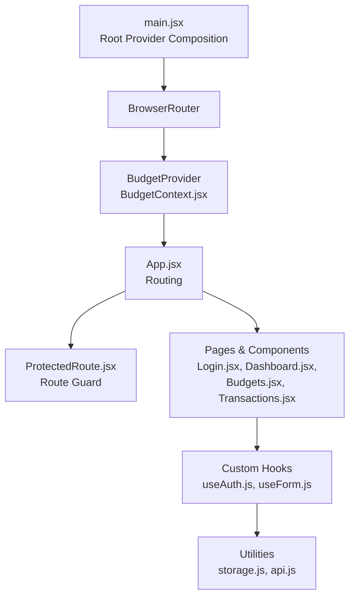
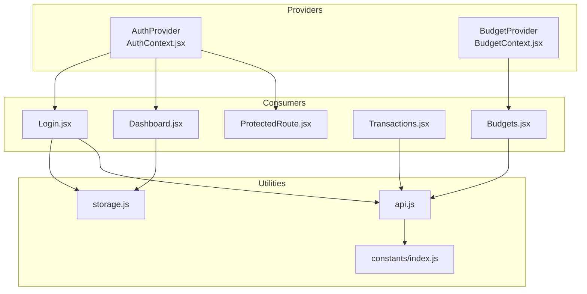
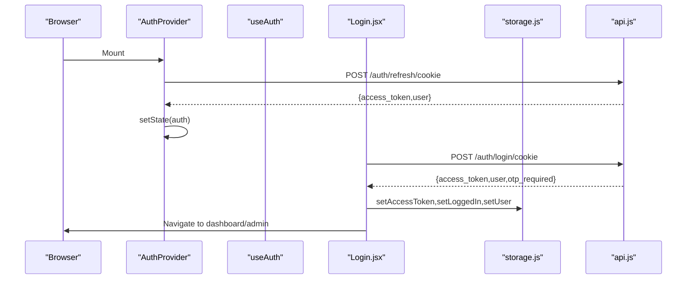
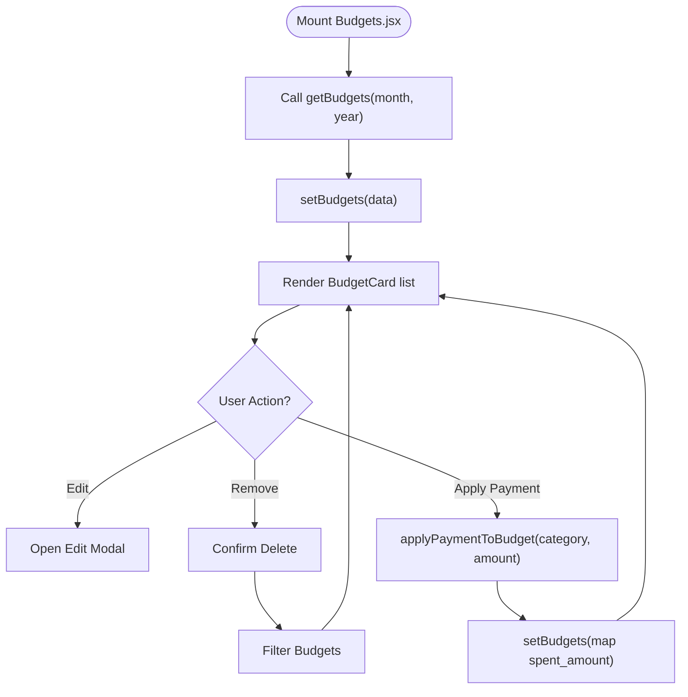
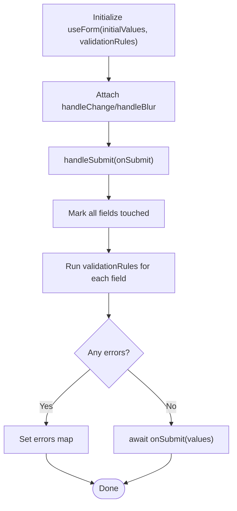
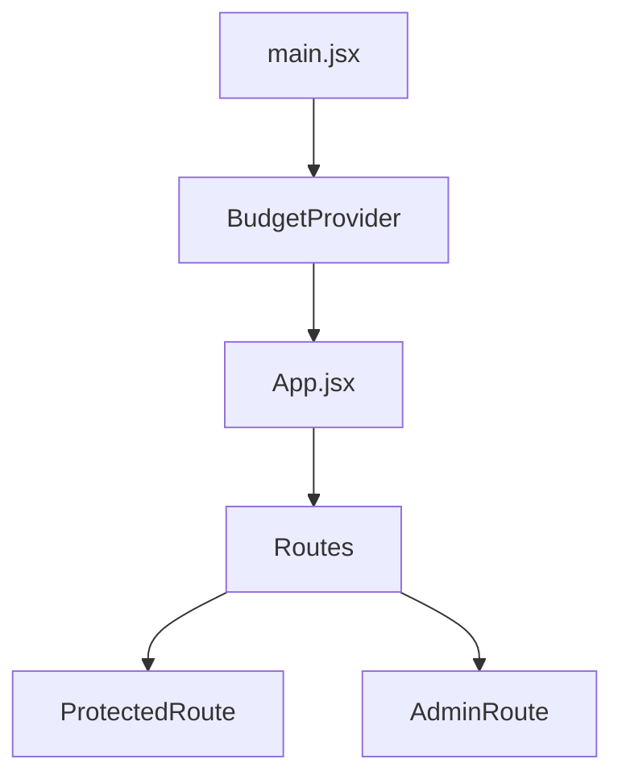
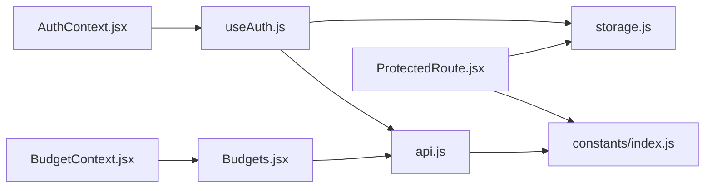

# State Management

<cite>
**Referenced Files in This Document**
- [AuthContext.jsx](file://frontend/src/context/AuthContext.jsx)
- [BudgetContext.jsx](file://frontend/src/context/BudgetContext.jsx)
- [useAuth.js](file://frontend/src/hooks/useAuth.js)
- [useForm.js](file://frontend/src/hooks/useForm.js)
- [storage.js](file://frontend/src/utils/storage.js)
- [main.jsx](file://frontend/src/main.jsx)
- [App.jsx](file://frontend/src/App.jsx)
- [ProtectedRoute.jsx](file://frontend/src/components/auth/ProtectedRoute.jsx)
- [Login.jsx](file://frontend/src/pages/user/Login.jsx)
- [Dashboard.jsx](file://frontend/src/pages/user/Dashboard.jsx)
- [index.js](file://frontend/src/constants/index.js)
- [api.js](file://frontend/src/services/api.js)
- [Budgets.jsx](file://frontend/src/pages/user/Budgets.jsx)
- [BudgetCard.jsx](file://frontend/src/components/user/budgets/BudgetCard.jsx)
- [Transactions.jsx](file://frontend/src/pages/user/Transactions.jsx)
</cite>

## Table of Contents
1. [Introduction](#introduction)
2. [Project Structure](#project-structure)
3. [Core Components](#core-components)
4. [Architecture Overview](#architecture-overview)
5. [Detailed Component Analysis](#detailed-component-analysis)
6. [Dependency Analysis](#dependency-analysis)
7. [Performance Considerations](#performance-considerations)
8. [Troubleshooting Guide](#troubleshooting-guide)
9. [Conclusion](#conclusion)

## Introduction
This document explains the React state management system used in the Modern Digital Banking Dashboard. It focuses on:
- Authentication context for managing user session data
- Budget context for financial data handling
- Custom hooks for form management and authentication operations
- Provider composition, state update patterns, and data flow
- Persistence strategies, synchronization, error handling, and performance optimizations

## Project Structure
The frontend composes providers at the root and exposes contexts and hooks consumed by pages and components. Providers wrap the application so that child components can consume context values without prop drilling.

**Diagram sources**
- [main.jsx:37-45](file://frontend/src/main.jsx#L37-L45)
- [App.jsx:78-167](file://frontend/src/App.jsx#L78-L167)
- [ProtectedRoute.jsx:27-37](file://frontend/src/components/auth/ProtectedRoute.jsx#L27-L37)
- [BudgetContext.jsx:22-60](file://frontend/src/context/BudgetContext.jsx#L22-L60)

**Section sources**
- [main.jsx:37-45](file://frontend/src/main.jsx#L37-L45)
- [App.jsx:78-167](file://frontend/src/App.jsx#L78-L167)

## Core Components
- Authentication Context and Hook
  - AuthProvider manages the global authentication state and refreshes tokens on mount.
  - useAuth encapsulates login, logout, and user update operations while persisting data to storage and returning computed flags.
  - ProtectedRoute enforces frontend route protection using persisted tokens and user roles.

- Budget Context and Page Integration
  - BudgetProvider holds budgets and exposes helpers to check budget limits and apply payments.
  - Budgets page fetches budgets from the backend and renders cards with progress indicators.

- Form Management Hook
  - useForm centralizes form state, validation, touch tracking, submission lifecycle, and reset logic.

- Persistence and API Layer
  - storage.js abstracts localStorage operations with safe wrappers and named keys.
  - api.js attaches Authorization headers automatically and exposes typed request helpers.

**Section sources**
- [AuthContext.jsx:23-46](file://frontend/src/context/AuthContext.jsx#L23-L46)
- [useAuth.js:22-63](file://frontend/src/hooks/useAuth.js#L22-L63)
- [ProtectedRoute.jsx:27-37](file://frontend/src/components/auth/ProtectedRoute.jsx#L27-L37)
- [BudgetContext.jsx:22-60](file://frontend/src/context/BudgetContext.jsx#L22-L60)
- [Budgets.jsx:19-30](file://frontend/src/pages/user/Budgets.jsx#L19-L30)
- [BudgetCard.jsx:3-67](file://frontend/src/components/user/budgets/BudgetCard.jsx#L3-L67)
- [useForm.js:19-106](file://frontend/src/hooks/useForm.js#L19-L106)
- [storage.js:8-72](file://frontend/src/utils/storage.js#L8-L72)
- [api.js:19-31](file://frontend/src/services/api.js#L19-L31)

## Architecture Overview
The state management architecture combines:
- Context providers for cross-cutting concerns (authentication, budgets)
- Custom hooks for encapsulating stateful logic and side effects
- Persistent storage for tokens and user data
- Centralized API client with automatic auth header injection

**Diagram sources**
- [AuthContext.jsx:23-46](file://frontend/src/context/AuthContext.jsx#L23-L46)
- [BudgetContext.jsx:22-60](file://frontend/src/context/BudgetContext.jsx#L22-L60)
- [Login.jsx:67-129](file://frontend/src/pages/user/Login.jsx#L67-L129)
- [Dashboard.jsx:86-89](file://frontend/src/pages/user/Dashboard.jsx#L86-L89)
- [Budgets.jsx:19-30](file://frontend/src/pages/user/Budgets.jsx#L19-L30)
- [Transactions.jsx:72-141](file://frontend/src/pages/user/Transactions.jsx#L72-L141)
- [ProtectedRoute.jsx:27-37](file://frontend/src/components/auth/ProtectedRoute.jsx#L27-L37)
- [storage.js:8-72](file://frontend/src/utils/storage.js#L8-L72)
- [api.js:19-31](file://frontend/src/services/api.js#L19-L31)
- [index.js:64-132](file://frontend/src/constants/index.js#L64-L132)

## Detailed Component Analysis

### Authentication Context and Hook
- AuthProvider
  - Initializes state with user and access token
  - Performs token refresh on mount via a controlled effect
  - Memoizes the context value to prevent unnecessary re-renders
- useAuth
  - Provides login, logout, and user update operations
  - Persists tokens and user data to storage
  - Computes flags for authentication and admin role
- ProtectedRoute
  - Enforces frontend route protection using persisted tokens and user roles

**Diagram sources**
- [AuthContext.jsx:26-42](file://frontend/src/context/AuthContext.jsx#L26-L42)
- [useAuth.js:29-46](file://frontend/src/hooks/useAuth.js#L29-L46)
- [Login.jsx:67-129](file://frontend/src/pages/user/Login.jsx#L67-L129)
- [storage.js:81-99](file://frontend/src/utils/storage.js#L81-L99)
- [api.js:19-31](file://frontend/src/services/api.js#L19-L31)

**Section sources**
- [AuthContext.jsx:23-46](file://frontend/src/context/AuthContext.jsx#L23-L46)
- [useAuth.js:22-63](file://frontend/src/hooks/useAuth.js#L22-L63)
- [ProtectedRoute.jsx:27-37](file://frontend/src/components/auth/ProtectedRoute.jsx#L27-L37)
- [Login.jsx:67-129](file://frontend/src/pages/user/Login.jsx#L67-L129)
- [storage.js:81-99](file://frontend/src/utils/storage.js#L81-L99)

### Budget Context and Data Flow
- BudgetProvider
  - Holds budgets array in state
  - Exposes helpers to check budget thresholds and apply payments
- Budgets page
  - Fetches budgets from backend and renders BudgetCard components
  - Calculates summary metrics and passes edit/remove handlers

**Diagram sources**
- [Budgets.jsx:19-30](file://frontend/src/pages/user/Budgets.jsx#L19-L30)
- [Budgets.jsx:50-65](file://frontend/src/pages/user/Budgets.jsx#L50-L65)
- [BudgetContext.jsx:25-33](file://frontend/src/context/BudgetContext.jsx#L25-L33)
- [BudgetCard.jsx:3-67](file://frontend/src/components/user/budgets/BudgetCard.jsx#L3-L67)

**Section sources**
- [BudgetContext.jsx:22-60](file://frontend/src/context/BudgetContext.jsx#L22-L60)
- [Budgets.jsx:19-30](file://frontend/src/pages/user/Budgets.jsx#L19-L30)
- [Budgets.jsx:50-65](file://frontend/src/pages/user/Budgets.jsx#L50-L65)
- [BudgetCard.jsx:3-67](file://frontend/src/components/user/budgets/BudgetCard.jsx#L3-L67)

### Form Management Hook Pattern
- useForm
  - Manages values, errors, touched, and submission state
  - Handles change and blur events, validates fields, and supports programmatic updates
  - Provides submit handler that runs validation and invokes onSubmit with current values

**Diagram sources**
- [useForm.js:19-106](file://frontend/src/hooks/useForm.js#L19-L106)

**Section sources**
- [useForm.js:19-106](file://frontend/src/hooks/useForm.js#L19-L106)

### Context Provider Composition
- Root composition
  - BudgetProvider wraps the entire app to expose budgets globally
  - Auth-related logic is handled by AuthProvider and storage utilities
- Routing and guards
  - ProtectedRoute checks tokens and redirects unauthenticated users
  - AdminRoute could be composed similarly to restrict admin pages

**Diagram sources**
- [main.jsx:37-45](file://frontend/src/main.jsx#L37-L45)
- [App.jsx:78-167](file://frontend/src/App.jsx#L78-L167)
- [ProtectedRoute.jsx:27-37](file://frontend/src/components/auth/ProtectedRoute.jsx#L27-L37)

**Section sources**
- [main.jsx:37-45](file://frontend/src/main.jsx#L37-L45)
- [App.jsx:78-167](file://frontend/src/App.jsx#L78-L167)

## Dependency Analysis
- Context-to-hook relationships
  - AuthProvider supplies auth state consumed by components indirectly via useAuth
  - BudgetProvider supplies budgets and helpers consumed by Budgets page and BudgetCard
- Utility dependencies
  - storage.js is used by useAuth and ProtectedRoute for persisted flags and tokens
  - api.js depends on constants for endpoints and attaches Authorization headers using storage
- Page-to-service relationships
  - Budgets page uses getBudgets from api.js
  - Transactions page uses accounts and transactions endpoints

**Diagram sources**
- [AuthContext.jsx:23-46](file://frontend/src/context/AuthContext.jsx#L23-L46)
- [useAuth.js:22-63](file://frontend/src/hooks/useAuth.js#L22-L63)
- [storage.js:81-99](file://frontend/src/utils/storage.js#L81-L99)
- [api.js:19-31](file://frontend/src/services/api.js#L19-L31)
- [BudgetContext.jsx:22-60](file://frontend/src/context/BudgetContext.jsx#L22-L60)
- [Budgets.jsx:19-30](file://frontend/src/pages/user/Budgets.jsx#L19-L30)
- [ProtectedRoute.jsx:27-37](file://frontend/src/components/auth/ProtectedRoute.jsx#L27-L37)
- [index.js:64-132](file://frontend/src/constants/index.js#L64-L132)

**Section sources**
- [index.js:64-132](file://frontend/src/constants/index.js#L64-L132)
- [api.js:19-31](file://frontend/src/services/api.js#L19-L31)
- [storage.js:81-99](file://frontend/src/utils/storage.js#L81-L99)

## Performance Considerations
- Memoization and stable context values
  - AuthProvider memoizes the context value to avoid re-renders when auth state is unchanged.
- Stable callbacks and dependency arrays
  - useAuth returns memoized callbacks and flags to prevent unnecessary renders.
- Efficient state updates
  - BudgetProvider uses functional updates to ensure atomic changes when applying payments.
- Lazy initialization and minimal re-renders
  - Budgets page uses useCallback for fetchBudgets to stabilize dependencies across renders.
- Request deduplication and batching
  - Consider caching or deduplication strategies for repeated API calls (e.g., fetching budgets) to reduce network overhead.

[No sources needed since this section provides general guidance]

## Troubleshooting Guide
- Authentication issues
  - If ProtectedRoute redirects unexpectedly, verify persisted tokens and user flags in storage.
  - If refresh fails silently, ensure the refresh endpoint is reachable and tokens are stored correctly.
- Form validation errors
  - Use setFieldError and setFieldValue from useForm to programmatically correct invalid states.
  - Inspect validationRules and ensure handleChange/handleBlur are attached to inputs.
- Budget threshold warnings
  - Confirm that checkBudget logic and remaining budget calculations are aligned with UI thresholds.
- API failures
  - For 401 responses in data-heavy pages, trigger a redirect to login and clear local state.
- Storage errors
  - storage.js wraps operations in safe blocks; check console logs for underlying errors and ensure browser supports localStorage.

**Section sources**
- [ProtectedRoute.jsx:27-37](file://frontend/src/components/auth/ProtectedRoute.jsx#L27-L37)
- [storage.js:8-72](file://frontend/src/utils/storage.js#L8-L72)
- [useForm.js:84-90](file://frontend/src/hooks/useForm.js#L84-L90)
- [BudgetContext.jsx:35-53](file://frontend/src/context/BudgetContext.jsx#L35-L53)
- [Transactions.jsx:124-141](file://frontend/src/pages/user/Transactions.jsx#L124-L141)

## Conclusion
The application’s state management leverages Context API and custom hooks to provide:
- Secure, persistent authentication via storage and route guards
- Centralized budget state with helpers for checks and updates
- Reusable form state and validation through a single hook
- Clear separation of concerns and predictable data flow

Adopting the recommended patterns and performance tips ensures maintainable, scalable state management across the dashboard.