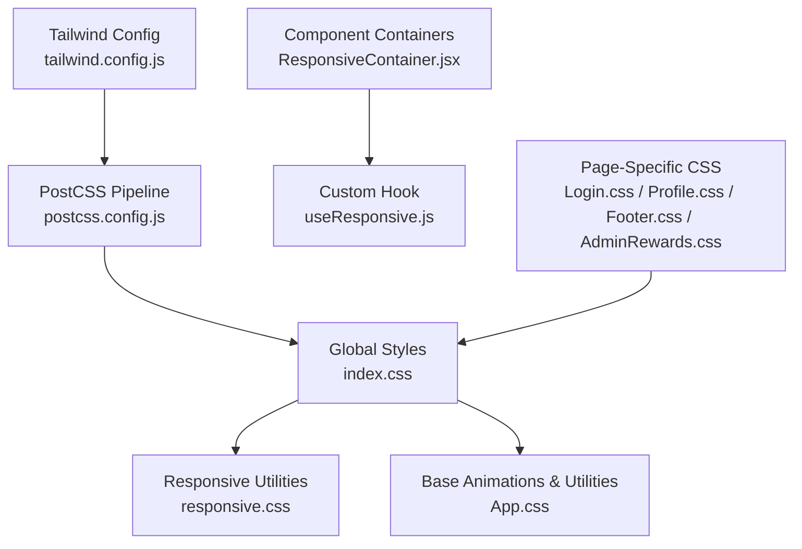
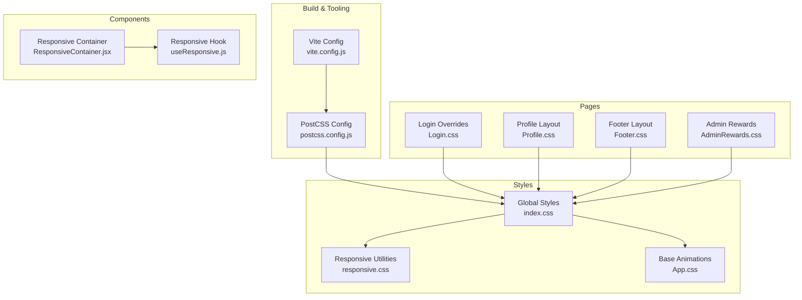
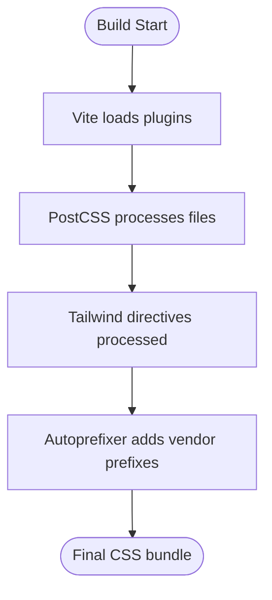
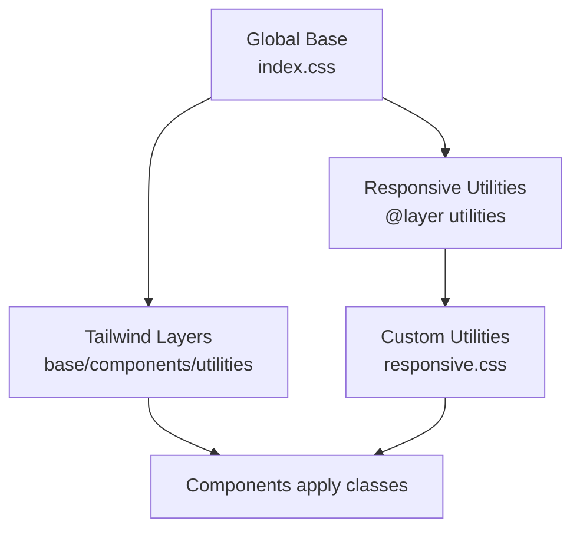
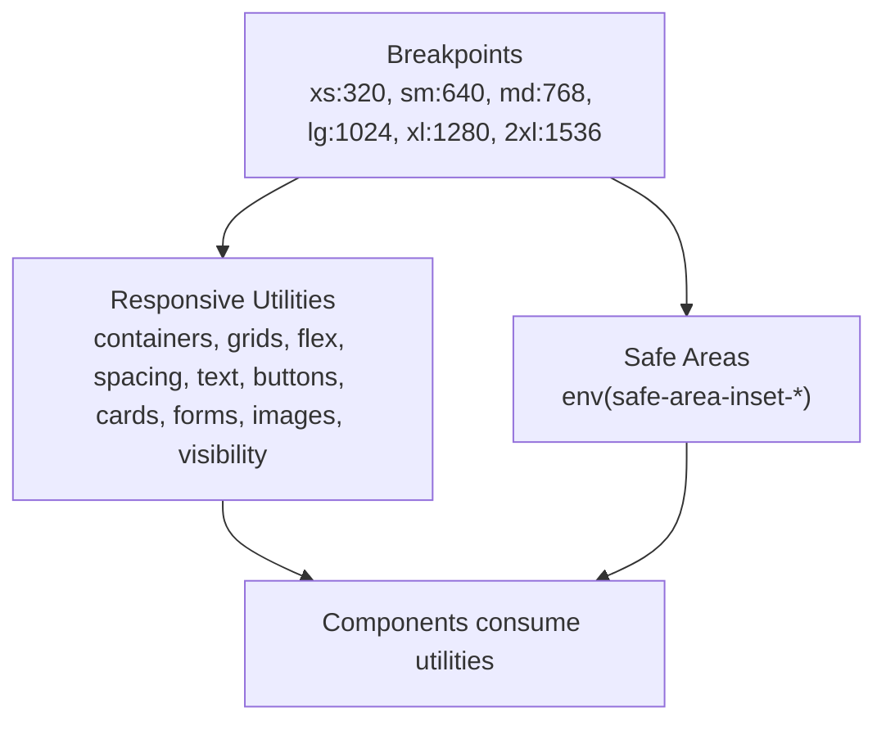
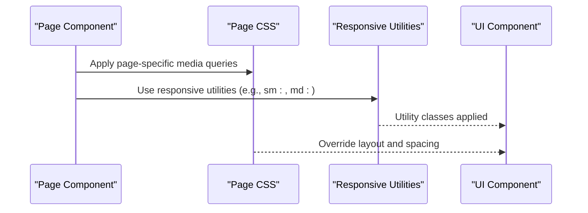
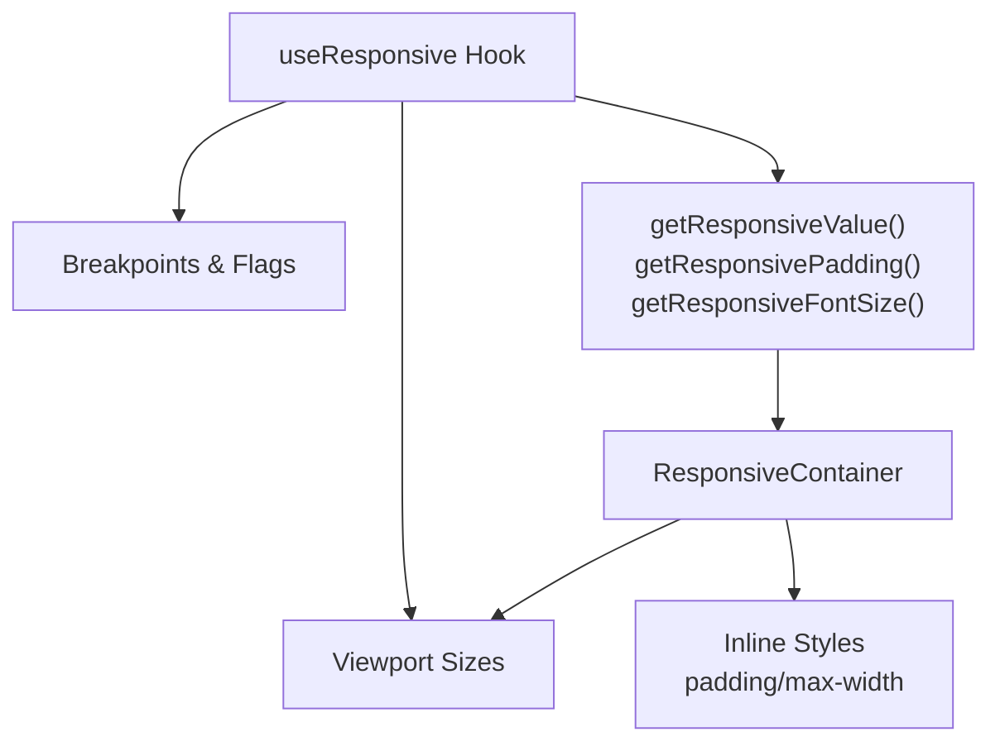
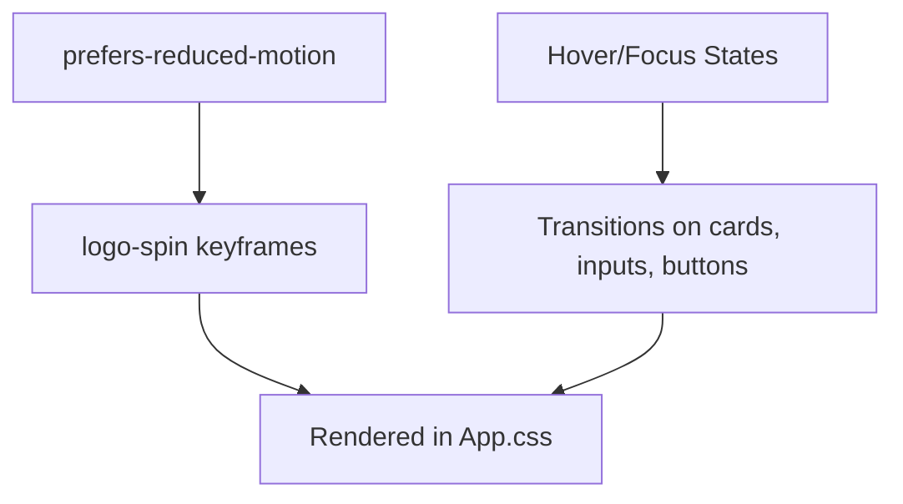
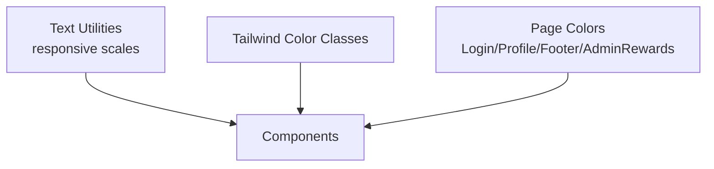
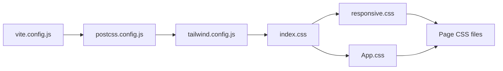

# Styling & Theming

<cite>
**Referenced Files in This Document**
- [tailwind.config.js](file://frontend/tailwind.config.js)
- [postcss.config.js](file://frontend/postcss.config.js)
- [index.css](file://frontend/src/index.css)
- [App.css](file://frontend/src/App.css)
- [responsive.css](file://frontend/src/styles/responsive.css)
- [ResponsiveContainer.jsx](file://frontend/src/components/common/ResponsiveContainer.jsx)
- [useResponsive.js](file://frontend/src/hooks/useResponsive.js)
- [Login.css](file://frontend/src/pages/user/Login.css)
- [Profile.css](file://frontend/src/pages/user/Profile.css)
- [Footer.css](file://frontend/src/components/user/home/Footer.css)
- [AdminRewards.css](file://frontend/src/pages/admin/AdminRewards.css)
- [vite.config.js](file://frontend/vite.config.js)
</cite>

## Table of Contents
1. [Introduction](#introduction)
2. [Project Structure](#project-structure)
3. [Core Components](#core-components)
4. [Architecture Overview](#architecture-overview)
5. [Detailed Component Analysis](#detailed-component-analysis)
6. [Dependency Analysis](#dependency-analysis)
7. [Performance Considerations](#performance-considerations)
8. [Troubleshooting Guide](#troubleshooting-guide)
9. [Conclusion](#conclusion)

## Introduction
This document explains the styling and theming approach used in the frontend. It covers Tailwind CSS configuration, PostCSS pipeline, custom responsive utilities, component styling patterns, and how responsive design is implemented across the application. It also outlines color and typography systems, theme customization strategies, and performance considerations for CSS delivery and rendering.

## Project Structure
The styling system is organized around a Tailwind CSS foundation with a PostCSS pipeline, global base styles, and reusable responsive utilities. Components leverage Tailwind utility classes alongside custom CSS for page-specific overrides and responsive containers.

**Diagram sources**
- [tailwind.config.js:1-26](file://frontend/tailwind.config.js#L1-L26)
- [postcss.config.js:1-7](file://frontend/postcss.config.js#L1-L7)
- [index.css:1-146](file://frontend/src/index.css#L1-L146)
- [responsive.css:1-398](file://frontend/src/styles/responsive.css#L1-L398)
- [App.css:1-75](file://frontend/src/App.css#L1-L75)
- [ResponsiveContainer.jsx:1-71](file://frontend/src/components/common/ResponsiveContainer.jsx#L1-L71)
- [useResponsive.js:1-116](file://frontend/src/hooks/useResponsive.js#L1-L116)
- [Login.css:1-44](file://frontend/src/pages/user/Login.css#L1-L44)
- [Profile.css:1-52](file://frontend/src/pages/user/Profile.css#L1-L52)
- [Footer.css:1-91](file://frontend/src/components/user/home/Footer.css#L1-L91)
- [AdminRewards.css:1-83](file://frontend/src/pages/admin/AdminRewards.css#L1-L83)

**Section sources**
- [tailwind.config.js:1-26](file://frontend/tailwind.config.js#L1-L26)
- [postcss.config.js:1-7](file://frontend/postcss.config.js#L1-L7)
- [index.css:1-146](file://frontend/src/index.css#L1-L146)
- [responsive.css:1-398](file://frontend/src/styles/responsive.css#L1-L398)
- [App.css:1-75](file://frontend/src/App.css#L1-L75)
- [ResponsiveContainer.jsx:1-71](file://frontend/src/components/common/ResponsiveContainer.jsx#L1-L71)
- [useResponsive.js:1-116](file://frontend/src/hooks/useResponsive.js#L1-L116)
- [Login.css:1-44](file://frontend/src/pages/user/Login.css#L1-L44)
- [Profile.css:1-52](file://frontend/src/pages/user/Profile.css#L1-L52)
- [Footer.css:1-91](file://frontend/src/components/user/home/Footer.css#L1-L91)
- [AdminRewards.css:1-83](file://frontend/src/pages/admin/AdminRewards.css#L1-L83)

## Core Components
- Tailwind CSS configuration defines content paths, custom breakpoints, and safe-area spacing extensions.
- PostCSS pipeline enables Tailwind and autoprefixing for cross-browser compatibility.
- Global styles include Tailwind layers, base fonts, and responsive utilities via @layer utilities.
- Custom responsive utilities provide grid, flex, spacing, visibility, buttons, cards, forms, images, and safe-area helpers.
- Page-specific CSS files override or refine styles for login, profile, footer, and admin rewards.
- A responsive container component and a responsive hook centralize breakpoint logic and responsive value computation.

**Section sources**
- [tailwind.config.js:1-26](file://frontend/tailwind.config.js#L1-L26)
- [postcss.config.js:1-7](file://frontend/postcss.config.js#L1-L7)
- [index.css:1-146](file://frontend/src/index.css#L1-L146)
- [responsive.css:1-398](file://frontend/src/styles/responsive.css#L1-L398)
- [ResponsiveContainer.jsx:1-71](file://frontend/src/components/common/ResponsiveContainer.jsx#L1-L71)
- [useResponsive.js:1-116](file://frontend/src/hooks/useResponsive.js#L1-L116)
- [Login.css:1-44](file://frontend/src/pages/user/Login.css#L1-L44)
- [Profile.css:1-52](file://frontend/src/pages/user/Profile.css#L1-L52)
- [Footer.css:1-91](file://frontend/src/components/user/home/Footer.css#L1-L91)
- [AdminRewards.css:1-83](file://frontend/src/pages/admin/AdminRewards.css#L1-L83)

## Architecture Overview
The styling architecture follows a layered approach:
- Build pipeline: Vite executes React plugin; PostCSS compiles Tailwind and autoprefixes.
- Tailwind layering: base, components, and utilities are injected globally.
- Custom responsive utilities: extend Tailwind with consistent spacing, grids, and typography scales.
- Component-level styling: Tailwind utilities dominate; page-level CSS handles device-specific tweaks.
- Responsive logic: JavaScript hook and component compute breakpoints and responsive values.

**Diagram sources**
- [vite.config.js:1-34](file://frontend/vite.config.js#L1-L34)
- [postcss.config.js:1-7](file://frontend/postcss.config.js#L1-L7)
- [index.css:1-146](file://frontend/src/index.css#L1-L146)
- [responsive.css:1-398](file://frontend/src/styles/responsive.css#L1-L398)
- [App.css:1-75](file://frontend/src/App.css#L1-L75)
- [ResponsiveContainer.jsx:1-71](file://frontend/src/components/common/ResponsiveContainer.jsx#L1-L71)
- [useResponsive.js:1-116](file://frontend/src/hooks/useResponsive.js#L1-L116)
- [Login.css:1-44](file://frontend/src/pages/user/Login.css#L1-L44)
- [Profile.css:1-52](file://frontend/src/pages/user/Profile.css#L1-L52)
- [Footer.css:1-91](file://frontend/src/components/user/home/Footer.css#L1-L91)
- [AdminRewards.css:1-83](file://frontend/src/pages/admin/AdminRewards.css#L1-L83)

## Detailed Component Analysis

### Tailwind Configuration and PostCSS Pipeline
- Tailwind content scanning includes HTML and JSX sources to purge unused CSS.
- Theme extends include custom screen breakpoints and safe-area spacing utilities.
- PostCSS pipeline injects Tailwind layers and autoprefixes vendor prefixes.

**Diagram sources**
- [vite.config.js:15-31](file://frontend/vite.config.js#L15-L31)
- [postcss.config.js:1-7](file://frontend/postcss.config.js#L1-L7)
- [tailwind.config.js:1-26](file://frontend/tailwind.config.js#L1-L26)

**Section sources**
- [tailwind.config.js:1-26](file://frontend/tailwind.config.js#L1-L26)
- [postcss.config.js:1-7](file://frontend/postcss.config.js#L1-L7)
- [vite.config.js:15-31](file://frontend/vite.config.js#L15-L31)

### Global Styles and Responsive Utilities
- Global base styles define font families and normalize box sizing.
- Tailwind base, components, and utilities are injected via directives.
- @layer utilities define responsive containers, text scales, spacing, grids, and safe-area insets.
- Custom responsive.css provides additional utilities for grids, flex, text, spacing, visibility, buttons, cards, forms, images, and touch targets.

**Diagram sources**
- [index.css:11-146](file://frontend/src/index.css#L11-L146)
- [responsive.css:1-398](file://frontend/src/styles/responsive.css#L1-L398)

**Section sources**
- [index.css:11-146](file://frontend/src/index.css#L11-L146)
- [responsive.css:1-398](file://frontend/src/styles/responsive.css#L1-L398)

### Responsive Design Implementation
- Breakpoints: xs (320), sm (640), md (768), lg (1024), xl (1280), 2xl (1536).
- Safe-area spacing: env(safe-area-inset-*) is exposed as spacing utilities.
- Responsive utilities: container widths, grid columns, flex direction, spacing, text sizes, button sizes, card paddings, form gaps, image ratios, visibility toggles, and overflow behavior.
- Touch targets: minimum 44px for coarse-pointer devices.

**Diagram sources**
- [tailwind.config.js:7-22](file://frontend/tailwind.config.js#L7-L22)
- [index.css:29-144](file://frontend/src/index.css#L29-L144)
- [responsive.css:10-398](file://frontend/src/styles/responsive.css#L10-L398)

**Section sources**
- [tailwind.config.js:7-22](file://frontend/tailwind.config.js#L7-L22)
- [index.css:29-144](file://frontend/src/index.css#L29-L144)
- [responsive.css:10-398](file://frontend/src/styles/responsive.css#L10-L398)

### Component-Level Styling Patterns
- Utility-first approach: components primarily use Tailwind classes for layout, colors, spacing, and typography.
- Page-specific overrides: Login.css, Profile.css, Footer.css, AdminRewards.css adjust layout and spacing for small screens.
- Modal and dialog patterns: use fixed positioning, z-index stacking, max-width constraints, and scrollable regions with responsive padding.

**Diagram sources**
- [Login.css:1-44](file://frontend/src/pages/user/Login.css#L1-L44)
- [Profile.css:1-52](file://frontend/src/pages/user/Profile.css#L1-L52)
- [Footer.css:1-91](file://frontend/src/components/user/home/Footer.css#L1-L91)
- [AdminRewards.css:1-83](file://frontend/src/pages/admin/AdminRewards.css#L1-L83)
- [responsive.css:10-398](file://frontend/src/styles/responsive.css#L10-L398)

**Section sources**
- [Login.css:1-44](file://frontend/src/pages/user/Login.css#L1-L44)
- [Profile.css:1-52](file://frontend/src/pages/user/Profile.css#L1-L52)
- [Footer.css:1-91](file://frontend/src/components/user/home/Footer.css#L1-L91)
- [AdminRewards.css:1-83](file://frontend/src/pages/admin/AdminRewards.css#L1-L83)
- [responsive.css:10-398](file://frontend/src/styles/responsive.css#L10-L398)

### Responsive Container and Hook
- ResponsiveContainer computes padding and max-width based on viewport size and passes inline styles to the container div.
- useResponsive provides breakpoints, responsive values, and responsive padding/font-size helpers using requestAnimationFrame to optimize resize handling.

**Diagram sources**
- [useResponsive.js:11-116](file://frontend/src/hooks/useResponsive.js#L11-L116)
- [ResponsiveContainer.jsx:18-69](file://frontend/src/components/common/ResponsiveContainer.jsx#L18-L69)

**Section sources**
- [useResponsive.js:11-116](file://frontend/src/hooks/useResponsive.js#L11-L116)
- [ResponsiveContainer.jsx:18-69](file://frontend/src/components/common/ResponsiveContainer.jsx#L18-L69)

### Animations and Transitions
- Logo hover animation uses a keyframes spin with prefers-reduced-motion consideration.
- Cards and inputs include transitions for hover and focus states.
- Buttons and interactive elements use transitions for smooth feedback.

**Diagram sources**
- [App.css:47-60](file://frontend/src/App.css#L47-L60)
- [responsive.css:252-337](file://frontend/src/styles/responsive.css#L252-L337)

**Section sources**
- [App.css:47-60](file://frontend/src/App.css#L47-L60)
- [responsive.css:252-337](file://frontend/src/styles/responsive.css#L252-L337)

### Typography and Color Systems
- Typography: responsive text utilities scale font sizes and line heights across breakpoints.
- Colors: extensive palette classes for backgrounds, borders, text, and gradients are generated by Tailwind and used throughout components.
- Page-specific colors: Login, Profile, Footer, and AdminRewards use explicit color values for branding and status indicators.

**Diagram sources**
- [index.css:66-92](file://frontend/src/index.css#L66-L92)
- [responsive.css:120-174](file://frontend/src/styles/responsive.css#L120-L174)
- [Login.css:1-44](file://frontend/src/pages/user/Login.css#L1-L44)
- [Profile.css:5-12](file://frontend/src/pages/user/Profile.css#L5-L12)
- [Footer.css:1-91](file://frontend/src/components/user/home/Footer.css#L1-L91)
- [AdminRewards.css:6-71](file://frontend/src/pages/admin/AdminRewards.css#L6-L71)

**Section sources**
- [index.css:66-92](file://frontend/src/index.css#L66-L92)
- [responsive.css:120-174](file://frontend/src/styles/responsive.css#L120-L174)
- [Login.css:1-44](file://frontend/src/pages/user/Login.css#L1-L44)
- [Profile.css:5-12](file://frontend/src/pages/user/Profile.css#L5-L12)
- [Footer.css:1-91](file://frontend/src/components/user/home/Footer.css#L1-L91)
- [AdminRewards.css:6-71](file://frontend/src/pages/admin/AdminRewards.css#L6-L71)

### Dark Mode Implementation
- No explicit dark mode classes or configuration were found in the referenced files.
- Suggested approach: introduce a dark mode variant using Tailwind’s variant configuration and toggle a root attribute to switch modes.

[No sources needed since this section provides general guidance]

### Theme Customization Patterns
- Extend Tailwind theme in tailwind.config.js for custom spacing, colors, and font families.
- Use @apply and @layer utilities to standardize component variants.
- Centralize brand tokens in CSS variables or Tailwind extension for reuse.

[No sources needed since this section provides general guidance]

## Dependency Analysis
The styling stack depends on Tailwind and PostCSS for CSS generation and autoprefixing. Vite orchestrates the build process. Components depend on Tailwind utilities and custom responsive CSS.

**Diagram sources**
- [vite.config.js:15-31](file://frontend/vite.config.js#L15-L31)
- [postcss.config.js:1-7](file://frontend/postcss.config.js#L1-L7)
- [tailwind.config.js:1-26](file://frontend/tailwind.config.js#L1-L26)
- [index.css:11-146](file://frontend/src/index.css#L11-L146)
- [responsive.css:1-398](file://frontend/src/styles/responsive.css#L1-L398)
- [App.css:1-75](file://frontend/src/App.css#L1-L75)

**Section sources**
- [vite.config.js:15-31](file://frontend/vite.config.js#L15-L31)
- [postcss.config.js:1-7](file://frontend/postcss.config.js#L1-L7)
- [tailwind.config.js:1-26](file://frontend/tailwind.config.js#L1-L26)
- [index.css:11-146](file://frontend/src/index.css#L11-L146)
- [responsive.css:1-398](file://frontend/src/styles/responsive.css#L1-L398)
- [App.css:1-75](file://frontend/src/App.css#L1-L75)

## Performance Considerations
- Purge unused CSS: Tailwind content globs scan JSX/HTML to remove unused styles.
- Minimize custom CSS: Prefer Tailwind utilities to reduce custom CSS size.
- Use @apply sparingly: Prefer direct utility classes for maintainability and purging.
- Optimize animations: Keep transitions lightweight; avoid heavy transforms on many elements.
- Media queries: Consolidate device-specific overrides to reduce CSS duplication.

[No sources needed since this section provides general guidance]

## Troubleshooting Guide
- Utilities not applying: Ensure Tailwind directives are present in global CSS and PostCSS runs during build.
- Breakpoint mismatches: Verify breakpoints in configuration match responsive utilities and page CSS.
- Safe-area issues: Confirm env(safe-area-inset-*) spacing is applied consistently.
- Modal overlays: Check z-index stacking and max-width constraints for modals.
- Animation preferences: Respect prefers-reduced-motion and test hover/focus states.

[No sources needed since this section provides general guidance]

## Conclusion
The styling system combines Tailwind CSS with a PostCSS pipeline, global responsive utilities, and targeted page-level overrides. Utility-first patterns, consistent breakpoints, and responsive helpers enable scalable, maintainable UI. Extending the configuration and adopting dark mode and theme tokens will further enhance consistency and accessibility.