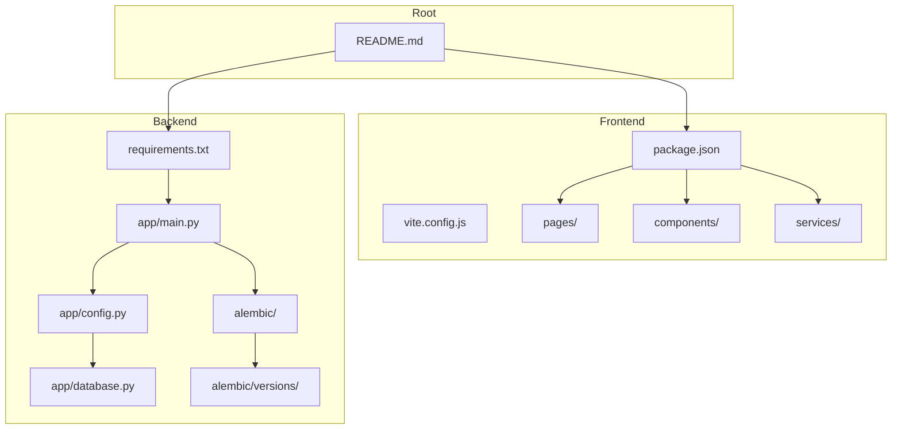
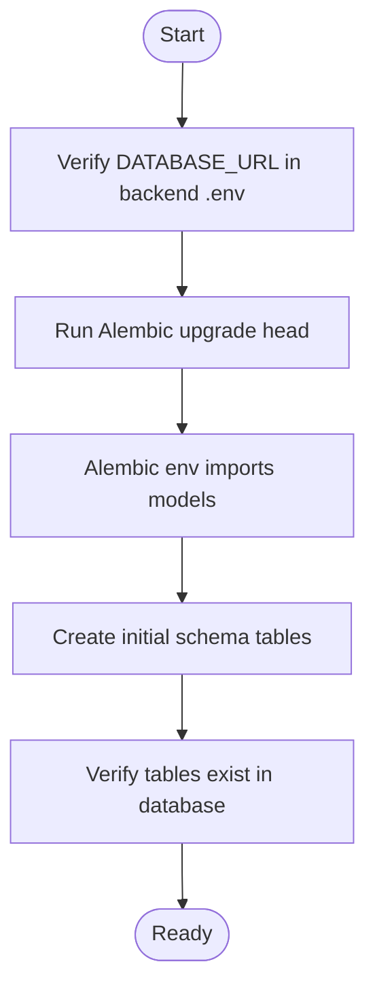
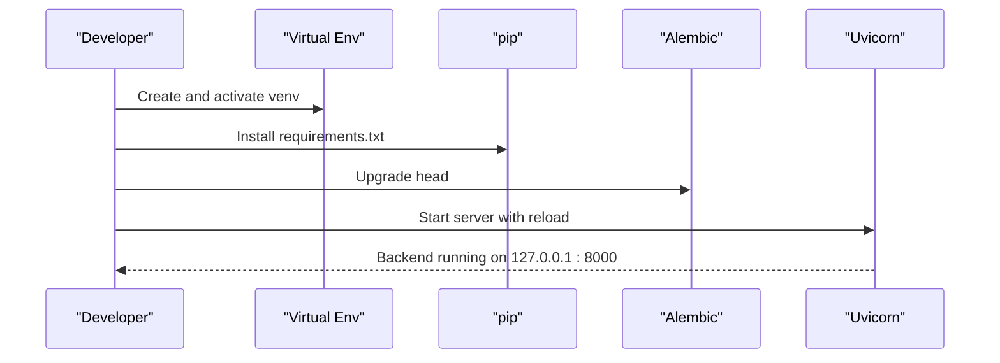
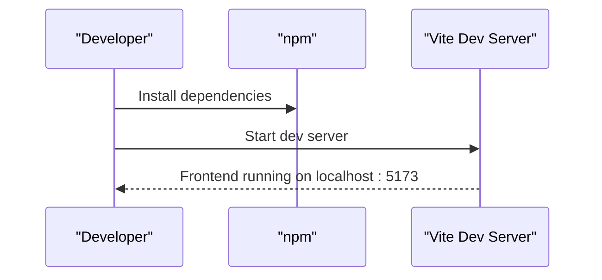
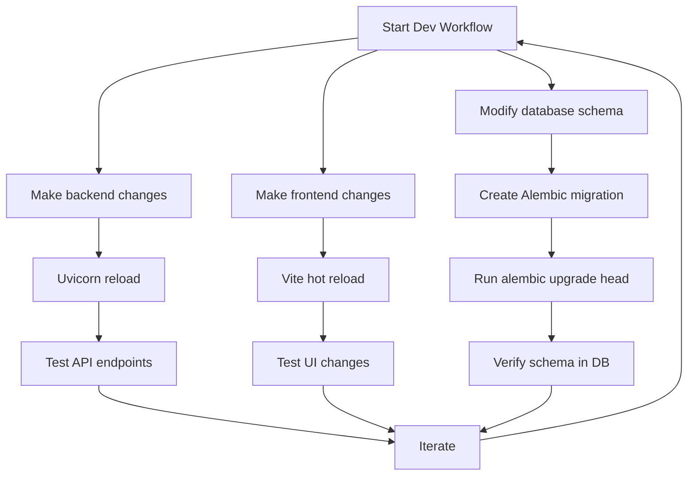

# Getting Started

<cite>
**Referenced Files in This Document**
- [README.md](file://README.md)
- [backend/README.md](file://backend/README.md)
- [frontend/README.md](file://frontend/README.md)
- [backend/requirements.txt](file://backend/requirements.txt)
- [backend/app/main.py](file://backend/app/main.py)
- [backend/app/config.py](file://backend/app/config.py)
- [backend/app/database.py](file://backend/app/database.py)
- [backend/alembic/env.py](file://backend/alembic/env.py)
- [backend/alembic/versions/f3c553c21ca8_initial_schema.py](file://backend/alembic/versions/f3c553c21ca8_initial_schema.py)
- [backend/alembic.ini](file://backend/alembic.ini)
- [frontend/package.json](file://frontend/package.json)
- [frontend/vite.config.js](file://frontend/vite.config.js)
</cite>

## Table of Contents
1. [Introduction](#introduction)
2. [Prerequisites](#prerequisites)
3. [Project Structure](#project-structure)
4. [Environment Setup](#environment-setup)
5. [Database Initialization](#database-initialization)
6. [Backend Setup](#backend-setup)
7. [Frontend Setup](#frontend-setup)
8. [Running Locally](#running-locally)
9. [Development Workflow](#development-workflow)
10. [Troubleshooting](#troubleshooting)
11. [IDE Recommendations](#ide-recommendations)
12. [Best Practices](#best-practices)
13. [Conclusion](#conclusion)

## Introduction
This guide walks you through setting up the Modern Digital Banking Dashboard locally, covering prerequisites, environment configuration, database initialization, backend and frontend setup, and running the complete application. It also includes troubleshooting tips, IDE recommendations, and development best practices to ensure a smooth development experience.

## Prerequisites
Ensure you have the following installed on your development machine:
- Node.js 18+
- Python 3.11+
- PostgreSQL (or use a hosted service like Neon)

These requirements are essential for running both the frontend and backend services.

**Section sources**
- [README.md:232-237](file://README.md#L232-L237)

## Project Structure
The repository is organized into:
- frontend: React + Vite application with routing, services, and UI components
- backend: FastAPI application with models, routers, services, and Alembic migrations
- docs: API and database schema documentation
- Root README with project overview, tech stack, and getting started instructions

**Diagram sources**
- [README.md:24-73](file://README.md#L24-L73)
- [frontend/package.json:1-37](file://frontend/package.json#L1-L37)
- [backend/requirements.txt:1-69](file://backend/requirements.txt#L1-L69)
- [backend/app/main.py:1-109](file://backend/app/main.py#L1-L109)
- [backend/app/config.py:1-72](file://backend/app/config.py#L1-L72)
- [backend/app/database.py:1-51](file://backend/app/database.py#L1-L51)
- [backend/alembic/env.py:1-59](file://backend/alembic/env.py#L1-L59)
- [backend/alembic/versions/f3c553c21ca8_initial_schema.py:1-79](file://backend/alembic/versions/f3c553c21ca8_initial_schema.py#L1-L79)

**Section sources**
- [README.md:24-73](file://README.md#L24-L73)

## Environment Setup
Configure environment variables for both backend and frontend.

Backend (.env)
- Database URL: DATABASE_URL
- JWT secrets: JWT_SECRET_KEY, JWT_REFRESH_SECRET_KEY
- JWT algorithm and expiry: JWT_ALGORITHM, ACCESS_TOKEN_EXPIRE_MINUTES, REFRESH_TOKEN_EXPIRE_DAYS
- Email (OTP): SMTP_SERVER, SMTP_PORT, SMTP_EMAIL, SMTP_PASSWORD
- Firebase credentials: FIREBASE_CREDENTIALS_JSON
- Optional admin seeding: SEED_ADMIN_EMAIL, SEED_ADMIN_PASSWORD, SEED_ADMIN_NAME, SEED_ADMIN_PHONE

Frontend (.env)
- API base URL: VITE_API_BASE_URL=http://localhost:8000/api

Notes:
- The backend loads .env explicitly from the backend directory and normalizes environment variable names.
- Missing JWT secrets fall back to development-safe defaults with warnings.

**Section sources**
- [README.md:278-314](file://README.md#L278-L314)
- [backend/app/config.py:26-71](file://backend/app/config.py#L26-L71)

## Database Initialization
Initialize the database schema using Alembic migrations.

Steps:
1. Ensure PostgreSQL is running and accessible.
2. Set DATABASE_URL in backend .env to point to your database.
3. From the backend directory, run Alembic to upgrade to the latest revision.
4. Verify the initial schema tables were created.

Migration details:
- Alembic configuration is located at backend/alembic.ini.
- Migration environment loader imports models to detect metadata.
- Initial schema migration creates core tables (users, accounts, budgets, etc.).

**Diagram sources**
- [backend/alembic.ini:1-37](file://backend/alembic.ini#L1-L37)
- [backend/alembic/env.py:14-37](file://backend/alembic/env.py#L14-L37)
- [backend/alembic/versions/f3c553c21ca8_initial_schema.py:18-66](file://backend/alembic/versions/f3c553c21ca8_initial_schema.py#L18-L66)

**Section sources**
- [backend/alembic.ini:1-37](file://backend/alembic.ini#L1-L37)
- [backend/alembic/env.py:14-37](file://backend/alembic/env.py#L14-L37)
- [backend/alembic/versions/f3c553c21ca8_initial_schema.py:18-66](file://backend/alembic/versions/f3c553c21ca8_initial_schema.py#L18-L66)

## Backend Setup
Set up and run the FastAPI backend.

Steps:
1. Navigate to the backend directory.
2. Create a Python virtual environment.
3. Activate the virtual environment (Windows vs Unix).
4. Install dependencies from requirements.txt.
5. Run Alembic migrations (upgrade head).
6. Start the development server with Uvicorn.

Expected outcomes:
- Backend starts at http://127.0.0.1:8000
- Swagger docs available at http://127.0.0.1:8000/docs

**Diagram sources**
- [README.md:248-270](file://README.md#L248-L270)
- [backend/requirements.txt:1-69](file://backend/requirements.txt#L1-L69)

**Section sources**
- [README.md:248-270](file://README.md#L248-L270)
- [backend/README.md:92-108](file://backend/README.md#L92-L108)

## Frontend Setup
Set up and run the React + Vite frontend.

Steps:
1. Navigate to the frontend directory.
2. Install dependencies using npm install.
3. Start the development server with npm run dev.

Expected outcomes:
- Frontend runs at http://localhost:5173
- Proxy configured for API requests to backend

**Diagram sources**
- [README.md:238-247](file://README.md#L238-L247)
- [frontend/README.md:196-207](file://frontend/README.md#L196-L207)
- [frontend/package.json:6-11](file://frontend/package.json#L6-L11)

**Section sources**
- [README.md:238-247](file://README.md#L238-L247)
- [frontend/README.md:196-207](file://frontend/README.md#L196-L207)
- [frontend/package.json:6-11](file://frontend/package.json#L6-L11)

## Running Locally
Start both backend and frontend to run the application locally.

Step-by-step:
1. Open a terminal window and start the backend:
   - cd backend
   - python -m venv .venv
   - Activate virtual environment
   - pip install -r requirements.txt
   - alembic upgrade head
   - uvicorn app.main:app --reload
2. Open another terminal window and start the frontend:
   - cd frontend
   - npm install
   - npm run dev
3. Access the application:
   - Frontend: http://localhost:5173
   - Backend: http://127.0.0.1:8000
   - Swagger: http://127.0.0.1:8000/docs

Expected outcomes:
- Both servers start successfully
- CORS allows frontend origin
- Database schema is initialized

**Section sources**
- [README.md:238-275](file://README.md#L238-L275)
- [backend/app/main.py:91-109](file://backend/app/main.py#L91-L109)

## Development Workflow
A typical development workflow includes:
- Backend: Modify routers, services, or models; restart Uvicorn with reload enabled
- Frontend: Modify components or pages; changes reflect immediately in the browser
- Database: After schema changes, create and run Alembic migrations
- Environment: Update .env variables as needed; backend loads them automatically

[No sources needed since this diagram shows conceptual workflow, not actual code structure]

## Troubleshooting
Common setup issues and resolutions:

- Missing or incorrect DATABASE_URL
  - Symptom: Backend fails to connect to database
  - Resolution: Set DATABASE_URL in backend .env to a valid PostgreSQL connection string

- Alembic upgrade failures
  - Symptom: Migration errors or inability to connect
  - Resolution: Verify DATABASE_URL, ensure PostgreSQL is running, and run alembic upgrade head again

- CORS errors in browser
  - Symptom: API requests blocked due to CORS
  - Resolution: Backend allows localhost:5173 by default; ensure frontend runs on this port

- Missing JWT secrets
  - Symptom: Development fallback warnings
  - Resolution: Set JWT_SECRET_KEY and JWT_REFRESH_SECRET_KEY in backend .env

- Email or Firebase credentials not set
  - Symptom: Email sending or push notifications skipped
  - Resolution: Configure SMTP_* or FIREBASE_CREDENTIALS_JSON in backend .env

- Port conflicts
  - Symptom: Ports 5173 or 8000 already in use
  - Resolution: Stop conflicting processes or change ports in Vite and Uvicorn configurations

**Section sources**
- [backend/app/config.py:41-55](file://backend/app/config.py#L41-L55)
- [backend/app/main.py:91-109](file://backend/app/main.py#L91-L109)
- [backend/app/firebase/firebase.py:11-17](file://backend/app/firebase/firebase.py#L11-L17)
- [backend/app/utils/email_utils.py:12-33](file://backend/app/utils/email_utils.py#L12-L33)

## IDE Recommendations
Recommended IDEs and extensions:
- VS Code
  - Extensions: Prettier, ESLint, Python, Alembic Extension
  - Settings: Enable format on save, configure Python interpreter to virtual environment
- WebStorm
  - Built-in Vite and React support
  - Configure Node interpreter and npm scripts

[No sources needed since this section provides general recommendations]

## Best Practices
- Keep dependencies updated: Regularly update requirements.txt and package.json
- Environment isolation: Use separate .env files for development and CI/CD
- Security: Never commit secrets; use environment variables for sensitive data
- Database migrations: Always create and test migrations before merging
- Code quality: Use linters and formatters consistently across frontend and backend

[No sources needed since this section provides general guidance]

## Conclusion
You now have the Modern Digital Banking Dashboard running locally. Follow the steps above to set up prerequisites, configure environments, initialize the database, and start both backend and frontend servers. Use the troubleshooting section for common issues and adopt the recommended IDE and best practices for efficient development.