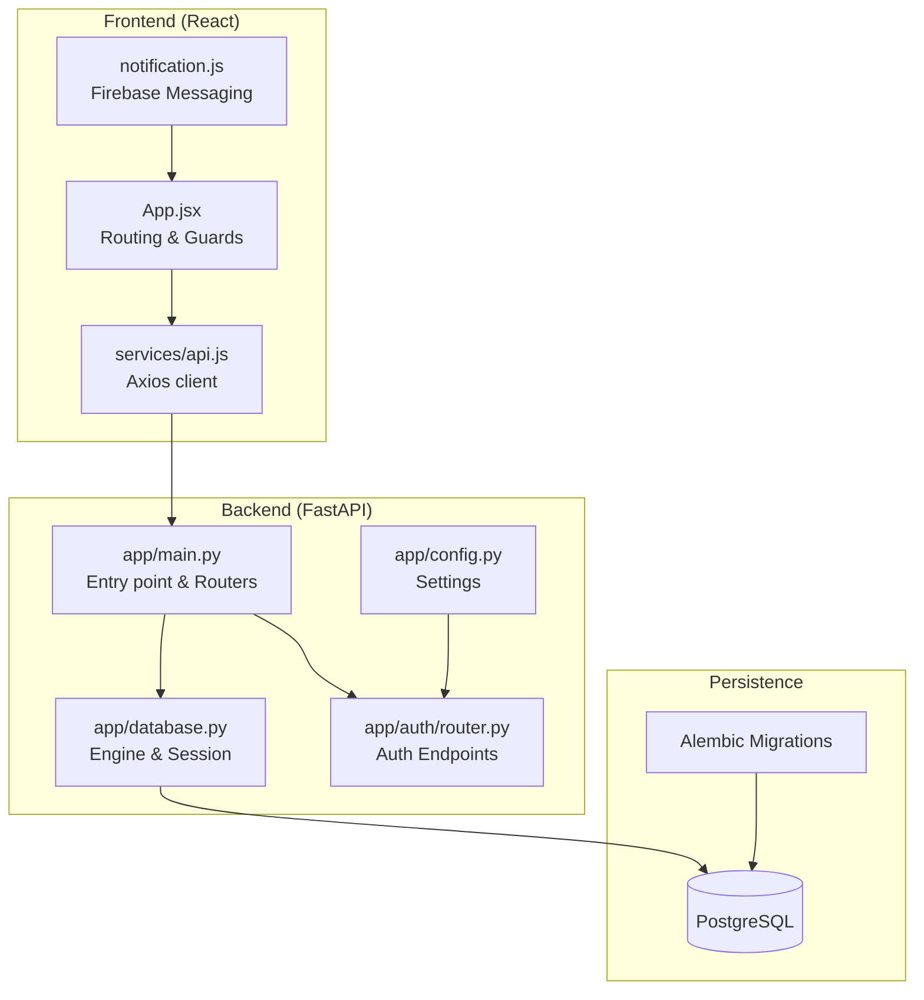
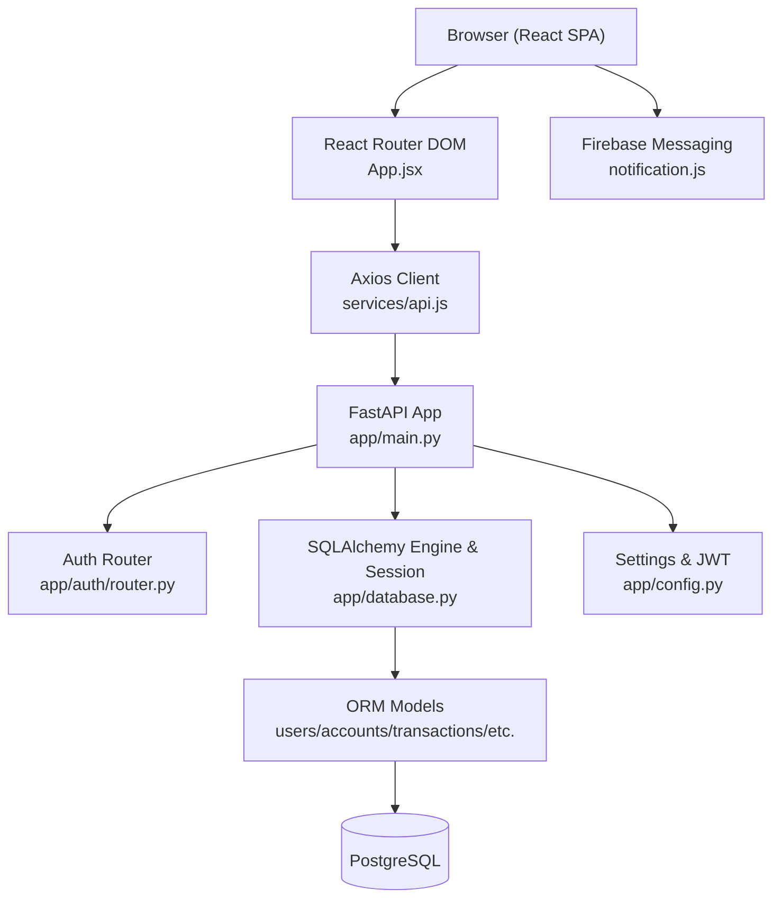
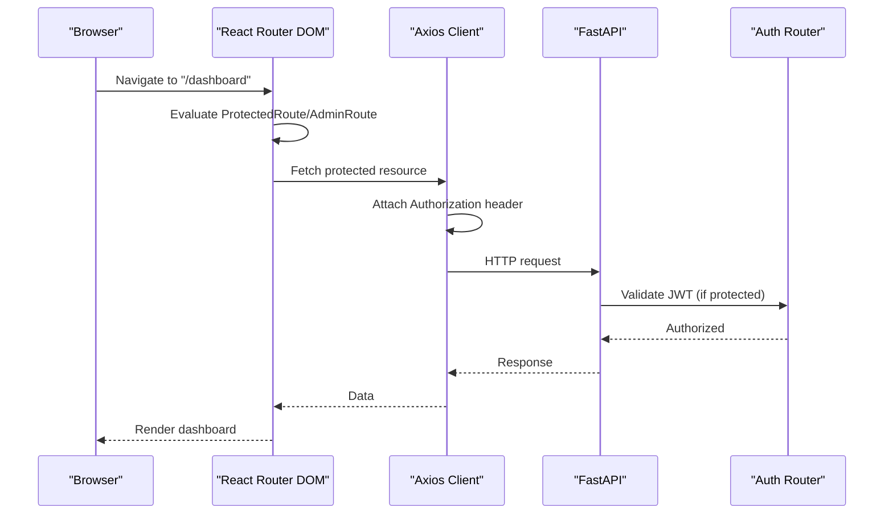
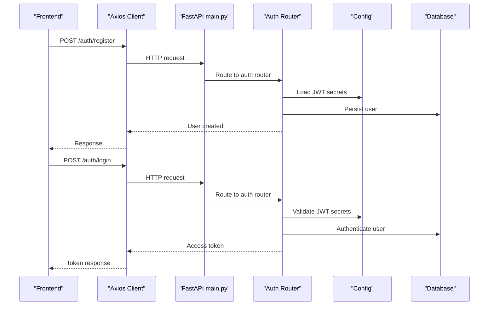
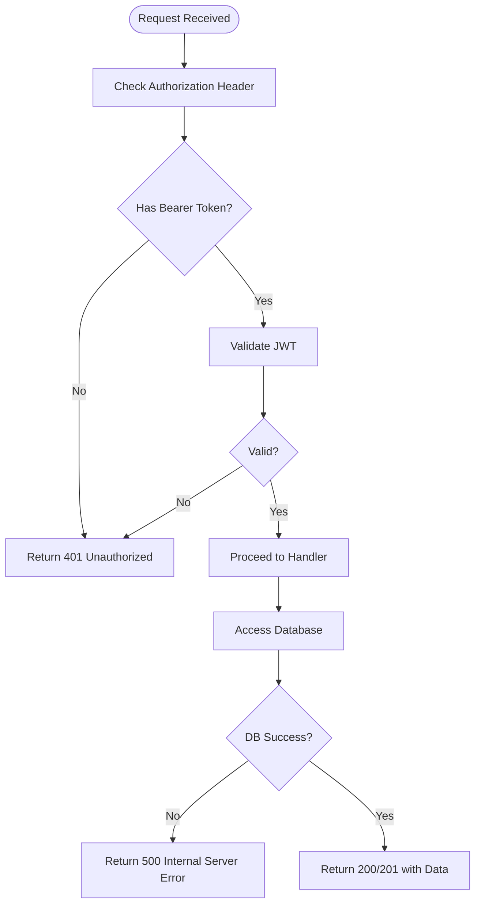
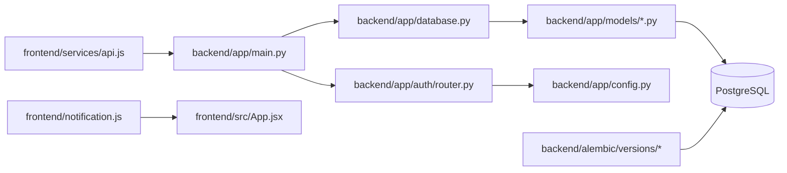

# Architecture Overview

<cite>
**Referenced Files in This Document**
- [backend/app/main.py](file://backend/app/main.py)
- [backend/README.md](file://backend/README.md)
- [frontend/src/App.jsx](file://frontend/src/App.jsx)
- [frontend/README.md](file://frontend/README.md)
- [docs/api-spec.md](file://docs/api-spec.md)
- [docs/database-schema.md](file://docs/database-schema.md)
- [docs/schema.sql](file://docs/schema.sql)
- [backend/app/database.py](file://backend/app/database.py)
- [backend/app/config.py](file://backend/app/config.py)
- [backend/app/auth/router.py](file://backend/app/auth/router.py)
- [frontend/src/services/api.js](file://frontend/src/services/api.js)
- [frontend/src/notification.js](file://frontend/src/notification.js)
- [backend/alembic/versions/f3c553c21ca8_initial_schema.py](file://backend/alembic/versions/f3c553c21ca8_initial_schema.py)
- [backend/alembic/versions/e4b6b665cae9_add_is_admin_to_users.py](file://backend/alembic/versions/e4b6b665cae9_add_is_admin_to_users.py)
- [backend/app/models/user.py](file://backend/app/models/user.py)
</cite>

## Table of Contents
1. [Introduction](#introduction)
2. [Project Structure](#project-structure)
3. [Core Components](#core-components)
4. [Architecture Overview](#architecture-overview)
5. [Detailed Component Analysis](#detailed-component-analysis)
6. [Dependency Analysis](#dependency-analysis)
7. [Performance Considerations](#performance-considerations)
8. [Troubleshooting Guide](#troubleshooting-guide)
9. [Conclusion](#conclusion)
10. [Appendices](#appendices)

## Introduction
This document presents the architecture of the Modern Digital Banking Dashboard, focusing on the separation between the frontend React application and the backend FastAPI service. It explains the layered architecture (presentation, business logic, data access, and utilities), integration patterns (RESTful API, JWT-based authentication, and Firebase-based notifications), and the database design with PostgreSQL and Alembic migrations. Cross-cutting concerns such as security, logging, and error handling are addressed throughout.

## Project Structure
The system is organized into two primary parts:
- Frontend (React + Vite): Handles UI routing, user interactions, and API communication via Axios.
- Backend (FastAPI): Serves REST endpoints, enforces authentication and authorization, orchestrates business logic, and manages data access.



**Diagram sources**
- [backend/app/main.py:56-109](file://backend/app/main.py#L56-L109)
- [backend/app/database.py:24-51](file://backend/app/database.py#L24-L51)
- [backend/app/config.py:57-72](file://backend/app/config.py#L57-L72)
- [backend/app/auth/router.py:21-180](file://backend/app/auth/router.py#L21-L180)
- [frontend/src/App.jsx:78-171](file://frontend/src/App.jsx#L78-L171)
- [frontend/src/services/api.js:19-73](file://frontend/src/services/api.js#L19-L73)
- [frontend/src/notification.js:1-14](file://frontend/src/notification.js#L1-L14)
- [backend/alembic/versions/f3c553c21ca8_initial_schema.py:18-79](file://backend/alembic/versions/f3c553c21ca8_initial_schema.py#L18-L79)
- [backend/alembic/versions/e4b6b665cae9_add_is_admin_to_users.py:18-151](file://backend/alembic/versions/e4b6b665cae9_add_is_admin_to_users.py#L18-L151)

**Section sources**
- [backend/README.md:27-44](file://backend/README.md#L27-L44)
- [frontend/README.md:37-49](file://frontend/README.md#L37-L49)

## Core Components
- Presentation Layer (Frontend)
  - Routing and guards: Public/user/admin routes with protected/admin-only wrappers.
  - API service: Centralized Axios client with automatic bearer token injection.
  - Notifications: Firebase Cloud Messaging integration for foreground push notifications.
- Business Logic Layer (Backend)
  - FastAPI routers grouped by domain (auth, accounts, transactions, budgets, bills, rewards, insights, alerts, settings, devices, admin).
  - Authentication endpoints supporting registration, login, OTP-based flows, and token issuance.
- Data Access Layer (Backend)
  - SQLAlchemy engine/session and declarative base.
  - Models representing users, accounts, transactions, budgets, bills, rewards, alerts, OTPs, user devices, and settings.
- Utility Layer (Backend)
  - Configuration management (environment variables, JWT secrets, token expiry).
  - JWT utilities and hashing helpers.
  - CORS middleware configuration for frontend origins.

**Section sources**
- [frontend/src/App.jsx:78-171](file://frontend/src/App.jsx#L78-L171)
- [frontend/src/services/api.js:19-73](file://frontend/src/services/api.js#L19-L73)
- [frontend/src/notification.js:1-14](file://frontend/src/notification.js#L1-L14)
- [backend/app/main.py:25-86](file://backend/app/main.py#L25-L86)
- [backend/app/auth/router.py:21-180](file://backend/app/auth/router.py#L21-L180)
- [backend/app/database.py:24-51](file://backend/app/database.py#L24-L51)
- [backend/app/config.py:57-72](file://backend/app/config.py#L57-L72)

## Architecture Overview
The system follows a clean layered architecture:
- Presentation (React) communicates with the Backend (FastAPI) over REST.
- Backend enforces JWT-based authentication and authorization.
- Business logic is encapsulated in routers and services; data access is abstracted via SQLAlchemy models and sessions.
- Persistence is handled by PostgreSQL with Alembic-managed migrations.
- Real-time notifications are integrated via Firebase Messaging on the frontend.



**Diagram sources**
- [frontend/src/App.jsx:78-171](file://frontend/src/App.jsx#L78-L171)
- [frontend/src/services/api.js:19-73](file://frontend/src/services/api.js#L19-L73)
- [backend/app/main.py:56-109](file://backend/app/main.py#L56-L109)
- [backend/app/auth/router.py:21-180](file://backend/app/auth/router.py#L21-L180)
- [backend/app/database.py:24-51](file://backend/app/database.py#L24-L51)
- [backend/app/config.py:57-72](file://backend/app/config.py#L57-L72)
- [frontend/src/notification.js:1-14](file://frontend/src/notification.js#L1-L14)

## Detailed Component Analysis

### Frontend: Routing, Guards, and API Integration
- Route configuration organizes public, user dashboard, and admin panels with nested routes and guards.
- ProtectedRoute and AdminRoute enforce access control at the routing level.
- Axios client attaches Authorization header automatically using stored access tokens.
- Firebase messaging initializes on app mount and displays foreground push notifications.



**Diagram sources**
- [frontend/src/App.jsx:78-171](file://frontend/src/App.jsx#L78-L171)
- [frontend/src/services/api.js:19-73](file://frontend/src/services/api.js#L19-L73)
- [backend/app/auth/router.py:21-180](file://backend/app/auth/router.py#L21-L180)

**Section sources**
- [frontend/src/App.jsx:78-171](file://frontend/src/App.jsx#L78-L171)
- [frontend/src/services/api.js:19-73](file://frontend/src/services/api.js#L19-L73)
- [frontend/src/notification.js:1-14](file://frontend/src/notification.js#L1-L14)

### Backend: Entry Point, Routers, and Authentication
- FastAPI app registers all routers and enables CORS for configured origins.
- Authentication endpoints handle user registration, login, OTP-based flows, and token issuance.
- Configuration loads environment variables for database URL and JWT secrets.



**Diagram sources**
- [backend/app/main.py:56-109](file://backend/app/main.py#L56-L109)
- [backend/app/auth/router.py:75-120](file://backend/app/auth/router.py#L75-L120)
- [backend/app/config.py:57-72](file://backend/app/config.py#L57-L72)
- [backend/app/database.py:24-51](file://backend/app/database.py#L24-L51)

**Section sources**
- [backend/app/main.py:56-109](file://backend/app/main.py#L56-L109)
- [backend/app/auth/router.py:75-120](file://backend/app/auth/router.py#L75-L120)
- [backend/app/config.py:57-72](file://backend/app/config.py#L57-L72)

### Database Architecture and Migration Strategy
- PostgreSQL schema supports users, accounts, transactions, budgets, bills, rewards, alerts, OTPs, user devices, and settings.
- Alembic migrations define initial schema and subsequent additions (e.g., admin flag, admin tables).
- Models map to tables with appropriate constraints and relationships.

```mermaid
erDiagram
USERS {
integer id PK
varchar name
varchar email UK
varchar password
varchar phone
boolean is_admin
date dob
varchar address
varchar pin_code
timestamptz created_at
timestamptz last_login
varchar reset_token
timestamptz reset_token_expiry
}
ACCOUNTS {
integer id PK
integer user_id FK
varchar bank_name
varchar account_type
varchar masked_account
char(3) currency
numeric balance
varchar pin_hash
boolean is_active
timestamptz created_at
}
TRANSACTIONS {
integer id PK
integer user_id FK
integer account_id FK
varchar description
varchar category
varchar merchant
numeric amount
char(3) currency
enum txn_type
date txn_date
timestamptz created_at
}
BUDGETS {
integer id PK
integer user_id FK
integer month
integer year
varchar category
numeric limit_amount
numeric spent_amount
boolean is_active
timestamptz created_at
}
BILLS {
integer id PK
integer user_id FK
integer account_id FK
varchar biller_name
date due_date
numeric amount_due
varchar status
boolean auto_pay
}
REWARDS {
integer id PK
integer user_id FK
varchar program_name
integer points_balance
timestamptz last_updated
}
ALERTS {
integer id PK
integer user_id FK
varchar type
text message
boolean is_read
timestamptz created_at
}
OTPS {
integer id PK
varchar identifier
varchar otp
timestamptz expires_at
}
USER_DEVICES {
integer id PK
integer user_id FK
varchar device_token UK
varchar platform
}
USER_SETTINGS {
integer id PK
integer user_id UK FK
boolean push_notifications
boolean email_alerts
boolean login_alerts
boolean two_factor_enabled
}
AUDIT_LOGS {
integer id PK
varchar admin_name
varchar action
varchar target_type
integer target_id
varchar details
timestamptz timestamp
}
ADMIN_REWARDS {
integer id PK
varchar name
varchar description
varchar reward_type
varchar applies_to
varchar value
enum status
timestamptz created_at
}
USERS ||--o{ ACCOUNTS : "owns"
USERS ||--o{ TRANSACTIONS : "has"
USERS ||--o{ BUDGETS : "manages"
USERS ||--o{ BILLS : "has"
USERS ||--o{ REWARDS : "earns"
USERS ||--o{ ALERTS : "receives"
USERS ||--o{ OTPS : "generates/validates"
USERS ||--o{ USER_DEVICES : "registered"
USERS ||--o{ USER_SETTINGS : "configured"
ACCOUNTS ||--o{ TRANSACTIONS : "contains"
ACCOUNTS ||--o{ BILLS : "linked"
```

**Diagram sources**
- [docs/database-schema.md:11-147](file://docs/database-schema.md#L11-L147)
- [docs/schema.sql:32-230](file://docs/schema.sql#L32-L230)
- [backend/alembic/versions/f3c553c21ca8_initial_schema.py:18-79](file://backend/alembic/versions/f3c553c21ca8_initial_schema.py#L18-L79)
- [backend/alembic/versions/e4b6b665cae9_add_is_admin_to_users.py:18-151](file://backend/alembic/versions/e4b6b665cae9_add_is_admin_to_users.py#L18-L151)

**Section sources**
- [docs/database-schema.md:11-147](file://docs/database-schema.md#L11-L147)
- [docs/schema.sql:32-230](file://docs/schema.sql#L32-L230)
- [backend/alembic/versions/f3c553c21ca8_initial_schema.py:18-79](file://backend/alembic/versions/f3c553c21ca8_initial_schema.py#L18-L79)
- [backend/alembic/versions/e4b6b665cae9_add_is_admin_to_users.py:18-151](file://backend/alembic/versions/e4b6b665cae9_add_is_admin_to_users.py#L18-L151)

### Security, Logging, and Error Handling
- JWT-based authentication: Access tokens are issued upon successful login; protected routes require Authorization headers.
- CORS configuration allows controlled origins for local and deployed environments.
- Logging: Authentication router logs exceptions for robust diagnostics.
- Error handling: Routers raise standardized HTTP exceptions with appropriate status codes.



**Diagram sources**
- [backend/app/auth/router.py:104-120](file://backend/app/auth/router.py#L104-L120)
- [backend/app/main.py:91-109](file://backend/app/main.py#L91-L109)

**Section sources**
- [backend/app/auth/router.py:104-120](file://backend/app/auth/router.py#L104-L120)
- [backend/app/main.py:91-109](file://backend/app/main.py#L91-L109)

## Dependency Analysis
- Frontend depends on Axios for HTTP requests and Firebase for push notifications.
- Backend depends on FastAPI for routing, SQLAlchemy for ORM, and Alembic for migrations.
- Routers depend on database sessions and configuration settings.
- Models encapsulate persistence logic and relationships.



**Diagram sources**
- [frontend/src/services/api.js:19-73](file://frontend/src/services/api.js#L19-L73)
- [frontend/src/notification.js:1-14](file://frontend/src/notification.js#L1-L14)
- [frontend/src/App.jsx:78-171](file://frontend/src/App.jsx#L78-L171)
- [backend/app/main.py:56-109](file://backend/app/main.py#L56-L109)
- [backend/app/auth/router.py:21-180](file://backend/app/auth/router.py#L21-L180)
- [backend/app/database.py:24-51](file://backend/app/database.py#L24-L51)
- [backend/app/config.py:57-72](file://backend/app/config.py#L57-L72)
- [backend/alembic/versions/f3c553c21ca8_initial_schema.py:18-79](file://backend/alembic/versions/f3c553c21ca8_initial_schema.py#L18-L79)
- [backend/alembic/versions/e4b6b665cae9_add_is_admin_to_users.py:18-151](file://backend/alembic/versions/e4b6b665cae9_add_is_admin_to_users.py#L18-L151)

**Section sources**
- [backend/app/models/user.py:37-65](file://backend/app/models/user.py#L37-L65)

## Performance Considerations
- Use pagination and filtering for endpoints returning large datasets (e.g., transactions).
- Leverage database indexes on frequently queried columns (e.g., user_id, email, account_id).
- Minimize payload sizes by selecting only required fields in queries.
- Cache non-sensitive, static data at the frontend where appropriate.
- Keep JWT expiration short and refresh tokens secure to reduce exposure windows.

## Troubleshooting Guide
- Authentication failures:
  - Verify Authorization header presence and validity.
  - Confirm JWT secrets and algorithms match backend configuration.
- CORS errors:
  - Ensure frontend origin is included in allowed origins.
- Database connectivity:
  - Validate DATABASE_URL and network access to PostgreSQL.
- Notification issues:
  - Confirm Firebase initialization and foreground message handler registration.

**Section sources**
- [backend/app/auth/router.py:104-120](file://backend/app/auth/router.py#L104-L120)
- [backend/app/main.py:91-109](file://backend/app/main.py#L91-L109)
- [backend/app/config.py:57-72](file://backend/app/config.py#L57-L72)
- [frontend/src/notification.js:1-14](file://frontend/src/notification.js#L1-L14)

## Conclusion
The Modern Digital Banking Dashboard employs a clear separation between the React frontend and FastAPI backend, with well-defined layers and robust integration patterns. JWT-based authentication secures endpoints, while PostgreSQL and Alembic manage persistence and schema evolution. The architecture supports scalability, maintainability, and a realistic banking user experience.

## Appendices
- API specification outlines endpoints, authentication, and status codes.
- Database schema and SQL provide detailed table definitions and enums.

**Section sources**
- [docs/api-spec.md:10-142](file://docs/api-spec.md#L10-L142)
- [docs/database-schema.md:11-147](file://docs/database-schema.md#L11-L147)
- [docs/schema.sql:32-230](file://docs/schema.sql#L32-L230)