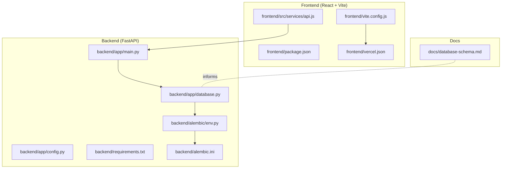
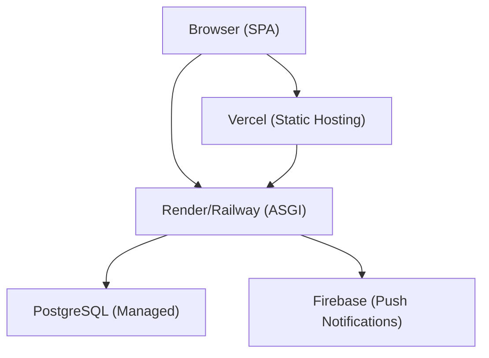
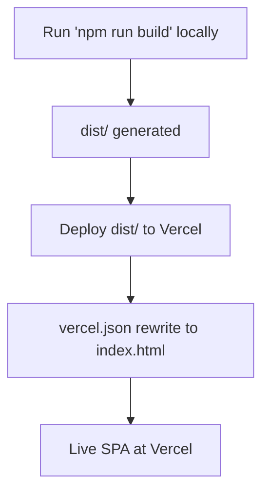
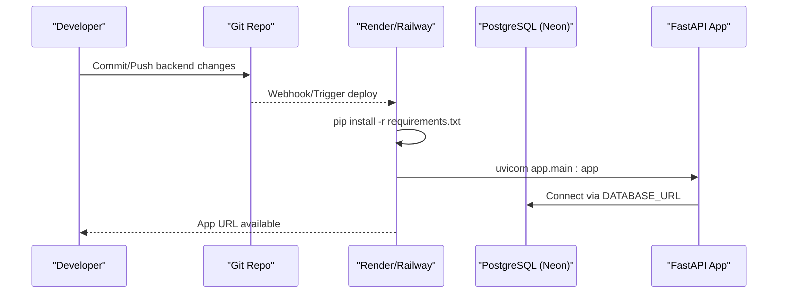
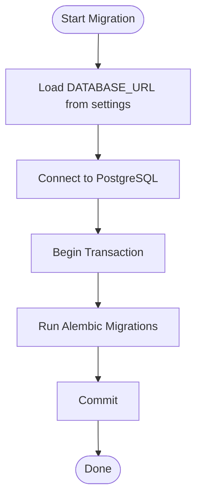
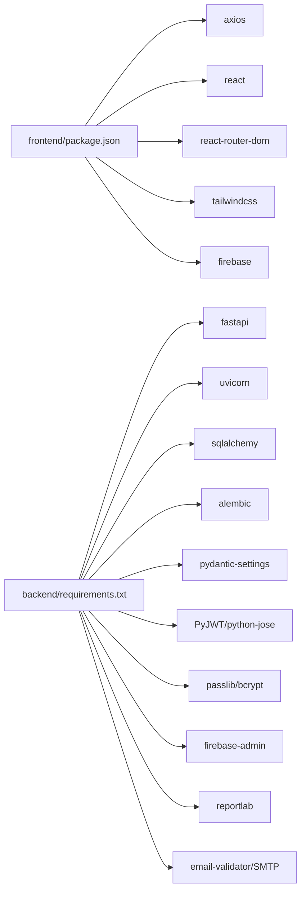

# Deployment Guide

<cite>
**Referenced Files in This Document**
- [README.md](file://README.md)
- [backend/README.md](file://backend/README.md)
- [frontend/README.md](file://frontend/README.md)
- [backend/app/main.py](file://backend/app/main.py)
- [backend/app/config.py](file://backend/app/config.py)
- [backend/app/database.py](file://backend/app/database.py)
- [backend/requirements.txt](file://backend/requirements.txt)
- [backend/alembic/env.py](file://backend/alembic/env.py)
- [backend/alembic.ini](file://backend/alembic.ini)
- [frontend/package.json](file://frontend/package.json)
- [frontend/vite.config.js](file://frontend/vite.config.js)
- [frontend/vercel.json](file://frontend/vercel.json)
- [frontend/src/services/api.js](file://frontend/src/services/api.js)
- [docs/database-schema.md](file://docs/database-schema.md)
</cite>

## Table of Contents
1. [Introduction](#introduction)
2. [Project Structure](#project-structure)
3. [Core Components](#core-components)
4. [Architecture Overview](#architecture-overview)
5. [Detailed Component Analysis](#detailed-component-analysis)
6. [Dependency Analysis](#dependency-analysis)
7. [Performance Considerations](#performance-considerations)
8. [Troubleshooting Guide](#troubleshooting-guide)
9. [Conclusion](#conclusion)
10. [Appendices](#appendices)

## Introduction
This guide provides production-grade deployment instructions for the Modern Digital Banking Dashboard. It covers frontend deployment to Vercel, backend deployment to Render or Railway, managed PostgreSQL services, environment configuration, database migrations, reverse proxy and CORS setup, SSL/TLS considerations, load balancing, containerization with Docker, CI/CD pipeline setup, automated testing, monitoring, backups, disaster recovery, performance optimization, scaling, and cost management.

## Project Structure
The project consists of:
- Frontend: React + Vite application with SPA routing and API client.
- Backend: FastAPI application with SQLAlchemy ORM, Alembic migrations, and JWT authentication.
- Documentation: API spec and database schema.

**Diagram sources**
- [frontend/package.json:1-37](file://frontend/package.json#L1-L37)
- [frontend/vite.config.js:1-34](file://frontend/vite.config.js#L1-L34)
- [frontend/vercel.json:1-9](file://frontend/vercel.json#L1-L9)
- [frontend/src/services/api.js:1-73](file://frontend/src/services/api.js#L1-L73)
- [backend/app/main.py:1-109](file://backend/app/main.py#L1-L109)
- [backend/app/config.py:1-72](file://backend/app/config.py#L1-L72)
- [backend/app/database.py:1-51](file://backend/app/database.py#L1-L51)
- [backend/requirements.txt:1-69](file://backend/requirements.txt#L1-L69)
- [backend/alembic/env.py:1-59](file://backend/alembic/env.py#L1-L59)
- [backend/alembic.ini:1-37](file://backend/alembic.ini#L1-L37)
- [docs/database-schema.md:1-147](file://docs/database-schema.md#L1-L147)

**Section sources**
- [README.md:24-73](file://README.md#L24-L73)
- [backend/README.md:27-44](file://backend/README.md#L27-L44)
- [frontend/README.md:37-49](file://frontend/README.md#L37-L49)

## Core Components
- Frontend: SPA built with Vite, served statically via Vercel. API requests are proxied during development and use environment-based base URLs in production.
- Backend: FastAPI application exposing REST endpoints, secured with JWT, backed by PostgreSQL, and migrated with Alembic.
- Database: PostgreSQL schema documented with entity relationships and constraints.

Key deployment-relevant files:
- Frontend: package.json, vite.config.js, vercel.json, api client.
- Backend: main.py (Routers, CORS), config.py (.env loading and settings), database.py (engine/session), requirements.txt, alembic env/ini.

**Section sources**
- [frontend/package.json:1-37](file://frontend/package.json#L1-L37)
- [frontend/vite.config.js:1-34](file://frontend/vite.config.js#L1-L34)
- [frontend/vercel.json:1-9](file://frontend/vercel.json#L1-L9)
- [frontend/src/services/api.js:1-73](file://frontend/src/services/api.js#L1-L73)
- [backend/app/main.py:56-109](file://backend/app/main.py#L56-L109)
- [backend/app/config.py:26-72](file://backend/app/config.py#L26-L72)
- [backend/app/database.py:24-51](file://backend/app/database.py#L24-L51)
- [backend/requirements.txt:1-69](file://backend/requirements.txt#L1-L69)
- [backend/alembic/env.py:1-59](file://backend/alembic/env.py#L1-L59)
- [backend/alembic.ini:1-37](file://backend/alembic.ini#L1-L37)
- [docs/database-schema.md:1-147](file://docs/database-schema.md#L1-L147)

## Architecture Overview
High-level production architecture:
- Frontend hosted on Vercel (static SPA).
- Backend hosted on Render/Railway (Python/ASGI).
- Managed PostgreSQL (e.g., Neon) for primary data.
- Optional CDN and TLS termination at platform edges.
- Reverse proxy considerations for development and CORS for production.

**Diagram sources**
- [README.md:317-333](file://README.md#L317-L333)
- [backend/app/main.py:91-109](file://backend/app/main.py#L91-L109)
- [backend/app/config.py:57-72](file://backend/app/config.py#L57-L72)
- [backend/app/database.py:24-51](file://backend/app/database.py#L24-L51)

## Detailed Component Analysis

### Frontend Deployment (Vercel)
- Build command: npm run build.
- Output directory: dist/.
- SPA routing: vercel.json rewrites all routes to index.html.
- Environment variables: VITE_API_BASE_URL points to backend domain.

Recommended steps:
1. Set VITE_API_BASE_URL in Vercel project settings to your production backend URL.
2. Configure environment variables in Vercel dashboard (e.g., analytics keys if used).
3. Enable HTTPS (automatic on Vercel).
4. Optionally configure custom domains and SSL certificates at Vercel.

**Diagram sources**
- [frontend/package.json:6-11](file://frontend/package.json#L6-L11)
- [frontend/vercel.json:1-9](file://frontend/vercel.json#L1-L9)

**Section sources**
- [README.md:317-327](file://README.md#L317-L327)
- [frontend/package.json:6-11](file://frontend/package.json#L6-L11)
- [frontend/vercel.json:1-9](file://frontend/vercel.json#L1-L9)

### Backend Deployment (Render or Railway)
- Runtime: Python 3.11+ with ASGI server (Uvicorn).
- Dependencies: installed from requirements.txt.
- Database: PostgreSQL via DATABASE_URL.
- Migrations: run with Alembic against managed PostgreSQL.
- CORS: configurable via environment variable CORS_ALLOWED_ORIGINS.

Recommended steps:
1. Provision managed PostgreSQL (e.g., Neon) and set DATABASE_URL.
2. Create a new Web Service on Render/Railway pointing to backend/.
3. Set environment variables: DATABASE_URL, JWT_SECRET_KEY, JWT_REFRESH_SECRET_KEY, JWT_ALGORITHM, ACCESS_TOKEN_EXPIRE_MINUTES, refresh_token_expire_days, SMTP_* (if OTP enabled), FIREBASE_CREDENTIALS_JSON.
4. Configure build command: pip install -r requirements.txt.
5. Configure start command: uvicorn app.main:app --host 0.0.0.0 --port $PORT.
6. Enable automatic deploys on commits.
7. Configure health checks if supported by platform.

**Diagram sources**
- [backend/requirements.txt:1-69](file://backend/requirements.txt#L1-L69)
- [backend/app/main.py:56-89](file://backend/app/main.py#L56-L89)
- [backend/app/config.py:57-72](file://backend/app/config.py#L57-L72)
- [backend/app/database.py:24-51](file://backend/app/database.py#L24-L51)

**Section sources**
- [README.md:329-333](file://README.md#L329-L333)
- [backend/README.md:92-108](file://backend/README.md#L92-L108)
- [backend/requirements.txt:1-69](file://backend/requirements.txt#L1-L69)
- [backend/app/main.py:56-109](file://backend/app/main.py#L56-L109)
- [backend/app/config.py:57-72](file://backend/app/config.py#L57-L72)
- [backend/app/database.py:24-51](file://backend/app/database.py#L24-L51)

### Database Migration Deployment
- Alembic is configured to run online migrations only.
- Target metadata includes all models.
- Migration logs configured via alembic.ini.

Recommended steps:
1. After deploying backend, run migrations using Alembic against the managed PostgreSQL instance.
2. Use DATABASE_URL from environment to connect Alembic to the database.
3. Keep migration scripts under version control; do not edit existing revisions.

**Diagram sources**
- [backend/alembic/env.py:40-58](file://backend/alembic/env.py#L40-L58)
- [backend/alembic.ini:1-37](file://backend/alembic.ini#L1-L37)
- [backend/app/config.py:57-72](file://backend/app/config.py#L57-L72)

**Section sources**
- [backend/alembic/env.py:1-59](file://backend/alembic/env.py#L1-L59)
- [backend/alembic.ini:1-37](file://backend/alembic.ini#L1-L37)
- [backend/app/config.py:57-72](file://backend/app/config.py#L57-L72)

### Environment Configuration Management
Backend settings are loaded from .env using pydantic-settings with safe development fallbacks and warnings. Frontend reads VITE_API_BASE_URL from environment.

Key variables:
- Backend: DATABASE_URL, JWT_SECRET_KEY, JWT_REFRESH_SECRET_KEY, JWT_ALGORITHM, ACCESS_TOKEN_EXPIRE_MINUTES, refresh_token_expire_days, SMTP_* (optional), FIREBASE_CREDENTIALS_JSON.
- Frontend: VITE_API_BASE_URL.

Recommendations:
- Store secrets in platform dashboards (Render/Railway/Vercel) and avoid committing secrets to repositories.
- Use separate environments (staging/production) with distinct secrets.
- Validate required variables at startup (development fallbacks are not for production).

**Section sources**
- [backend/app/config.py:26-72](file://backend/app/config.py#L26-L72)
- [README.md:278-314](file://README.md#L278-L314)
- [frontend/src/services/api.js:19-21](file://frontend/src/services/api.js#L19-L21)

### Reverse Proxy Setup and CORS
- Development proxy: vite.config.js proxies /api to backend host.
- Production CORS: main.py adds middleware with default origins and allows override via CORS_ALLOWED_ORIGINS environment variable.

Recommendations:
- Set CORS_ALLOWED_ORIGINS to your frontend domains (e.g., Vercel preview/production domains).
- For production, ensure HTTPS termination at platform edges; configure SSL/TLS at Vercel and Render/Railway.
- If self-hosting a reverse proxy, forward Authorization headers and preserve original host/port.

**Section sources**
- [frontend/vite.config.js:22-31](file://frontend/vite.config.js#L22-L31)
- [backend/app/main.py:91-109](file://backend/app/main.py#L91-L109)

### SSL Certificate Configuration
- Vercel: HTTPS is enabled automatically; custom domains can be added with platform-managed certificates.
- Render/Railway: HTTPS is typically enabled; custom domains and certificates are configurable in platform settings.
- Ensure backend endpoints are served over HTTPS in production.

**Section sources**
- [README.md:317-333](file://README.md#L317-L333)

### Load Balancing Considerations
- Backend: Single-process Uvicorn by default; scale horizontally by adding multiple dynos/instances on Render/Railway.
- Frontend: Vercel distributes traffic globally; enable caching and CDN features as needed.
- Database: Use managed PostgreSQL with read replicas if needed; ensure connection pooling and pre-ping settings are appropriate.

**Section sources**
- [backend/app/database.py:31-34](file://backend/app/database.py#L31-L34)
- [backend/README.md:92-108](file://backend/README.md#L92-L108)

### Containerization Options with Docker
While the project does not include a Dockerfile, you can containerize the backend as follows:
- Base image: python:3.11-slim.
- Copy requirements.txt and install dependencies.
- Copy application code.
- Set environment variables (DATABASE_URL, JWT secrets).
- Health check endpoint: GET "/".
- Command: uvicorn app.main:app --host 0.0.0.0 --port $PORT.

Frontend containerization:
- Use nginx:alpine to serve dist/.
- Mount dist/ as static content.
- Configure gzip/brotli compression and cache headers.

**Section sources**
- [backend/requirements.txt:1-69](file://backend/requirements.txt#L1-L69)
- [backend/app/main.py:56-89](file://backend/app/main.py#L56-L89)
- [frontend/package.json:6-11](file://frontend/package.json#L6-L11)

### CI/CD Pipeline Setup
Recommended pipeline stages:
- Test: Run frontend tests and backend unit/integration tests.
- Lint: JavaScript and Python linting.
- Build: Build frontend dist and backend artifacts.
- Deploy: Deploy frontend to Vercel and backend to Render/Railway.
- Migrate: Run Alembic migrations post-deploy.
- Monitor: Post-deployment health checks and smoke tests.

Tools:
- GitHub Actions/Azure Pipelines/Jenkins.
- Use platform-native deployment integrations for Vercel and Render/Railway.

**Section sources**
- [frontend/README.md:196-207](file://frontend/README.md#L196-L207)
- [backend/README.md:92-108](file://backend/README.md#L92-L108)

### Automated Testing Integration
- Frontend: Jest configuration exists; run npm test or equivalent in CI.
- Backend: Integrate pytest with Alembic for database tests; mock external services (Firebase, SMTP) in CI.

**Section sources**
- [frontend/README.md:196-207](file://frontend/README.md#L196-L207)
- [backend/README.md:92-108](file://backend/README.md#L92-L108)

### Monitoring Configuration
- Backend: Enable structured logging; export logs to platform logging or external services (e.g., Datadog, Sentry).
- Frontend: Use browser performance monitoring; monitor API latency and error rates.
- Database: Enable managed DB monitoring and slow query logs.

**Section sources**
- [backend/alembic.ini:15-37](file://backend/alembic.ini#L15-L37)

### Backup Strategies and Disaster Recovery
- Database: Use managed PostgreSQL snapshots/backups; enable PITR if available.
- Secrets: Store in platform secret managers; rotate JWT secrets periodically.
- Frontend: Versioned static assets; keep previous builds for rollback.
- Backend: Maintain immutable deployments; tag releases and keep artifacts.

**Section sources**
- [docs/database-schema.md:141-147](file://docs/database-schema.md#L141-L147)

### Performance Optimization Techniques
- Frontend: Bundle splitting, lazy loading, minification, and CDN distribution via Vercel.
- Backend: Use connection pooling, pre-ping, and efficient queries; enable gzip/HTTP/2.
- Database: Indexes on frequently queried columns (user_id, account_id, timestamps); consider read replicas.

**Section sources**
- [backend/app/database.py:31-34](file://backend/app/database.py#L31-L34)
- [docs/database-schema.md:141-147](file://docs/database-schema.md#L141-L147)

### Scaling Considerations
- Horizontal scaling: Add more instances on Render/Railway; ensure shared database and stateless app.
- Frontend: Rely on Vercel edge caching and global distribution.
- Database: Use managed provider scaling options; optimize queries and connections.

**Section sources**
- [backend/README.md:92-108](file://backend/README.md#L92-L108)

### Cost Management Best Practices
- Choose appropriate instance sizes; autoscale based on traffic.
- Use managed services to reduce operational overhead.
- Monitor resource usage and optimize queries.
- Enable compression and caching to reduce bandwidth costs.

[No sources needed since this section provides general guidance]

## Dependency Analysis
Runtime dependencies and their roles:
- Frontend: React, Vite, Axios, Tailwind, Firebase.
- Backend: FastAPI, Uvicorn, SQLAlchemy, Alembic, Pydantic, PyJWT, passlib/bcrypt, Firebase Admin, ReportLab, SMTP/email-validator.

**Diagram sources**
- [frontend/package.json:12-35](file://frontend/package.json#L12-L35)
- [backend/requirements.txt:1-69](file://backend/requirements.txt#L1-L69)

**Section sources**
- [frontend/package.json:12-35](file://frontend/package.json#L12-L35)
- [backend/requirements.txt:1-69](file://backend/requirements.txt#L1-L69)

## Performance Considerations
- Use managed PostgreSQL with appropriate tier for workload.
- Enable HTTP/2 and compression at platform edges.
- Optimize frontend bundle size and leverage Vercel’s CDN.
- Tune backend connection pool and pre-ping settings.

[No sources needed since this section provides general guidance]

## Troubleshooting Guide
Common production issues and resolutions:
- CORS errors: Ensure CORS_ALLOWED_ORIGINS includes frontend domains.
- JWT token expiration: Adjust ACCESS_TOKEN_EXPIRE_MINUTES and refresh token expiry.
- Database connectivity: Verify DATABASE_URL and network policies; enable pre-ping.
- OTP failures: Validate SMTP settings and email deliverability.
- Firebase push notifications: Confirm FIREBASE_CREDENTIALS_JSON validity.

**Section sources**
- [backend/app/main.py:91-109](file://backend/app/main.py#L91-L109)
- [backend/app/config.py:57-72](file://backend/app/config.py#L57-L72)
- [backend/app/database.py:31-34](file://backend/app/database.py#L31-L34)
- [README.md:278-314](file://README.md#L278-L314)

## Conclusion
This guide outlines a production-ready deployment strategy for the Modern Digital Banking Dashboard across Vercel, Render/Railway, and managed PostgreSQL. By following environment configuration, migration, CORS, SSL, load balancing, containerization, CI/CD, testing, monitoring, backups, and cost management practices, you can achieve a secure, scalable, and maintainable system.

[No sources needed since this section summarizes without analyzing specific files]

## Appendices

### Step-by-Step Deployment Checklist
- Prepare secrets: DATABASE_URL, JWT secrets, SMTP, FIREBASE_CREDENTIALS_JSON.
- Build frontend: npm run build; verify dist/.
- Deploy frontend to Vercel; set VITE_API_BASE_URL.
- Deploy backend to Render/Railway; set environment variables.
- Run migrations with Alembic against managed PostgreSQL.
- Configure CORS and SSL/TLS.
- Set up CI/CD pipeline with testing and linting.
- Configure monitoring and alerting.
- Plan backups and disaster recovery procedures.

**Section sources**
- [README.md:278-333](file://README.md#L278-L333)
- [frontend/package.json:6-11](file://frontend/package.json#L6-L11)
- [backend/requirements.txt:1-69](file://backend/requirements.txt#L1-L69)
- [backend/alembic/env.py:40-58](file://backend/alembic/env.py#L40-L58)

### Environment Variable Reference
- Backend:
  - DATABASE_URL
  - JWT_SECRET_KEY, JWT_REFRESH_SECRET_KEY, JWT_ALGORITHM, ACCESS_TOKEN_EXPIRE_MINUTES, refresh_token_expire_days
  - SMTP_SERVER, SMTP_PORT, SMTP_EMAIL, SMTP_PASSWORD
  - FIREBASE_CREDENTIALS_JSON
  - CORS_ALLOWED_ORIGINS
- Frontend:
  - VITE_API_BASE_URL

**Section sources**
- [README.md:278-314](file://README.md#L278-L314)
- [backend/app/config.py:57-72](file://backend/app/config.py#L57-L72)
- [frontend/src/services/api.js:19-21](file://frontend/src/services/api.js#L19-L21)