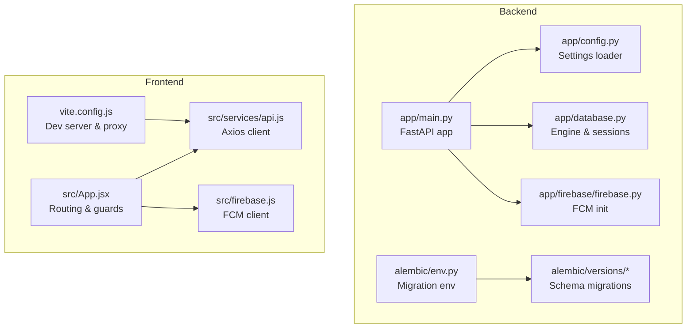
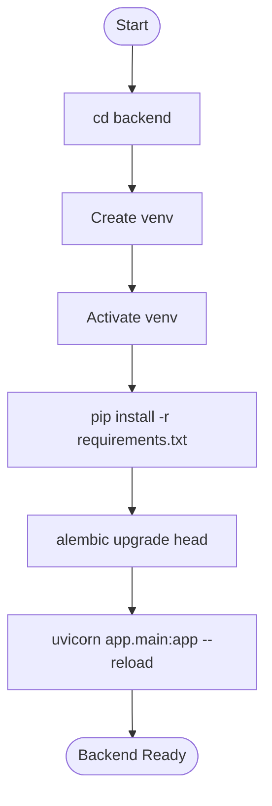
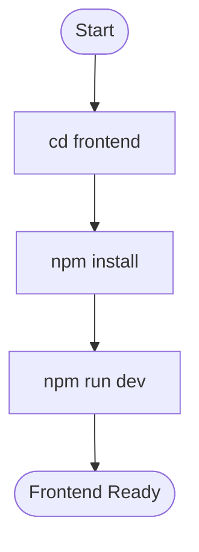
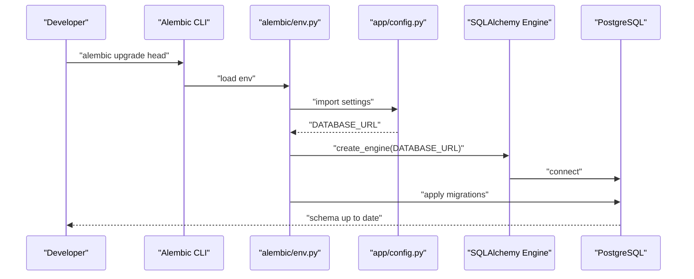
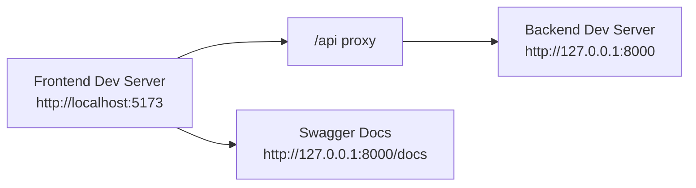

# Getting Started

<cite>
**Referenced Files in This Document**
- [README.md](file://README.md)
- [backend/README.md](file://backend/README.md)
- [frontend/README.md](file://frontend/README.md)
- [backend/app/main.py](file://backend/app/main.py)
- [backend/app/config.py](file://backend/app/config.py)
- [backend/app/database.py](file://backend/app/database.py)
- [backend/app/firebase/firebase.py](file://backend/app/firebase/firebase.py)
- [backend/requirements.txt](file://backend/requirements.txt)
- [backend/alembic/env.py](file://backend/alembic/env.py)
- [backend/alembic/versions/f3c553c21ca8_initial_schema.py](file://backend/alembic/versions/f3c553c21ca8_initial_schema.py)
- [backend/alembic.ini](file://backend/alembic.ini)
- [frontend/package.json](file://frontend/package.json)
- [frontend/vite.config.js](file://frontend/vite.config.js)
- [frontend/src/services/api.js](file://frontend/src/services/api.js)
- [frontend/src/App.jsx](file://frontend/src/App.jsx)
- [frontend/src/firebase.js](file://frontend/src/firebase.js)
</cite>

## Table of Contents
1. [Introduction](#introduction)
2. [Project Structure](#project-structure)
3. [Prerequisites](#prerequisites)
4. [Environment Setup](#environment-setup)
5. [Backend Installation](#backend-installation)
6. [Frontend Installation](#frontend-installation)
7. [Database Initialization](#database-initialization)
8. [Local Development Servers](#local-development-servers)
9. [Quick Start Examples](#quick-start-examples)
10. [Verification Steps](#verification-steps)
11. [Troubleshooting](#troubleshooting)
12. [Deployment Options](#deployment-options)
13. [Conclusion](#conclusion)

## Introduction
This guide helps you install and run the Modern Digital Banking Dashboard locally, covering both backend and frontend environments. It also documents environment variables, database setup with Alembic migrations, local development servers, quick start examples, verification steps, troubleshooting, and deployment options for development and production.

## Project Structure
The project is organized into:
- backend: FastAPI application with modular features (authentication, accounts, transactions, transfers, budgets, bills, rewards, insights, alerts, exports, Firebase push notifications)
- frontend: React + Vite application with user/admin dashboards, routing, and Firebase integration
- docs: API specification and database schema documentation

**Diagram sources**
- [backend/app/main.py:56-89](file://backend/app/main.py#L56-L89)
- [backend/app/config.py:57-72](file://backend/app/config.py#L57-L72)
- [backend/app/database.py:29-51](file://backend/app/database.py#L29-L51)
- [backend/app/firebase/firebase.py:7-29](file://backend/app/firebase/firebase.py#L7-L29)
- [backend/alembic/env.py:11-58](file://backend/alembic/env.py#L11-L58)
- [backend/alembic/versions/f3c553c21ca8_initial_schema.py:18-79](file://backend/alembic/versions/f3c553c21ca8_initial_schema.py#L18-L79)
- [frontend/vite.config.js:22-31](file://frontend/vite.config.js#L22-L31)
- [frontend/src/services/api.js:19-31](file://frontend/src/services/api.js#L19-L31)
- [frontend/src/App.jsx:78-168](file://frontend/src/App.jsx#L78-L168)
- [frontend/src/firebase.js:1-24](file://frontend/src/firebase.js#L1-L24)

**Section sources**
- [README.md:24-73](file://README.md#L24-L73)
- [backend/README.md:27-44](file://backend/README.md#L27-L44)
- [frontend/README.md:37-49](file://frontend/README.md#L37-L49)

## Prerequisites
Ensure your environment meets the minimum requirements:
- Python 3.11+ (development tested with 3.11)
- Node.js 18+ (development tested with 18)
- PostgreSQL (or use Neon cloud)
- Firebase account for push notifications

Notes:
- The repository documentation lists Node.js 18+ and Python 3.11+ as prerequisites.
- Firebase is required for push notifications.

**Section sources**
- [README.md:232-237](file://README.md#L232-L237)
- [backend/README.md:15-24](file://backend/README.md#L15-L24)
- [frontend/README.md:27-34](file://frontend/README.md#L27-L34)

## Environment Setup
Configure environment variables for both backend and frontend.

Backend (.env):
- Database URL
- JWT secrets and algorithm
- SMTP settings for OTP emails
- Firebase credentials JSON
- Optional admin seeding variables

Frontend (.env):
- VITE_API_BASE_URL pointing to backend API base

These variables are loaded by the backend configuration and consumed by the frontend API client.

**Section sources**
- [README.md:278-314](file://README.md#L278-L314)
- [backend/app/config.py:31-72](file://backend/app/config.py#L31-L72)
- [frontend/src/services/api.js:19-21](file://frontend/src/services/api.js#L19-L21)

## Backend Installation
Follow these steps to prepare and run the backend:

1. Change to the backend directory.
2. Create a virtual environment.
3. Activate the virtual environment.
4. Install Python dependencies from requirements.txt.
5. Prepare the database with Alembic migrations.
6. Start the development server.

**Diagram sources**
- [README.md:248-270](file://README.md#L248-L270)
- [backend/README.md:92-108](file://backend/README.md#L92-L108)
- [backend/requirements.txt:1-69](file://backend/requirements.txt#L1-L69)

**Section sources**
- [README.md:248-270](file://README.md#L248-L270)
- [backend/README.md:92-108](file://backend/README.md#L92-L108)
- [backend/requirements.txt:1-69](file://backend/requirements.txt#L1-L69)

## Frontend Installation
Follow these steps to prepare and run the frontend:

1. Change to the frontend directory.
2. Install Node.js dependencies.
3. Start the development server.

**Diagram sources**
- [README.md:238-246](file://README.md#L238-L246)
- [frontend/README.md:196-207](file://frontend/README.md#L196-L207)
- [frontend/package.json:6-11](file://frontend/package.json#L6-L11)

**Section sources**
- [README.md:238-246](file://README.md#L238-L246)
- [frontend/README.md:196-207](file://frontend/README.md#L196-L207)
- [frontend/package.json:6-11](file://frontend/package.json#L6-L11)

## Database Initialization
The backend uses Alembic for database migrations. The initial schema includes users, accounts, and budgets tables.

Key steps:
- Alembic loads settings from the backend configuration.
- The migration environment imports all SQLAlchemy models to detect metadata.
- Migrations are applied online against the configured DATABASE_URL.

**Diagram sources**
- [backend/alembic/env.py:11-58](file://backend/alembic/env.py#L11-L58)
- [backend/app/config.py:57-72](file://backend/app/config.py#L57-L72)
- [backend/alembic/versions/f3c553c21ca8_initial_schema.py:18-79](file://backend/alembic/versions/f3c553c21ca8_initial_schema.py#L18-L79)

**Section sources**
- [backend/alembic/env.py:11-58](file://backend/alembic/env.py#L11-L58)
- [backend/alembic/versions/f3c553c21ca8_initial_schema.py:18-79](file://backend/alembic/versions/f3c553c21ca8_initial_schema.py#L18-L79)
- [backend/alembic.ini:1-37](file://backend/alembic.ini#L1-L37)

## Local Development Servers
Run both servers concurrently:

Backend:
- Port: 8000
- Swagger docs: http://127.0.0.1:8000/docs
- CORS origins include localhost:5173 and Vercel domains

Frontend:
- Port: 5173
- Proxy configured to forward /api requests to a Render-hosted backend (for production builds)

**Diagram sources**
- [backend/app/main.py:91-109](file://backend/app/main.py#L91-L109)
- [frontend/vite.config.js:22-31](file://frontend/vite.config.js#L22-L31)

**Section sources**
- [README.md:248-275](file://README.md#L248-L275)
- [backend/app/main.py:91-109](file://backend/app/main.py#L91-L109)
- [frontend/vite.config.js:22-31](file://frontend/vite.config.js#L22-L31)

## Quick Start Examples
Complete basic user operations using the installed local environment.

1) User Registration
- Endpoint: POST /api/auth/register
- Fields: name, email, password
- Behavior: Hashes password and persists user record

2) User Login
- Endpoint: POST /api/auth/login
- Fields: username (email), password
- Returns: access_token and user info

3) Basic Account Operations
- List accounts: GET /api/accounts
- Create account: POST /api/accounts
- Update account: PUT /api/accounts/{id}
- Delete account: DELETE /api/accounts/{id}

Notes:
- These endpoints are exposed by the backend and consumed by the frontend.
- The frontend uses an Axios instance configured with the base URL from environment variables.

**Section sources**
- [README.md:167-226](file://README.md#L167-L226)
- [frontend/src/services/api.js:19-31](file://frontend/src/services/api.js#L19-L31)
- [backend/app/auth/router.py:75-120](file://backend/app/auth/router.py#L75-L120)

## Verification Steps
After completing installation, verify your setup:

- Backend health
  - Visit http://127.0.0.1:8000/ to confirm the API is running
  - Open http://127.0.0.1:8000/docs to review available endpoints

- Frontend health
  - Open http://localhost:5173
  - Confirm the home page loads and navigation works

- Database connectivity
  - Ensure migrations ran successfully (no errors in backend logs)
  - Confirm initial schema tables exist in the database

- Environment variables
  - Backend loads .env automatically; missing variables fall back to development values with warnings
  - Frontend reads VITE_API_BASE_URL from .env

- Firebase notifications
  - Backend initializes Firebase on startup
  - Frontend requests notification permissions and retrieves FCM token

**Section sources**
- [backend/app/main.py:87-89](file://backend/app/main.py#L87-L89)
- [backend/app/main.py:59-61](file://backend/app/main.py#L59-L61)
- [backend/app/config.py:31-56](file://backend/app/config.py#L31-L56)
- [frontend/src/firebase.js:16-23](file://frontend/src/firebase.js#L16-L23)

## Troubleshooting
Common setup issues and resolutions:

- Missing or invalid DATABASE_URL
  - Symptom: Migration or startup errors related to database connection
  - Resolution: Set DATABASE_URL in backend .env to a valid PostgreSQL connection string

- Missing JWT secrets
  - Symptom: Warning about missing JWT_SECRET_KEY/JWT_REFRESH_SECRET_KEY during startup
  - Resolution: Add JWT_SECRET_KEY and JWT_REFRESH_SECRET_KEY to backend .env

- CORS errors in browser
  - Symptom: Preflight failures or blocked requests from frontend to backend
  - Resolution: Ensure frontend runs on http://localhost:5173; backend CORS allows this origin

- Firebase credentials not configured
  - Symptom: Runtime error indicating FIREBASE_CREDENTIALS_JSON not set
  - Resolution: Provide Firebase credentials JSON in backend .env

- Frontend proxy misconfiguration
  - Symptom: API calls fail when running frontend locally
  - Resolution: Use VITE_API_BASE_URL in frontend .env to point to backend; or configure proxy in vite.config.js

- Python dependencies not installing
  - Symptom: pip install fails
  - Resolution: Use Python 3.11+ and ensure virtual environment activation before installing requirements.txt

- Node dependencies not installing
  - Symptom: npm install fails
  - Resolution: Use Node.js 18+ and ensure npm cache is clean if needed

**Section sources**
- [backend/app/config.py:31-56](file://backend/app/config.py#L31-L56)
- [backend/app/firebase/firebase.py:11-18](file://backend/app/firebase/firebase.py#L11-L18)
- [frontend/vite.config.js:22-31](file://frontend/vite.config.js#L22-L31)
- [frontend/src/services/api.js:19-21](file://frontend/src/services/api.js#L19-L21)
- [backend/requirements.txt:1-69](file://backend/requirements.txt#L1-L69)
- [frontend/package.json:6-11](file://frontend/package.json#L6-L11)

## Deployment Options
Two primary deployment targets are documented:

- Frontend (Vercel)
  - Build command: npm run build
  - Deploy the built static files (dist/) to Vercel
  - SPA routing is supported

- Backend (Render)
  - Hosted on Render with PostgreSQL on Neon cloud
  - The frontend proxy in vite.config.js targets a Render-hosted backend URL for production builds

Additional considerations:
- Environment variables must be configured in production for both backend and frontend
- Ensure CORS origins are updated for production domains
- For Firebase push notifications, configure production FCM credentials in backend environment

**Section sources**
- [README.md:317-333](file://README.md#L317-L333)
- [frontend/vite.config.js:22-31](file://frontend/vite.config.js#L22-L31)

## Conclusion
You now have the complete picture to install, configure, and run the Modern Digital Banking Dashboard locally, initialize the database, and deploy to production platforms. Use the quick start examples to validate your setup and refer to the troubleshooting section for common issues. For production, mirror the environment variable configuration and platform-specific settings described here.