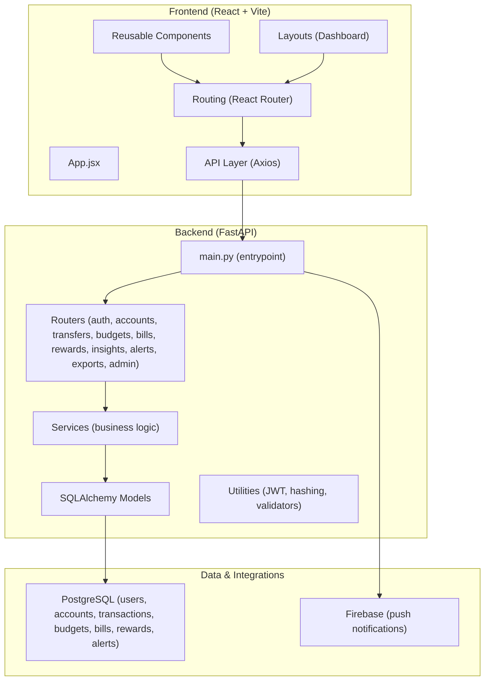
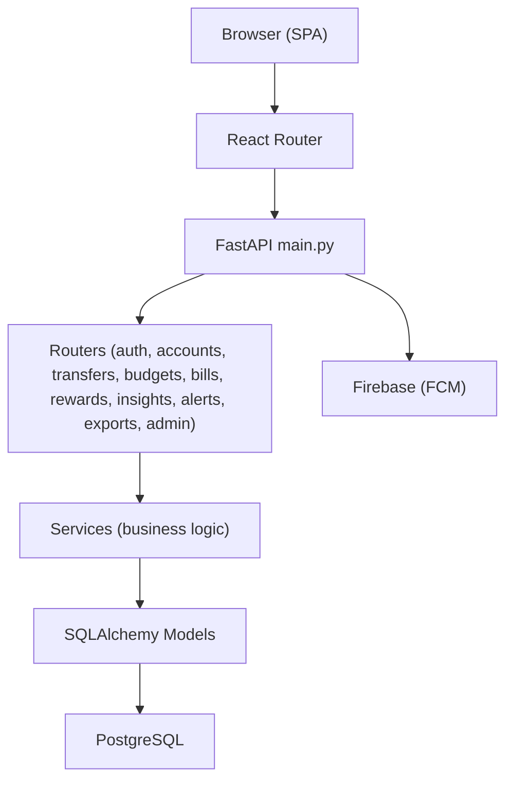
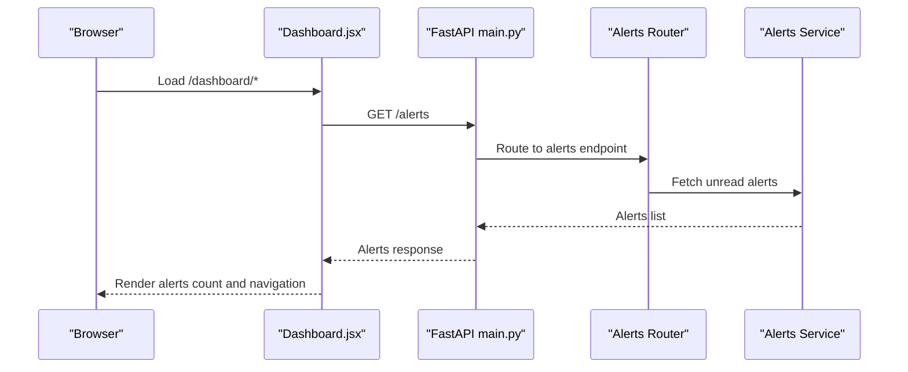
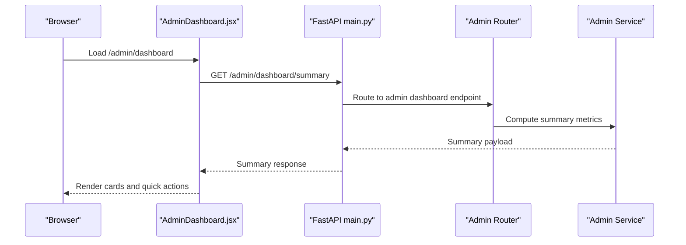
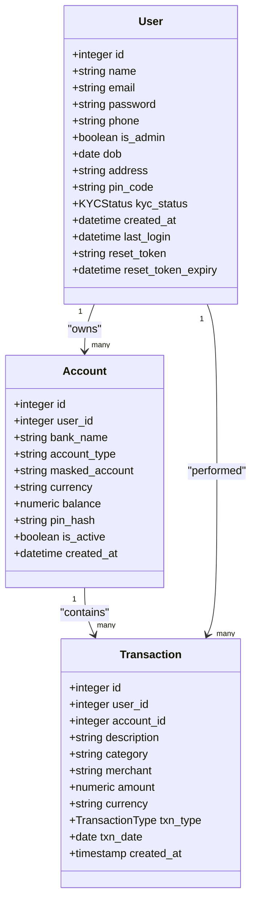
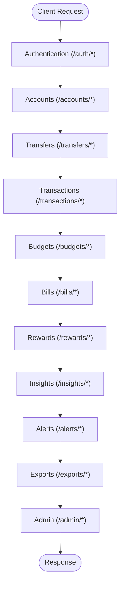
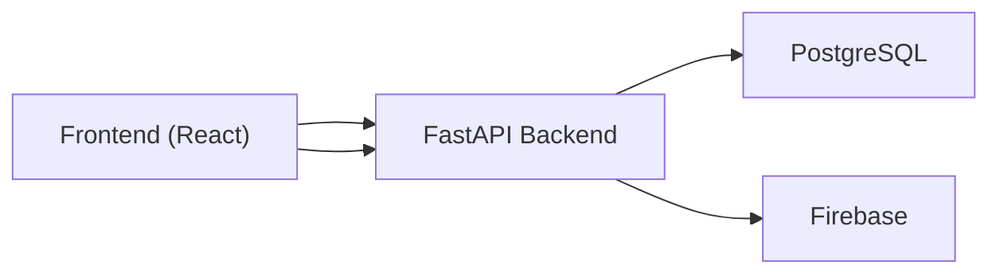

# Introduction

<cite>
**Referenced Files in This Document**
- [README.md](file://README.md)
- [backend/README.md](file://backend/README.md)
- [frontend/README.md](file://frontend/README.md)
- [backend/app/main.py](file://backend/app/main.py)
- [frontend/src/pages/user/Dashboard.jsx](file://frontend/src/pages/user/Dashboard.jsx)
- [frontend/src/pages/admin/AdminDashboard.jsx](file://frontend/src/pages/admin/AdminDashboard.jsx)
- [backend/app/models/user.py](file://backend/app/models/user.py)
- [backend/app/models/account.py](file://backend/app/models/account.py)
- [backend/app/models/transaction.py](file://backend/app/models/transaction.py)
- [docs/database-schema.md](file://docs/database-schema.md)
- [docs/api-spec.md](file://docs/api-spec.md)
</cite>

## Table of Contents
1. [Introduction](#introduction)
2. [Project Structure](#project-structure)
3. [Core Components](#core-components)
4. [Architecture Overview](#architecture-overview)
5. [Detailed Component Analysis](#detailed-component-analysis)
6. [Dependency Analysis](#dependency-analysis)
7. [Performance Considerations](#performance-considerations)
8. [Troubleshooting Guide](#troubleshooting-guide)
9. [Conclusion](#conclusion)

## Introduction
Aureus is a full-stack digital banking dashboard designed to modernize personal and administrative financial management. As part of the Infosys Springboard internship program, this project demonstrates professional software engineering practices across a React/Vite frontend and a FastAPI backend, integrated with PostgreSQL and Firebase. It simulates realistic banking experiences including secure authentication, account and transaction management, bill payments, budgeting, rewards, financial insights, and comprehensive admin oversight.

The application targets:
- Individual users who need seamless account management, automated bill payments, intelligent budget tracking, and rewards programs.
- Administrators who require comprehensive oversight of users, transactions, KYC workflows, alerts, and analytics.

Aureus addresses real-world banking challenges such as fragmented financial visibility, manual bill reconciliation, lack of automated budget controls, and limited admin observability. Its innovative solutions include:
- Unified dashboard for personal finance management with intuitive navigation and responsive design.
- Automated bill reminders and payment workflows with simulated transaction processing.
- Intelligent budget tracking with category-based limits and spending insights.
- Reward points management aligned with user engagement.
- Admin dashboards for monitoring, approvals, and system health.

Educationally, this project showcases end-to-end development practices, layered architecture, security controls (JWT, OTP, PIN verification), and scalable database modeling tailored for financial data.

**Section sources**
- [README.md:1-367](file://README.md#L1-L367)
- [backend/README.md:1-108](file://backend/README.md#L1-L108)
- [frontend/README.md:1-207](file://frontend/README.md#L1-L207)

## Project Structure
The repository is organized into three primary areas:
- frontend: React + Vite application with user and admin UIs, routing, services, and reusable components.
- backend: FastAPI application with modular routers, services, models, and utilities.
- docs: API specification and database schema documentation.

**Diagram sources**
- [backend/app/main.py:56-89](file://backend/app/main.py#L56-L89)
- [docs/database-schema.md:11-147](file://docs/database-schema.md#L11-L147)

**Section sources**
- [README.md:24-73](file://README.md#L24-L73)
- [backend/README.md:27-44](file://backend/README.md#L27-L44)
- [frontend/README.md:37-49](file://frontend/README.md#L37-L49)

## Core Components
- Frontend dashboard and admin panels:
  - User dashboard provides navigation, quick actions, alerts, and profile management.
  - Admin dashboard presents system summaries, quick actions, and health indicators.
- Backend API entrypoint:
  - Centralized router registration and CORS configuration for frontend-backend communication.
- Database models:
  - User, Account, and Transaction models define core entities and relationships.
- Documentation:
  - API specification and database schema outline endpoints and data structures.

Value propositions:
- Seamless account management with PIN-secured operations.
- Automated bill payments and reminders.
- Intelligent budget tracking with category-based limits.
- Rewards programs integrated with user engagement.
- Comprehensive admin oversight for users, transactions, KYC, and analytics.

Target audience:
- Individual users: personal finance management, payments, insights, and rewards.
- Administrators: monitoring, approvals, analytics, and system controls.

**Section sources**
- [frontend/src/pages/user/Dashboard.jsx:43-55](file://frontend/src/pages/user/Dashboard.jsx#L43-L55)
- [frontend/src/pages/admin/AdminDashboard.jsx:19-35](file://frontend/src/pages/admin/AdminDashboard.jsx#L19-L35)
- [backend/app/main.py:64-85](file://backend/app/main.py#L64-L85)
- [backend/app/models/user.py:37-65](file://backend/app/models/user.py#L37-L65)
- [backend/app/models/account.py:31-57](file://backend/app/models/account.py#L31-L57)
- [backend/app/models/transaction.py:32-58](file://backend/app/models/transaction.py#L32-L58)
- [docs/api-spec.md:1-142](file://docs/api-spec.md#L1-L142)
- [docs/database-schema.md:1-147](file://docs/database-schema.md#L1-L147)

## Architecture Overview
Aureus follows a layered architecture:
- Presentation layer: React frontend with protected routes and admin layouts.
- API layer: FastAPI application registering modular routers for authentication, accounts, transfers, budgets, bills, rewards, insights, alerts, exports, and admin operations.
- Business logic layer: Services implementing domain-specific workflows.
- Data layer: SQLAlchemy models mapped to PostgreSQL tables, with Firebase integration for push notifications.

**Diagram sources**
- [backend/app/main.py:29-85](file://backend/app/main.py#L29-L85)
- [docs/database-schema.md:11-147](file://docs/database-schema.md#L11-L147)

**Section sources**
- [backend/app/main.py:56-109](file://backend/app/main.py#L56-L109)
- [docs/database-schema.md:1-147](file://docs/database-schema.md#L1-L147)

## Detailed Component Analysis

### User Dashboard
The user dashboard serves as the central hub for authenticated users, offering navigation, alerts, and quick actions. It integrates with the backend via Axios-based services and enforces protected routing.

**Diagram sources**
- [frontend/src/pages/user/Dashboard.jsx:119-131](file://frontend/src/pages/user/Dashboard.jsx#L119-L131)
- [backend/app/main.py:37-38](file://backend/app/main.py#L37-L38)

**Section sources**
- [frontend/src/pages/user/Dashboard.jsx:58-311](file://frontend/src/pages/user/Dashboard.jsx#L58-L311)

### Admin Dashboard
The admin dashboard aggregates system metrics, provides quick actions, and displays system health. It fetches summary data from backend admin endpoints.

**Diagram sources**
- [frontend/src/pages/admin/AdminDashboard.jsx:27-34](file://frontend/src/pages/admin/AdminDashboard.jsx#L27-L34)
- [backend/app/main.py:48-50](file://backend/app/main.py#L48-L50)

**Section sources**
- [frontend/src/pages/admin/AdminDashboard.jsx:19-173](file://frontend/src/pages/admin/AdminDashboard.jsx#L19-L173)

### Database Models Overview
The backend models define core entities and relationships supporting user accounts, transactions, and related features.

**Diagram sources**
- [backend/app/models/user.py:37-65](file://backend/app/models/user.py#L37-L65)
- [backend/app/models/account.py:31-57](file://backend/app/models/account.py#L31-L57)
- [backend/app/models/transaction.py:32-58](file://backend/app/models/transaction.py#L32-L58)

**Section sources**
- [backend/app/models/user.py:31-65](file://backend/app/models/user.py#L31-L65)
- [backend/app/models/account.py:30-57](file://backend/app/models/account.py#L30-L57)
- [backend/app/models/transaction.py:28-58](file://backend/app/models/transaction.py#L28-L58)
- [docs/database-schema.md:11-147](file://docs/database-schema.md#L11-L147)

### API Endpoints Overview
Endpoints are grouped by functional modules and secured with JWT. The backend registers routers for user and admin features, enabling comprehensive banking operations.

**Diagram sources**
- [docs/api-spec.md:10-125](file://docs/api-spec.md#L10-L125)
- [backend/app/main.py:64-85](file://backend/app/main.py#L64-L85)

**Section sources**
- [docs/api-spec.md:1-142](file://docs/api-spec.md#L1-L142)
- [backend/app/main.py:56-109](file://backend/app/main.py#L56-L109)

## Dependency Analysis
- Frontend depends on:
  - React Router for client-side routing.
  - Axios for API communication.
  - Firebase for push notifications.
- Backend depends on:
  - FastAPI for routing and middleware.
  - SQLAlchemy for ORM and database operations.
  - Alembic for migrations.
  - Pydantic for data validation.
  - JWT and hashing utilities for security.
- Cross-cutting integrations:
  - CORS configuration allows controlled frontend origins.
  - Firebase initialization on startup enables notifications.

**Diagram sources**
- [backend/app/main.py:91-109](file://backend/app/main.py#L91-L109)

**Section sources**
- [frontend/README.md:178-183](file://frontend/README.md#L178-L183)
- [backend/README.md:49-90](file://backend/README.md#L49-L90)
- [backend/app/main.py:91-109](file://backend/app/main.py#L91-L109)

## Performance Considerations
- Use pagination and filtering for transaction lists to reduce payload sizes.
- Cache frequently accessed dashboard metrics on the client to minimize repeated requests.
- Optimize chart rendering by debouncing resize events and limiting data granularity.
- Employ background tasks for periodic jobs (e.g., bill reminders) to avoid blocking API responses.
- Ensure database indexes on frequently queried columns (e.g., user_id, account_id, dates).

## Troubleshooting Guide
Common issues and resolutions:
- Authentication failures:
  - Verify JWT secret keys and algorithms in environment variables.
  - Confirm token presence and validity in request headers.
- CORS errors:
  - Ensure frontend origin is included in allowed CORS origins.
- Database connectivity:
  - Validate DATABASE_URL and confirm PostgreSQL availability.
- Firebase notifications:
  - Confirm FIREBASE_CREDENTIALS_JSON is correctly configured.
- Admin seeding:
  - Set SEED_ADMIN_* variables to initialize default admin credentials.

**Section sources**
- [README.md:278-314](file://README.md#L278-L314)
- [backend/README.md:83-90](file://backend/README.md#L83-L90)

## Conclusion
Aureus delivers a comprehensive digital banking experience through a modern, secure, and scalable full-stack architecture. It empowers users with seamless account management, automated bill payments, intelligent budget tracking, and rewards while equipping administrators with robust oversight and analytics. As an Infosys Springboard project, it exemplifies professional software development practices, layered design, and real-world applicability in financial services.