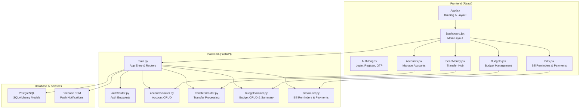
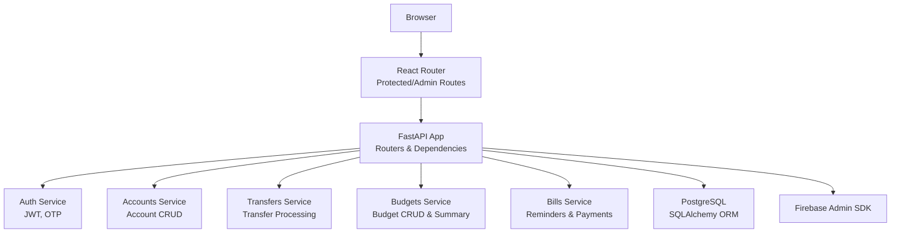
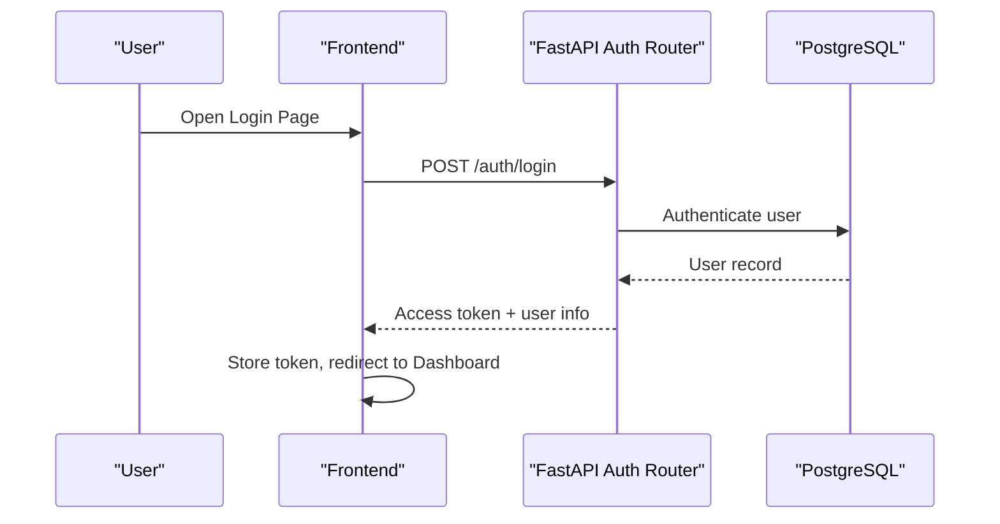
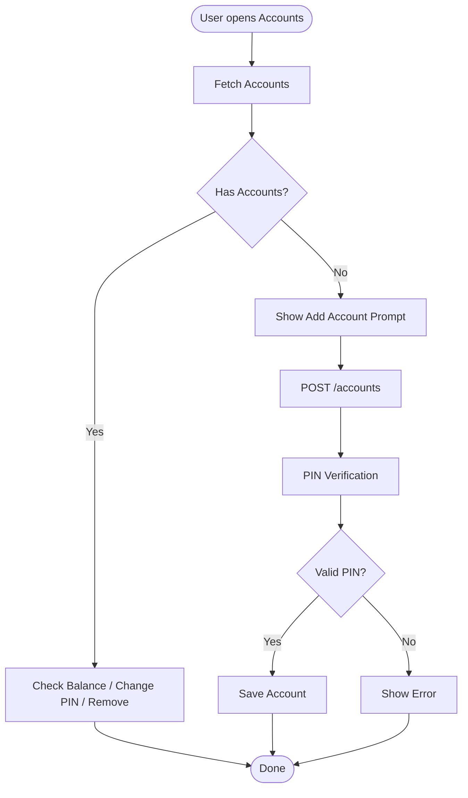
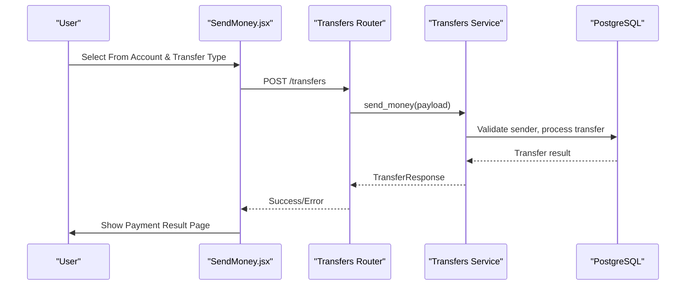
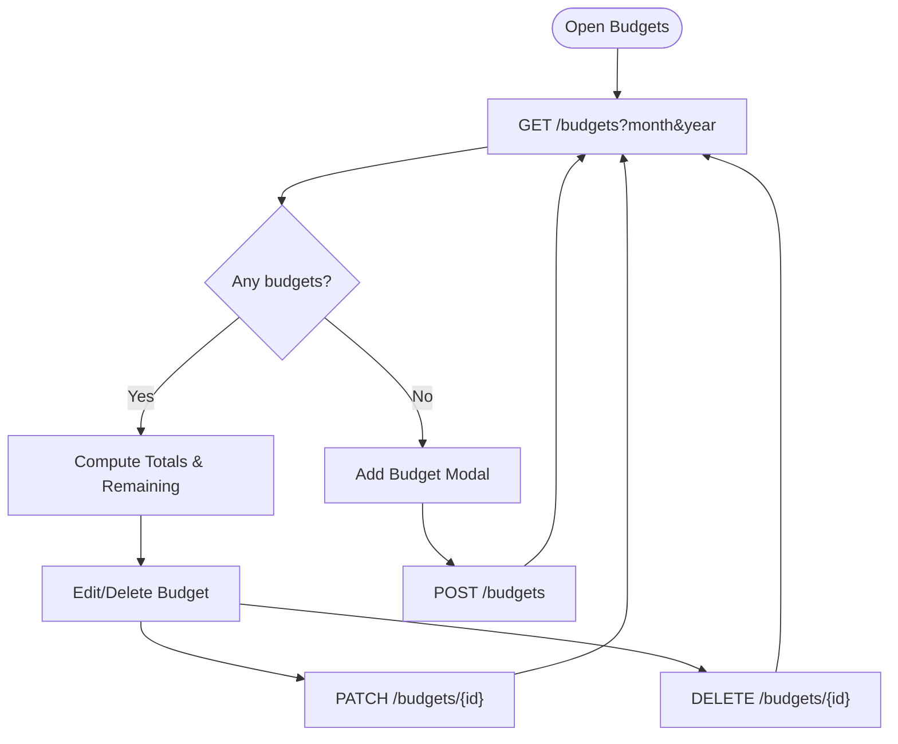
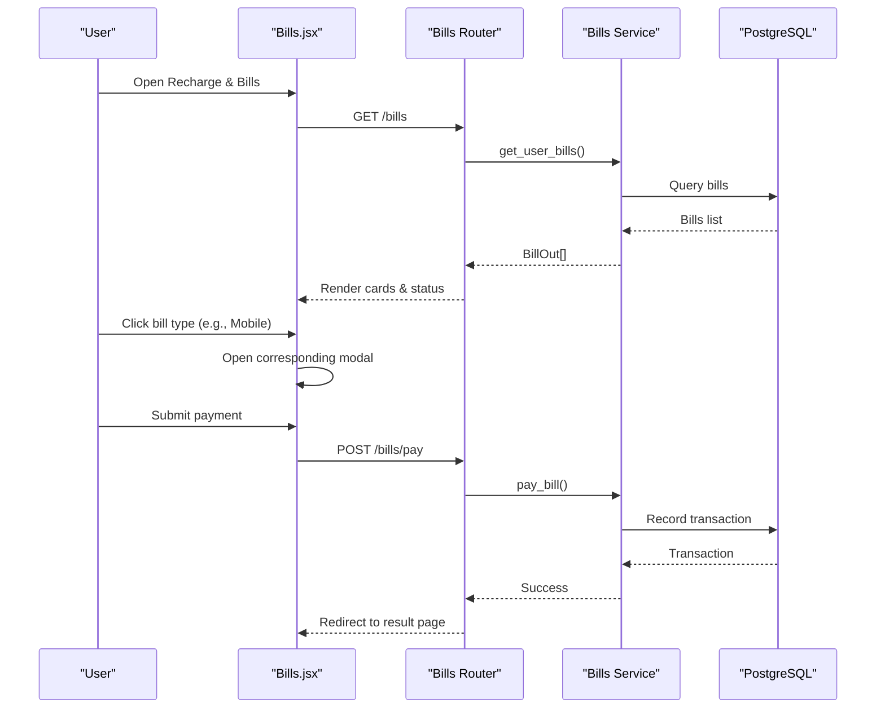
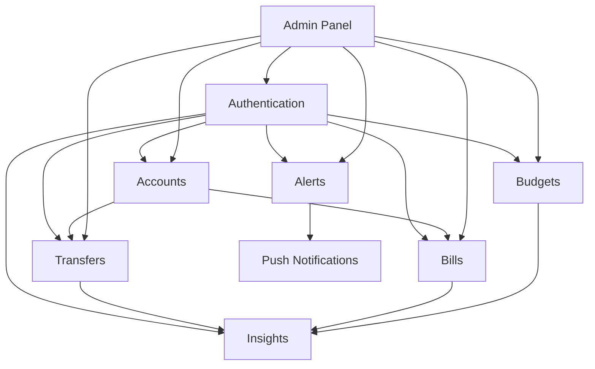
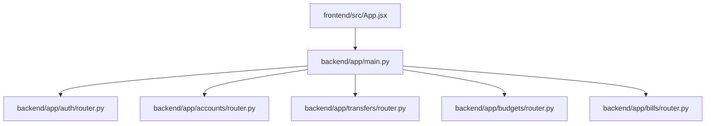

# Key Features

<cite>
**Referenced Files in This Document**
- [README.md](file://README.md)
- [backend/app/main.py](file://backend/app/main.py)
- [frontend/src/App.jsx](file://frontend/src/App.jsx)
- [frontend/src/pages/user/Dashboard.jsx](file://frontend/src/pages/user/Dashboard.jsx)
- [frontend/src/pages/user/Accounts.jsx](file://frontend/src/pages/user/Accounts.jsx)
- [frontend/src/pages/user/SendMoney.jsx](file://frontend/src/pages/user/SendMoney.jsx)
- [frontend/src/pages/user/Budgets.jsx](file://frontend/src/pages/user/Budgets.jsx)
- [frontend/src/pages/user/Bills.jsx](file://frontend/src/pages/user/Bills.jsx)
- [backend/app/auth/router.py](file://backend/app/auth/router.py)
- [backend/app/accounts/router.py](file://backend/app/accounts/router.py)
- [backend/app/transfers/router.py](file://backend/app/transfers/router.py)
- [backend/app/budgets/router.py](file://backend/app/budgets/router.py)
- [backend/app/bills/router.py](file://backend/app/bills/router.py)
</cite>

## Table of Contents
1. [Introduction](#introduction)
2. [Project Structure](#project-structure)
3. [Core Components](#core-components)
4. [Architecture Overview](#architecture-overview)
5. [Detailed Feature Analysis](#detailed-feature-analysis)
6. [Feature Relationships and Workflows](#feature-relationships-and-workflows)
7. [Dependency Analysis](#dependency-analysis)
8. [Performance Considerations](#performance-considerations)
9. [Troubleshooting Guide](#troubleshooting-guide)
10. [Conclusion](#conclusion)

## Introduction
This document presents the complete feature set of the Modern Digital Banking Dashboard, a full-stack banking application designed to simulate real-world banking experiences. It covers user authentication and profile management, multi-account banking, real-time transaction processing (including UPI, bank transfers, and self-account transfers), intelligent budget management, automated bill payment and reminders, rewards and loyalty programs, financial insights and analytics, admin dashboards for oversight, KYC verification workflows, and real-time push notifications. The guide includes user workflows, feature screenshots, and integration examples to help both technical and non-technical stakeholders understand how features relate and deliver a cohesive banking experience.

## Project Structure
The application follows a clear separation of concerns:
- Frontend: React + Vite with protected routes, admin routes, and reusable components.
- Backend: FastAPI with modular routers for authentication, accounts, transfers, budgets, bills, insights, alerts, and admin panels.
- Database: PostgreSQL with SQLAlchemy ORM and Alembic migrations.
- Notifications: Firebase Cloud Messaging (FCM) for real-time push notifications.

**Diagram sources**
- [backend/app/main.py:56-85](file://backend/app/main.py#L56-L85)
- [frontend/src/App.jsx:78-167](file://frontend/src/App.jsx#L78-L167)
- [frontend/src/pages/user/Dashboard.jsx:58-311](file://frontend/src/pages/user/Dashboard.jsx#L58-L311)

**Section sources**
- [README.md:24-73](file://README.md#L24-L73)
- [backend/app/main.py:56-85](file://backend/app/main.py#L56-L85)
- [frontend/src/App.jsx:78-167](file://frontend/src/App.jsx#L78-L167)

## Core Components
- Authentication and Profile Management: JWT-based login, OTP verification, password reset, and profile updates.
- Multi-Account Banking: Create, list, update, delete accounts with PIN security.
- Money Transfers: UPI, Bank-to-Bank, and Self transfers with transaction PIN verification.
- Budget Management: Create monthly budgets by category, track spending, and view summaries.
- Bill Payments and Reminders: Add bill reminders, pay bills, and manage upcoming/overdue bills.
- Rewards and Loyalty: Track reward points across programs.
- Financial Insights: Monthly spending, category breakdown, and cash flow analytics.
- Admin Dashboard: System-wide analytics, user management, KYC approvals, transaction monitoring, and alert management.
- KYC Verification: Identity confirmation workflow integrated into account management.
- Real-Time Notifications: Push notifications via Firebase FCM.

**Section sources**
- [README.md](file://README.md)
- [backend/app/auth/router.py:75-180](file://backend/app/auth/router.py#L75-L180)
- [backend/app/accounts/router.py:61-109](file://backend/app/accounts/router.py#L61-L109)
- [backend/app/transfers/router.py:13-24](file://backend/app/transfers/router.py#L13-L24)
- [backend/app/budgets/router.py:26-81](file://backend/app/budgets/router.py#L26-L81)
- [backend/app/bills/router.py:26-81](file://backend/app/bills/router.py#L26-L81)

## Architecture Overview
The system uses a layered architecture:
- Presentation Layer: React frontend with protected and admin routes.
- API Layer: FastAPI routers exposing REST endpoints.
- Business Logic Layer: Services orchestrating domain logic.
- Persistence Layer: PostgreSQL with SQLAlchemy models.
- Integration Layer: Firebase for push notifications.

**Diagram sources**
- [backend/app/main.py:29-85](file://backend/app/main.py#L29-L85)
- [frontend/src/App.jsx:78-167](file://frontend/src/App.jsx#L78-L167)

**Section sources**
- [backend/app/main.py:29-85](file://backend/app/main.py#L29-L85)
- [frontend/src/App.jsx:78-167](file://frontend/src/App.jsx#L78-L167)

## Detailed Feature Analysis

### User Authentication and Profile Management
- Registration, login, and logout with JWT access tokens.
- OTP-based password reset and resend OTP endpoints.
- Profile updates and security settings (PIN change, device management).
- ProtectedRoute guards ensure only authenticated users access protected pages.

**Diagram sources**
- [backend/app/auth/router.py:104-119](file://backend/app/auth/router.py#L104-L119)
- [frontend/src/App.jsx:98-104](file://frontend/src/App.jsx#L98-L104)

**Section sources**
- [backend/app/auth/router.py:75-180](file://backend/app/auth/router.py#L75-L180)
- [frontend/src/App.jsx:78-167](file://frontend/src/App.jsx#L78-L167)

### Multi-Account Banking
- Users can list, add, and delete accounts with PIN verification.
- PIN creation enforces numeric 4-digit requirement.
- Account change PIN endpoint updates hashed PIN securely.

**Diagram sources**
- [backend/app/accounts/router.py:61-109](file://backend/app/accounts/router.py#L61-L109)
- [frontend/src/pages/user/Accounts.jsx:52-91](file://frontend/src/pages/user/Accounts.jsx#L52-L91)

**Section sources**
- [backend/app/accounts/router.py:61-109](file://backend/app/accounts/router.py#L61-L109)
- [frontend/src/pages/user/Accounts.jsx:16-419](file://frontend/src/pages/user/Accounts.jsx#L16-L419)

### Real-Time Transaction Processing (UPI, Bank Transfers, Self Transfers)
- Transfer hub allows selecting an account and choosing transfer type.
- Transfer processing validates sender account and applies transaction PIN verification.
- Transaction history supports filtering and CSV import.

**Diagram sources**
- [frontend/src/pages/user/SendMoney.jsx:37-192](file://frontend/src/pages/user/SendMoney.jsx#L37-L192)
- [backend/app/transfers/router.py:13-24](file://backend/app/transfers/router.py#L13-L24)

**Section sources**
- [frontend/src/pages/user/SendMoney.jsx:1-260](file://frontend/src/pages/user/SendMoney.jsx#L1-L260)
- [backend/app/transfers/router.py:13-24](file://backend/app/transfers/router.py#L13-L24)

### Intelligent Budget Management
- Create monthly budgets by category with limit amounts.
- Track spent amounts and compute remaining budget.
- View summaries and filter budgets by category.

**Diagram sources**
- [backend/app/budgets/router.py:26-81](file://backend/app/budgets/router.py#L26-L81)
- [frontend/src/pages/user/Budgets.jsx:19-66](file://frontend/src/pages/user/Budgets.jsx#L19-L66)

**Section sources**
- [backend/app/budgets/router.py:26-81](file://backend/app/budgets/router.py#L26-L81)
- [frontend/src/pages/user/Budgets.jsx:1-191](file://frontend/src/pages/user/Budgets.jsx#L1-L191)

### Automated Bill Payment System (Reminders and Recharges)
- Add bill reminders with due dates and auto-pay options.
- Pay bills via selected accounts; supports multiple bill types (mobile, electricity, FASTag, Google Play, credit card, subscriptions).
- Upcoming/overdue status computed based on due date.

**Diagram sources**
- [frontend/src/pages/user/Bills.jsx:38-439](file://frontend/src/pages/user/Bills.jsx#L38-L439)
- [backend/app/bills/router.py:26-81](file://backend/app/bills/router.py#L26-L81)

**Section sources**
- [frontend/src/pages/user/Bills.jsx:1-439](file://frontend/src/pages/user/Bills.jsx#L1-L439)
- [backend/app/bills/router.py:26-81](file://backend/app/bills/router.py#L26-L81)

### Rewards and Loyalty Program
- View available reward programs and user rewards.
- Track points accumulation and redemption across programs.

**Section sources**
- [README.md](file://README.md)

### Comprehensive Financial Insights and Analytics
- Monthly spending trends, category breakdown, and financial summaries.
- Insights dashboard integrates charts and analytics for informed decisions.

**Section sources**
- [README.md](file://README.md)

### Admin Dashboard for User Management and System Oversight
- Admin dashboard provides system statistics and metrics.
- Manage users, monitor transactions, approve KYC, configure rewards, and manage alerts.

**Section sources**
- [README.md](file://README.md)

### KYC Verification Workflow
- Integrated into account management; users can verify identity and OTP during sensitive operations.
- Admin panel reviews and approves KYC applications.

**Section sources**
- [README.md](file://README.md)
- [frontend/src/pages/user/Accounts.jsx:258-262](file://frontend/src/pages/user/Accounts.jsx#L258-L262)

### Real-Time Push Notifications
- Firebase Cloud Messaging initialized at app startup.
- Notifications integrated into dashboard header with unread count.

**Section sources**
- [backend/app/main.py:59-61](file://backend/app/main.py#L59-L61)
- [frontend/src/pages/user/Dashboard.jsx:119-131](file://frontend/src/pages/user/Dashboard.jsx#L119-L131)

## Feature Relationships and Workflows
The features are interconnected:
- Authentication enables access to all user features.
- Accounts are prerequisites for transfers, bill payments, and budget tracking.
- Budgets rely on transaction history to compute spent amounts.
- Bill reminders feed into payment processing and transaction recording.
- Admin dashboards oversee user activities, KYC, and system-wide alerts.
- Notifications keep users informed about transfers, bill due dates, and system alerts.

[No sources needed since this diagram shows conceptual relationships, not direct code mappings]

## Dependency Analysis
- Frontend routing depends on protected routes and admin routes.
- Backend routers depend on SQLAlchemy models and services.
- Firebase initialization occurs at app startup for notifications.
- Cross-origin requests are configured for development and deployment domains.

**Diagram sources**
- [frontend/src/App.jsx:78-167](file://frontend/src/App.jsx#L78-L167)
- [backend/app/main.py:29-85](file://backend/app/main.py#L29-L85)

**Section sources**
- [frontend/src/App.jsx:78-167](file://frontend/src/App.jsx#L78-L167)
- [backend/app/main.py:91-109](file://backend/app/main.py#L91-L109)

## Performance Considerations
- Use pagination and filters for large datasets (transactions, bills, budgets).
- Optimize chart rendering by limiting data points to relevant periods.
- Cache frequently accessed account lists and user profiles.
- Minimize network requests by batching operations where feasible.

[No sources needed since this section provides general guidance]

## Troubleshooting Guide
- Authentication failures: Verify credentials and ensure OTP is valid and unexpired.
- Account deletion errors: Confirm 4-digit numeric PIN matches stored hash.
- Transfer failures: Validate sender account ownership and sufficient balance; ensure PIN verification succeeds.
- Budget creation conflicts: Check for existing budget in the same category for the month/year.
- Bill payment errors: Confirm account selection and bill status (not paid).

**Section sources**
- [backend/app/auth/router.py:141-163](file://backend/app/auth/router.py#L141-L163)
- [backend/app/accounts/router.py:86-108](file://backend/app/accounts/router.py#L86-L108)
- [backend/app/transfers/router.py:13-24](file://backend/app/transfers/router.py#L13-L24)
- [backend/app/budgets/router.py:32-35](file://backend/app/budgets/router.py#L32-L35)
- [backend/app/bills/router.py:26-37](file://backend/app/bills/router.py#L26-L37)

## Conclusion
The Modern Digital Banking Dashboard delivers a comprehensive, secure, and user-friendly banking experience. Its modular backend and intuitive frontend enable seamless account management, real-time transfers, intelligent budgeting, automated bill payments, insightful analytics, robust admin oversight, KYC workflows, and real-time notifications. The documented features, workflows, and integrations provide a blueprint for extending functionality while maintaining strong security and scalability.