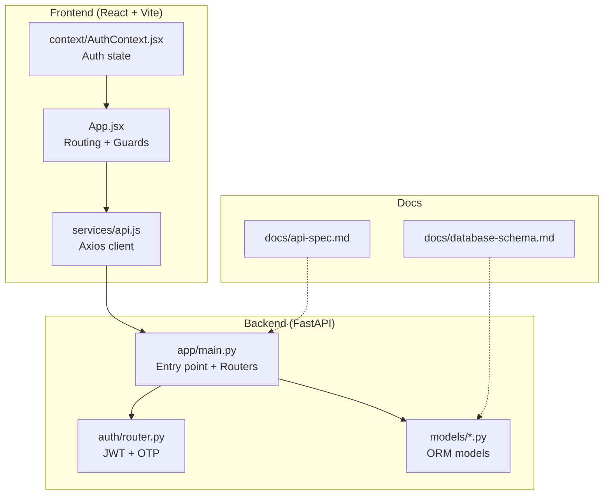
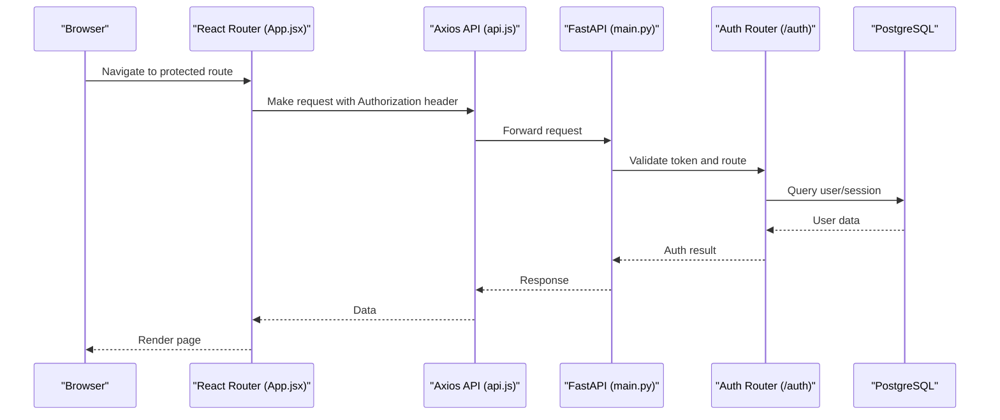
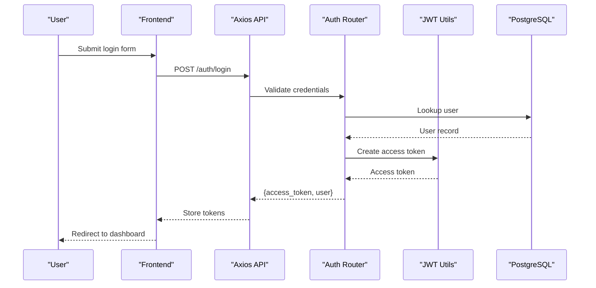
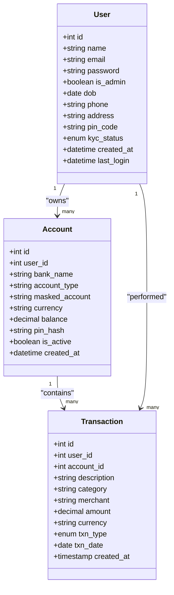
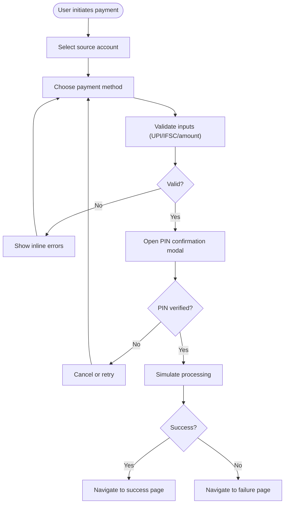
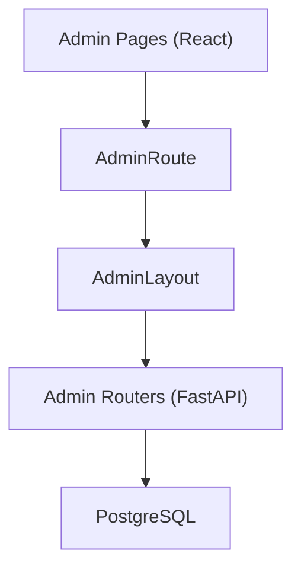
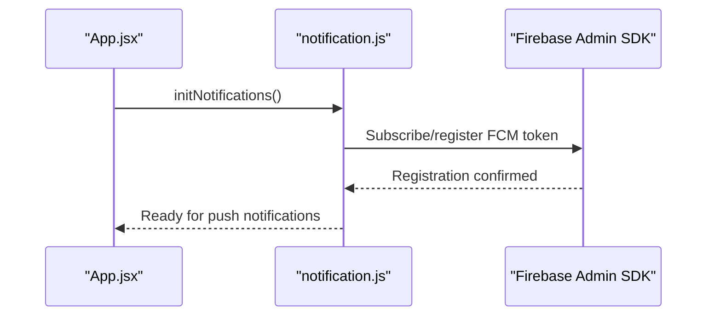
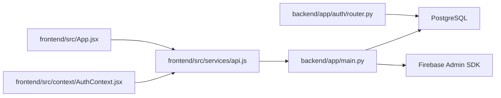

# Project Overview

<cite>
**Referenced Files in This Document**
- [README.md](file://README.md)
- [backend/README.md](file://backend/README.md)
- [frontend/README.md](file://frontend/README.md)
- [backend/app/main.py](file://backend/app/main.py)
- [frontend/src/App.jsx](file://frontend/src/App.jsx)
- [backend/app/models/user.py](file://backend/app/models/user.py)
- [backend/app/models/account.py](file://backend/app/models/account.py)
- [backend/app/models/transaction.py](file://backend/app/models/transaction.py)
- [docs/database-schema.md](file://docs/database-schema.md)
- [docs/api-spec.md](file://docs/api-spec.md)
- [frontend/src/services/api.js](file://frontend/src/services/api.js)
- [frontend/src/context/AuthContext.jsx](file://frontend/src/context/AuthContext.jsx)
- [backend/app/auth/router.py](file://backend/app/auth/router.py)
</cite>

## Table of Contents
1. [Introduction](#introduction)
2. [Project Structure](#project-structure)
3. [Core Components](#core-components)
4. [Architecture Overview](#architecture-overview)
5. [Detailed Component Analysis](#detailed-component-analysis)
6. [Dependency Analysis](#dependency-analysis)
7. [Performance Considerations](#performance-considerations)
8. [Troubleshooting Guide](#troubleshooting-guide)
9. [Conclusion](#conclusion)
10. [Appendices](#appendices)

## Introduction
Aureus is a full-stack digital banking dashboard developed as part of the Infosys Springboard Modern Digital Banking Dashboard internship project. It simulates a modern banking experience with secure authentication, account and transaction management, UPI and bank transfers, budgeting, bill payments, financial insights, rewards, alerts, and push notifications. The application targets learners, interns, and developers seeking hands-on exposure to real-world banking workflows, including KYC, admin controls, and transaction analytics.

Educational context:
- Designed as a capstone learning project under the Infosys Springboard program.
- Demonstrates end-to-end development of a scalable, modular banking application.

Business value proposition:
- Provides a realistic sandbox for understanding banking domain logic.
- Highlights secure authentication, role-based access control, and modular backend architecture.
- Offers practical UI/UX patterns for financial dashboards and admin panels.

Target audience:
- Students and interns learning full-stack development.
- Developers building or evaluating banking-like applications.
- Educators teaching modern web technologies and secure API design.

Use cases:
- Onboarding users with secure registration and login.
- Managing multiple bank accounts with PIN protection.
- Performing UPI and bank transfers with simulated processing.
- Tracking spending, setting budgets, and receiving alerts.
- Admin monitoring and managing users, KYC, and system analytics.

**Section sources**
- [README.md:1-367](file://README.md#L1-L367)
- [backend/README.md:1-108](file://backend/README.md#L1-L108)
- [frontend/README.md:1-207](file://frontend/README.md#L1-L207)

## Project Structure
High-level structure:
- Frontend: React + Vite application with route-based pages, reusable components, context providers, and API service layer.
- Backend: FastAPI application with modular routers, SQLAlchemy models, Pydantic schemas, and utility services.
- Docs: API specification and database schema documentation.
- Scripts and configurations for migrations, environment variables, and deployment.

**Diagram sources**
- [frontend/src/App.jsx:78-168](file://frontend/src/App.jsx#L78-L168)
- [frontend/src/services/api.js:19-46](file://frontend/src/services/api.js#L19-L46)
- [frontend/src/context/AuthContext.jsx:23-46](file://frontend/src/context/AuthContext.jsx#L23-L46)
- [backend/app/main.py:56-85](file://backend/app/main.py#L56-L85)
- [backend/app/auth/router.py:21-21](file://backend/app/auth/router.py#L21-L21)
- [docs/api-spec.md:1-142](file://docs/api-spec.md#L1-L142)
- [docs/database-schema.md:1-147](file://docs/database-schema.md#L1-L147)

**Section sources**
- [README.md:24-73](file://README.md#L24-L73)
- [backend/README.md:27-44](file://backend/README.md#L27-L44)
- [frontend/README.md:37-49](file://frontend/README.md#L37-L49)

## Core Components
- Authentication and Authorization: JWT-based access/refresh tokens, OTP verification, protected routes, and admin role checks.
- Accounts and Transactions: Account management with PIN hashing, transaction history, and categorization.
- Payments: UPI, self-transfers, and bank transfers with simulated processing and PIN modal.
- Budgeting: Monthly budgets by category with spend tracking.
- Bills: Bill reminders and payment workflows.
- Rewards and Insights: Reward points and financial insights endpoints.
- Admin Panel: User management, KYC approval, transaction monitoring, analytics, and alerts.
- Notifications: Firebase Cloud Messaging integration for push notifications.

**Section sources**
- [README.md:77-109](file://README.md#L77-L109)
- [backend/README.md:49-89](file://backend/README.md#L49-L89)
- [frontend/README.md:53-97](file://frontend/README.md#L53-L97)

## Architecture Overview
End-to-end integration:
- Frontend routes define user and admin experiences, guarded by authentication and admin route guards.
- API service attaches JWT tokens automatically and centralizes HTTP requests.
- Backend FastAPI app aggregates routers for auth, accounts, transfers, transactions, budgets, bills, rewards, insights, alerts, and admin modules.
- CORS middleware enables controlled cross-origin access for local and deployed environments.
- Firebase initialization occurs on startup for push notifications.

**Diagram sources**
- [frontend/src/App.jsx:78-168](file://frontend/src/App.jsx#L78-L168)
- [frontend/src/services/api.js:19-31](file://frontend/src/services/api.js#L19-L31)
- [backend/app/main.py:56-85](file://backend/app/main.py#L56-L85)
- [backend/app/auth/router.py:104-119](file://backend/app/auth/router.py#L104-L119)

Technology stack summary:
- Frontend: React 19, Vite 7, React Router 6, Tailwind CSS 3, Axios, Recharts 3, Lucide React, Firebase.
- Backend: FastAPI, PostgreSQL (Neon), SQLAlchemy 2, Alembic, Pydantic 2, JWT (python-jose), Passlib + bcrypt, Firebase Admin, ReportLab, SMTP.

**Section sources**
- [README.md:112-141](file://README.md#L112-L141)
- [backend/README.md:15-24](file://backend/README.md#L15-L24)
- [frontend/README.md:27-34](file://frontend/README.md#L27-L34)

## Detailed Component Analysis

### Authentication and Authorization
- JWT tokens: Access and refresh token issuance and cookie-based refresh handling.
- OTP verification: Email-based OTP for password reset and login flows.
- Protected routes: Frontend route guards enforce authentication; backend enforces via dependencies.
- Admin role: Admin-only endpoints gated by role checks.

**Diagram sources**
- [backend/app/auth/router.py:104-119](file://backend/app/auth/router.py#L104-L119)
- [frontend/src/services/api.js:19-31](file://frontend/src/services/api.js#L19-L31)
- [frontend/src/App.jsx:75-77](file://frontend/src/App.jsx#L75-L77)

**Section sources**
- [backend/app/auth/router.py:21-180](file://backend/app/auth/router.py#L21-L180)
- [frontend/src/context/AuthContext.jsx:23-46](file://frontend/src/context/AuthContext.jsx#L23-L46)

### Accounts and Transactions
- Account model: Links users to bank accounts, stores masked account info, currency, balance, and PIN hash.
- Transaction model: Records debits/credits, categories, merchant, amount, currency, and timestamps.
- Frontend integration: Account selection and PIN modal used across payment flows.

**Diagram sources**
- [backend/app/models/user.py:37-65](file://backend/app/models/user.py#L37-L65)
- [backend/app/models/account.py:31-57](file://backend/app/models/account.py#L31-L57)
- [backend/app/models/transaction.py:32-58](file://backend/app/models/transaction.py#L32-L58)

**Section sources**
- [docs/database-schema.md:11-61](file://docs/database-schema.md#L11-L61)
- [frontend/README.md:53-64](file://frontend/README.md#L53-L64)

### Payments and Transfers
- Payment flows: UPI, self-transfer, and bank transfer with input validation and PIN confirmation.
- Simulated processing: PaymentProcessing component enhances UX realism.
- Success/failure pages: PaymentSuccess and PaymentFailed handle outcomes and actions.

**Diagram sources**
- [frontend/README.md:68-97](file://frontend/README.md#L68-L97)
- [frontend/README.md:130-136](file://frontend/README.md#L130-L136)
- [frontend/README.md:139-163](file://frontend/README.md#L139-L163)

**Section sources**
- [frontend/README.md:68-97](file://frontend/README.md#L68-L97)
- [frontend/README.md:130-163](file://frontend/README.md#L130-L163)

### Admin Controls and Analytics
- Admin routes: Guarded by AdminRoute, covering dashboard, users, KYC, transactions, rewards, analytics, alerts, and settings.
- Backend admin routers: Dedicated routers for admin operations and analytics.
- Audit and logs: Optional admin logs table for tracking administrative actions.

**Diagram sources**
- [frontend/src/App.jsx:144-160](file://frontend/src/App.jsx#L144-L160)
- [backend/app/main.py:44-85](file://backend/app/main.py#L44-L85)

**Section sources**
- [docs/database-schema.md:126-138](file://docs/database-schema.md#L126-L138)
- [README.md:97-109](file://README.md#L97-L109)

### Notifications and Alerts
- Firebase integration: Backend initializes Firebase on startup; frontend initializes notifications on app load.
- Alerts: Endpoint to list user alerts and mark as read; categorized alerts for low balance, bill due, and budget exceeded.

**Diagram sources**
- [frontend/src/App.jsx:79-81](file://frontend/src/App.jsx#L79-L81)
- [backend/app/main.py:59-61](file://backend/app/main.py#L59-L61)

**Section sources**
- [README.md:91-92](file://README.md#L91-L92)
- [docs/database-schema.md:112-123](file://docs/database-schema.md#L112-L123)

## Dependency Analysis
- Frontend depends on:
  - Axios for HTTP requests.
  - React Router for client-side routing and guards.
  - Context providers for global auth state.
- Backend depends on:
  - SQLAlchemy for ORM and Alembic for migrations.
  - Pydantic for data validation.
  - JWT and bcrypt for security.
  - Firebase Admin for push notifications.
  - SMTP for OTP delivery.

**Diagram sources**
- [frontend/src/services/api.js:19-46](file://frontend/src/services/api.js#L19-L46)
- [frontend/src/App.jsx:78-168](file://frontend/src/App.jsx#L78-L168)
- [frontend/src/context/AuthContext.jsx:23-46](file://frontend/src/context/AuthContext.jsx#L23-L46)
- [backend/app/main.py:56-85](file://backend/app/main.py#L56-L85)
- [backend/app/auth/router.py:21-21](file://backend/app/auth/router.py#L21-L21)

**Section sources**
- [docs/api-spec.md:1-142](file://docs/api-spec.md#L1-L142)
- [docs/database-schema.md:1-147](file://docs/database-schema.md#L1-L147)

## Performance Considerations
- Token-based auth reduces session overhead; ensure efficient token refresh strategies.
- Database queries should leverage indexes on frequently filtered columns (e.g., user_id, account_id).
- Pagination and filtering for transactions and budgets improve responsiveness.
- Firebase push notification batching can reduce network overhead.
- Frontend lazy loading of heavy components and charts can improve initial load times.

## Troubleshooting Guide
Common issues and resolutions:
- CORS errors: Verify allowed origins in environment variables or defaults configured in the backend.
- Authentication failures: Confirm Authorization header presence and token validity; check refresh cookie settings.
- OTP verification failures: Ensure OTP endpoint is called before verifying and that expiration logic is respected.
- PIN verification (frontend demo): PIN is stored locally for demo; backend enforcement is planned.

Operational checks:
- Backend startup: Confirm Firebase initialization and database connectivity.
- Frontend routing: Ensure ProtectedRoute and AdminRoute wrappers are applied to protected pages.
- Environment variables: Validate DATABASE_URL, JWT secrets, SMTP credentials, and Firebase credentials.

**Section sources**
- [backend/app/main.py:91-108](file://backend/app/main.py#L91-L108)
- [frontend/src/services/api.js:23-29](file://frontend/src/services/api.js#L23-L29)
- [backend/app/auth/router.py:141-163](file://backend/app/auth/router.py#L141-L163)
- [frontend/README.md:186-193](file://frontend/README.md#L186-L193)

## Conclusion
Aureus demonstrates a comprehensive digital banking dashboard with secure authentication, modular backend services, and a rich frontend experience. Its architecture aligns with modern full-stack practices, emphasizing separation of concerns, role-based access control, and extensibility. As an Infosys Springboard project, it serves as an excellent educational resource for understanding real-world banking workflows, API design, and scalable application development.

## Appendices
- API endpoints overview: Authentication, accounts, transactions, transfers, budgets, bills, rewards, insights, alerts, exports, and admin endpoints.
- Database schema: Users, accounts, transactions, budgets, bills, rewards, alerts, and optional admin logs.

**Section sources**
- [README.md:165-226](file://README.md#L165-L226)
- [docs/api-spec.md:1-142](file://docs/api-spec.md#L1-L142)
- [docs/database-schema.md:1-147](file://docs/database-schema.md#L1-L147)