# Technology Stack

<cite>
**Referenced Files in This Document**
- [backend/README.md](file://backend/README.md)
- [frontend/README.md](file://frontend/README.md)
- [backend/app/main.py](file://backend/app/main.py)
- [backend/app/config.py](file://backend/app/config.py)
- [backend/app/database.py](file://backend/app/database.py)
- [backend/app/utils/jwt.py](file://backend/app/utils/jwt.py)
- [backend/app/firebase/firebase.py](file://backend/app/firebase/firebase.py)
- [backend/alembic.ini](file://backend/alembic.ini)
- [backend/requirements.txt](file://backend/requirements.txt)
- [frontend/package.json](file://frontend/package.json)
- [frontend/src/services/api.js](file://frontend/src/services/api.js)
- [frontend/src/App.jsx](file://frontend/src/App.jsx)
- [frontend/tailwind.config.js](file://frontend/tailwind.config.js)
- [frontend/src/firebase.js](file://frontend/src/firebase.js)
</cite>

## Table of Contents
1. [Introduction](#introduction)
2. [Project Structure](#project-structure)
3. [Core Components](#core-components)
4. [Architecture Overview](#architecture-overview)
5. [Detailed Component Analysis](#detailed-component-analysis)
6. [Dependency Analysis](#dependency-analysis)
7. [Performance Considerations](#performance-considerations)
8. [Troubleshooting Guide](#troubleshooting-guide)
9. [Conclusion](#conclusion)

## Introduction
This document provides a comprehensive technology stack overview for the Modern Digital Banking Dashboard. It covers the backend technologies (FastAPI, SQLAlchemy, PostgreSQL, Alembic, JWT, Firebase Admin SDK), the frontend technologies (React, React Router, Chart.js and Recharts, Tailwind CSS, Firebase SDK), and the integration patterns between them. It also includes rationale for technology choices, version compatibility, performance considerations, extensibility benefits, and official documentation links.

## Project Structure
The project follows a clear separation of concerns:
- Backend: FastAPI application with modular routers, SQLAlchemy models, Alembic migrations, and Firebase Admin SDK initialization.
- Frontend: React application with Vite, routing via React Router, stateless API service layer, and Tailwind CSS for styling.

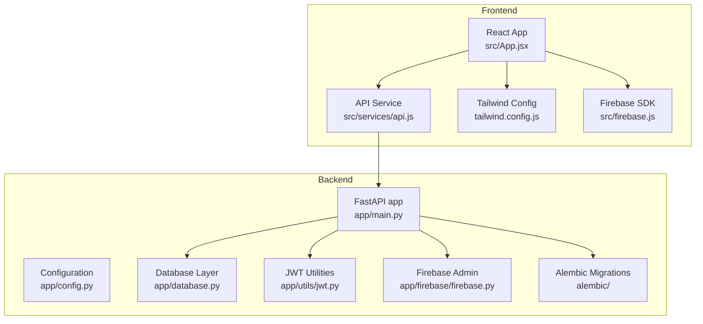

**Diagram sources**
- [backend/app/main.py:56-85](file://backend/app/main.py#L56-L85)
- [backend/app/config.py:57-72](file://backend/app/config.py#L57-L72)
- [backend/app/database.py:24-51](file://backend/app/database.py#L24-L51)
- [backend/app/utils/jwt.py:1-26](file://backend/app/utils/jwt.py#L1-L26)
- [backend/app/firebase/firebase.py:7-29](file://backend/app/firebase/firebase.py#L7-L29)
- [backend/alembic.ini:1-37](file://backend/alembic.ini#L1-L37)
- [frontend/src/App.jsx:78-168](file://frontend/src/App.jsx#L78-L168)
- [frontend/src/services/api.js:19-31](file://frontend/src/services/api.js#L19-L31)
- [frontend/tailwind.config.js:1-26](file://frontend/tailwind.config.js#L1-L26)
- [frontend/src/firebase.js:1-24](file://frontend/src/firebase.js#L1-L24)

**Section sources**
- [backend/README.md:27-44](file://backend/README.md#L27-L44)
- [frontend/README.md:37-49](file://frontend/README.md#L37-L49)

## Core Components
This section documents the primary technologies and their roles in the system.

- Backend
  - FastAPI: Web framework powering the REST API, CORS middleware, and router registration.
  - SQLAlchemy: ORM for database modeling and session management.
  - PostgreSQL: Relational database for persistent data.
  - Alembic: Database migration tool integrated with SQLAlchemy.
  - JWT: Access and refresh token generation and validation.
  - Firebase Admin SDK: Push notification delivery via Firebase Cloud Messaging.
  - Pydantic and Uvicorn: Validation and ASGI server runtime.

- Frontend
  - React: UI library with React 19.2.3.
  - React Router DOM: Client-side routing.
  - Chart.js and Recharts: Data visualization libraries.
  - Tailwind CSS: Utility-first styling framework.
  - Firebase SDK: Client-side push notification setup and token retrieval.

**Section sources**
- [backend/README.md:15-24](file://backend/README.md#L15-L24)
- [backend/requirements.txt:17-69](file://backend/requirements.txt#L17-L69)
- [frontend/README.md:27-34](file://frontend/README.md#L27-L34)
- [frontend/package.json:12-21](file://frontend/package.json#L12-L21)

## Architecture Overview
The system architecture separates concerns across backend and frontend while integrating Firebase for push notifications.

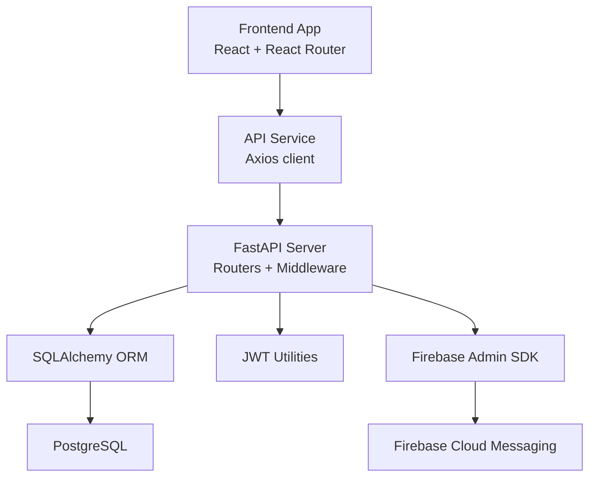

**Diagram sources**
- [backend/app/main.py:56-109](file://backend/app/main.py#L56-L109)
- [backend/app/database.py:24-51](file://backend/app/database.py#L24-L51)
- [backend/app/utils/jwt.py:1-26](file://backend/app/utils/jwt.py#L1-L26)
- [backend/app/firebase/firebase.py:7-29](file://backend/app/firebase/firebase.py#L7-L29)
- [frontend/src/services/api.js:19-31](file://frontend/src/services/api.js#L19-L31)

## Detailed Component Analysis

### Backend: FastAPI Application
- Entry point and router registration are centralized in the main application module.
- CORS middleware supports multiple origins for local and deployed environments.
- Firebase Admin SDK is initialized on startup.

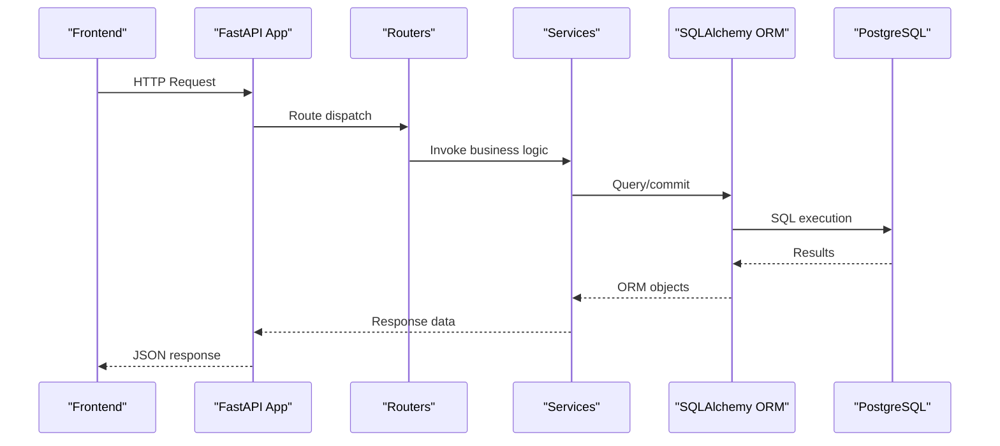

**Diagram sources**
- [backend/app/main.py:56-85](file://backend/app/main.py#L56-L85)
- [backend/app/database.py:45-51](file://backend/app/database.py#L45-L51)

**Section sources**
- [backend/app/main.py:56-109](file://backend/app/main.py#L56-L109)

### Backend: Configuration and Environment
- Centralized settings using Pydantic BaseSettings with environment variable loading.
- JWT secrets, algorithms, and expiration are configurable.
- Database URL is loaded from environment.

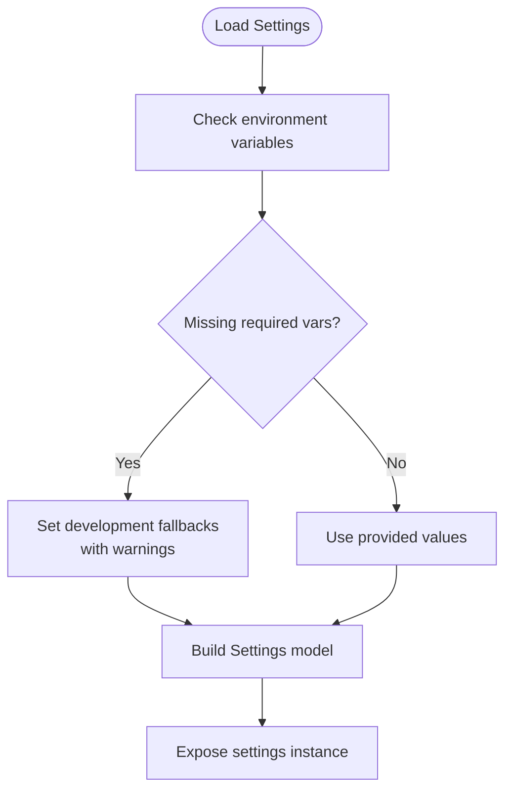

**Diagram sources**
- [backend/app/config.py:31-72](file://backend/app/config.py#L31-L72)

**Section sources**
- [backend/app/config.py:57-72](file://backend/app/config.py#L57-L72)

### Backend: Database Layer and ORM
- Engine and session creation with connection pooling and pre-ping.
- Declarative base for models.
- Dependency provider for request-scoped sessions.

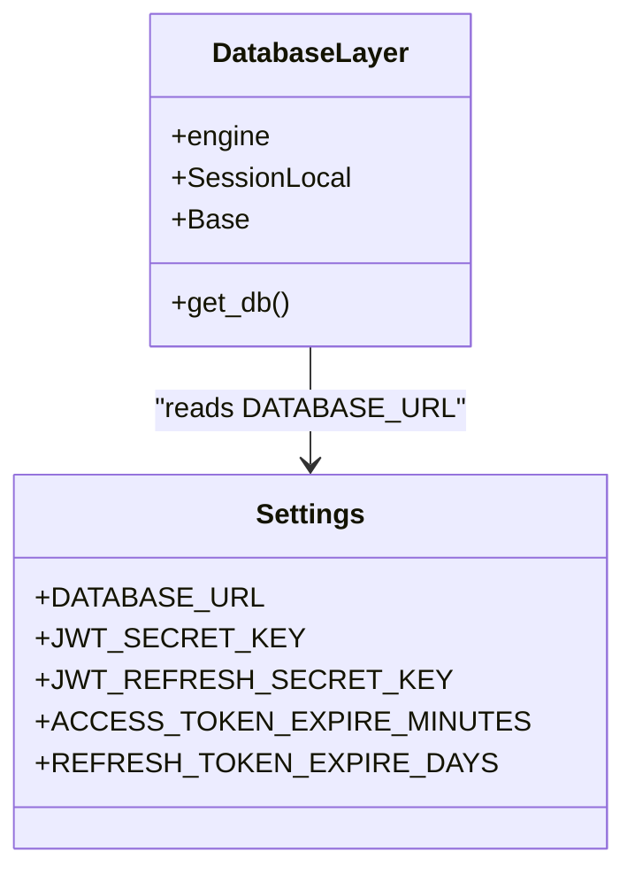

**Diagram sources**
- [backend/app/database.py:24-51](file://backend/app/database.py#L24-L51)
- [backend/app/config.py:57-72](file://backend/app/config.py#L57-L72)

**Section sources**
- [backend/app/database.py:24-51](file://backend/app/database.py#L24-L51)

### Backend: JWT Utilities
- Token creation and decoding for access and refresh tokens.
- Algorithm and expiry derived from settings.

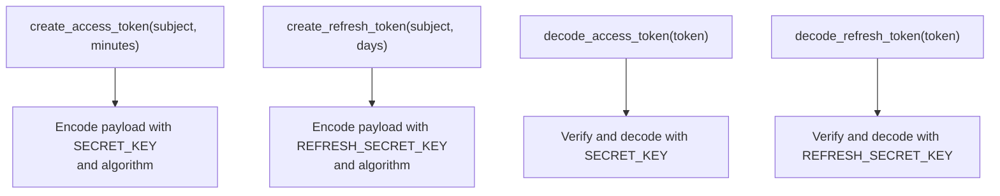

**Diagram sources**
- [backend/app/utils/jwt.py:11-25](file://backend/app/utils/jwt.py#L11-L25)

**Section sources**
- [backend/app/utils/jwt.py:1-26](file://backend/app/utils/jwt.py#L1-L26)

### Backend: Firebase Admin SDK
- Initialization from environment-provided JSON credentials.
- Helper to send push notifications via FCM.

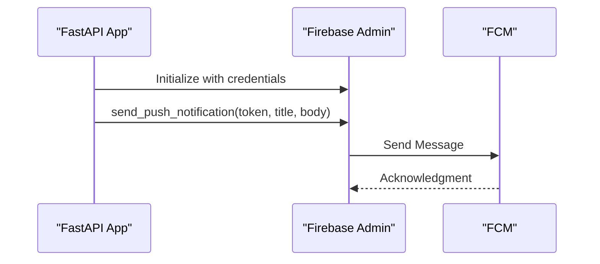

**Diagram sources**
- [backend/app/firebase/firebase.py:7-29](file://backend/app/firebase/firebase.py#L7-L29)

**Section sources**
- [backend/app/firebase/firebase.py:1-29](file://backend/app/firebase/firebase.py#L1-L29)

### Backend: Database Migrations (Alembic)
- Alembic configuration file defines logging and script location.
- Migrations manage schema evolution alongside SQLAlchemy models.

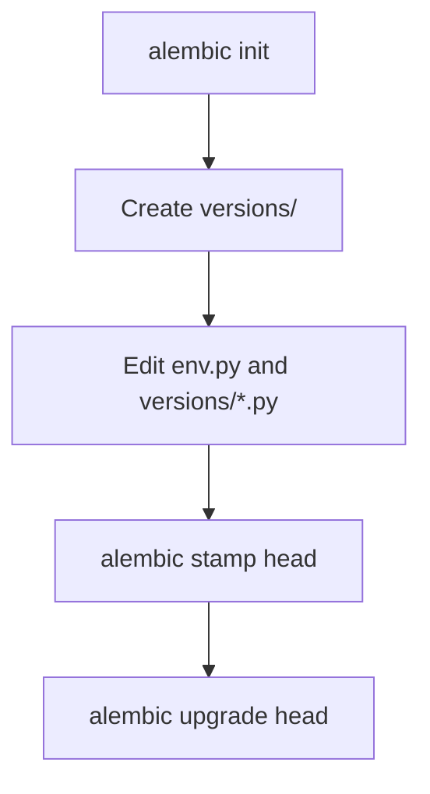

**Diagram sources**
- [backend/alembic.ini:1-37](file://backend/alembic.ini#L1-L37)

**Section sources**
- [backend/alembic.ini:1-37](file://backend/alembic.ini#L1-L37)

### Frontend: React Application and Routing
- Centralized routing with protected routes for user and admin panels.
- Notifications initialization on app mount.

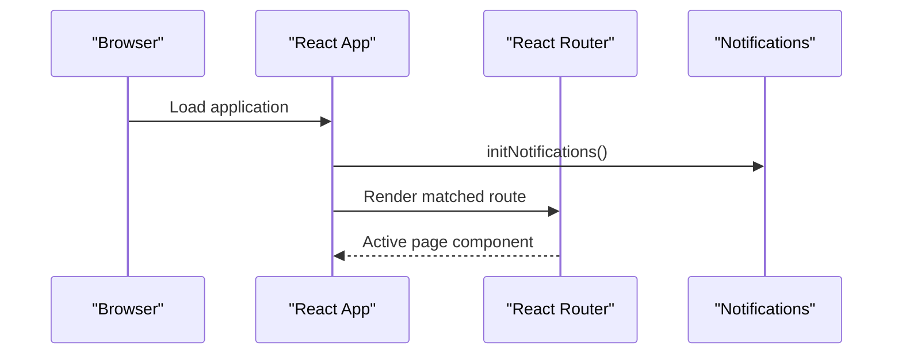

**Diagram sources**
- [frontend/src/App.jsx:78-81](file://frontend/src/App.jsx#L78-L81)

**Section sources**
- [frontend/src/App.jsx:78-168](file://frontend/src/App.jsx#L78-L168)

### Frontend: API Service Layer
- Axios instance configured with base URL from environment.
- Automatic Authorization header injection using access token from storage.

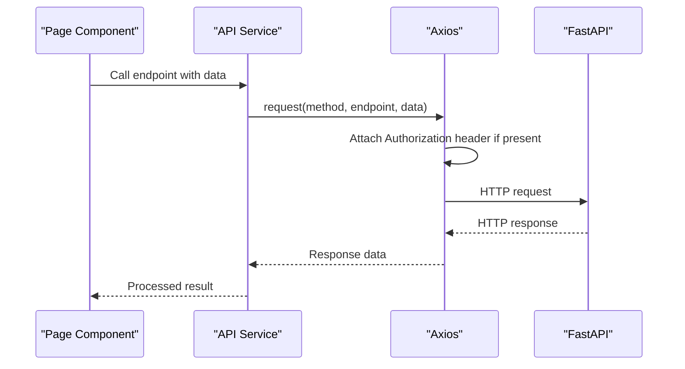

**Diagram sources**
- [frontend/src/services/api.js:19-41](file://frontend/src/services/api.js#L19-L41)

**Section sources**
- [frontend/src/services/api.js:1-73](file://frontend/src/services/api.js#L1-L73)

### Frontend: Firebase SDK for Push Notifications
- Initializes Firebase app and messaging service.
- Requests notification permission and retrieves FCM token.

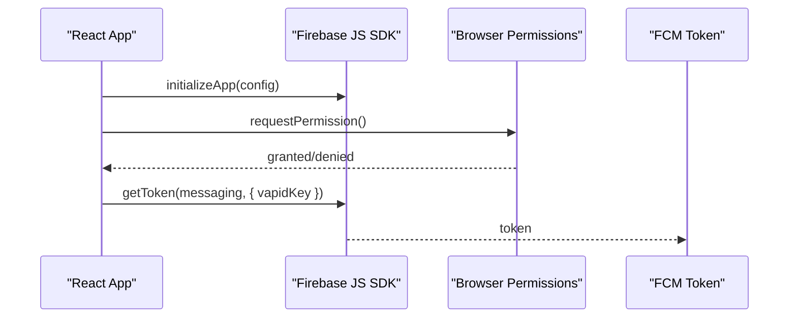

**Diagram sources**
- [frontend/src/firebase.js:1-24](file://frontend/src/firebase.js#L1-L24)

**Section sources**
- [frontend/src/firebase.js:1-24](file://frontend/src/firebase.js#L1-L24)

### Frontend: Styling with Tailwind CSS
- Content paths configured for HTML and JSX/TSX files.
- Custom screen sizes and safe-area spacing extensions.

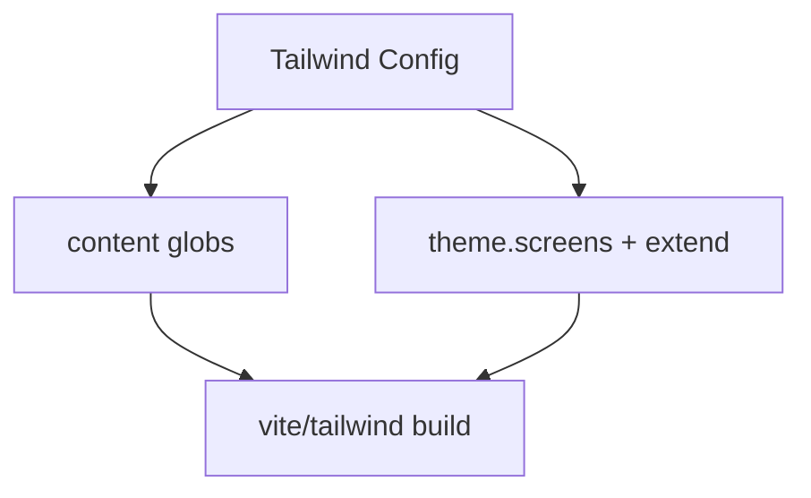

**Diagram sources**
- [frontend/tailwind.config.js:1-26](file://frontend/tailwind.config.js#L1-L26)

**Section sources**
- [frontend/tailwind.config.js:1-26](file://frontend/tailwind.config.js#L1-L26)

## Dependency Analysis
This section outlines key dependencies and their roles across the stack.

- Backend dependencies (selected):
  - FastAPI: Web framework and router orchestration.
  - SQLAlchemy: ORM and database connectivity.
  - Alembic: Migration management.
  - Pydantic and Pydantic Settings: Configuration validation.
  - Uvicorn: ASGI server.
  - PyJWT: JWT encoding/decoding.
  - Firebase Admin SDK: FCM integration.

- Frontend dependencies (selected):
  - React and React Router DOM: UI and routing.
  - Axios: HTTP client.
  - Chart.js and Recharts: Charts.
  - Tailwind CSS: Styles.
  - Firebase JS SDK: Messaging.

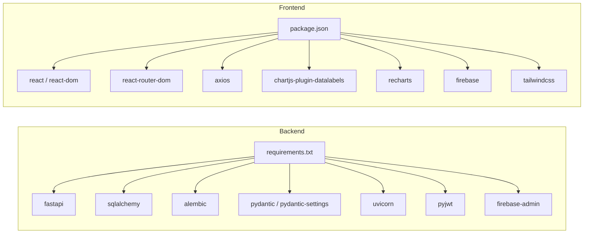

**Diagram sources**
- [backend/requirements.txt:17-69](file://backend/requirements.txt#L17-L69)
- [frontend/package.json:12-35](file://frontend/package.json#L12-L35)

**Section sources**
- [backend/requirements.txt:1-69](file://backend/requirements.txt#L1-L69)
- [frontend/package.json:1-37](file://frontend/package.json#L1-L37)

## Performance Considerations
- Backend
  - Use connection pooling and pre-ping to maintain robust database connections.
  - Keep JWT expiration short-lived for access tokens and rotate refresh tokens securely.
  - Use Alembic migrations to evolve schema without downtime.
  - Enable CORS only for trusted origins in production.

- Frontend
  - Lazy-load heavy chart components to reduce initial bundle size.
  - Debounce or throttle API calls for charts and filters.
  - Use Tailwind utilities efficiently to avoid bloated CSS.

[No sources needed since this section provides general guidance]

## Troubleshooting Guide
- Backend
  - CORS issues: Verify allowed origins in environment or defaults and ensure consistent protocol/host.
  - JWT errors: Confirm JWT secrets and algorithm match backend settings.
  - Database connectivity: Check DATABASE_URL and network access to PostgreSQL.
  - Firebase Admin initialization: Ensure FIREBASE_CREDENTIALS_JSON is set and valid.

- Frontend
  - API requests failing: Confirm VITE_API_BASE_URL and Authorization header injection.
  - Notifications not received: Verify browser permissions and FCM token retrieval.

**Section sources**
- [backend/app/main.py:91-109](file://backend/app/main.py#L91-L109)
- [backend/app/config.py:57-72](file://backend/app/config.py#L57-L72)
- [backend/app/firebase/firebase.py:11-17](file://backend/app/firebase/firebase.py#L11-L17)
- [frontend/src/services/api.js:19-31](file://frontend/src/services/api.js#L19-L31)
- [frontend/src/firebase.js:16-23](file://frontend/src/firebase.js#L16-L23)

## Conclusion
The Modern Digital Banking Dashboard leverages a modern, scalable stack:
- Backend: FastAPI for rapid API development, SQLAlchemy for robust ORM, PostgreSQL for reliability, Alembic for migrations, JWT for secure authentication, and Firebase Admin SDK for notifications.
- Frontend: React with Vite for a fast developer experience, React Router for navigation, Chart.js and Recharts for insightful visualizations, Tailwind CSS for efficient styling, and Firebase SDK for push notifications.

This combination ensures maintainability, performance, and extensibility for a production-grade digital banking experience.