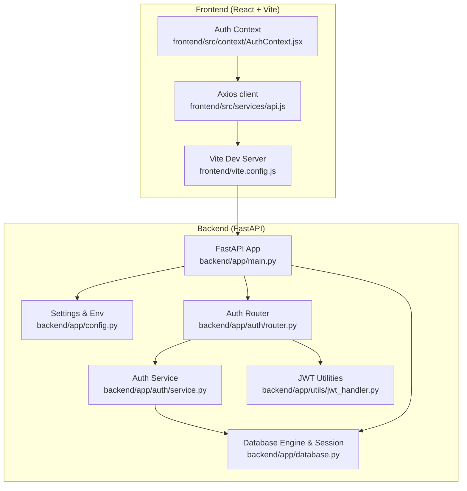
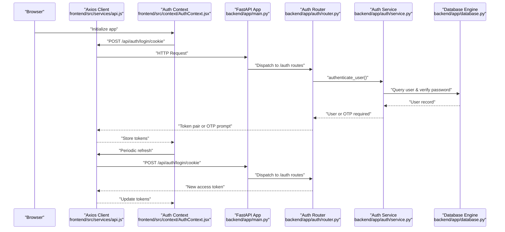
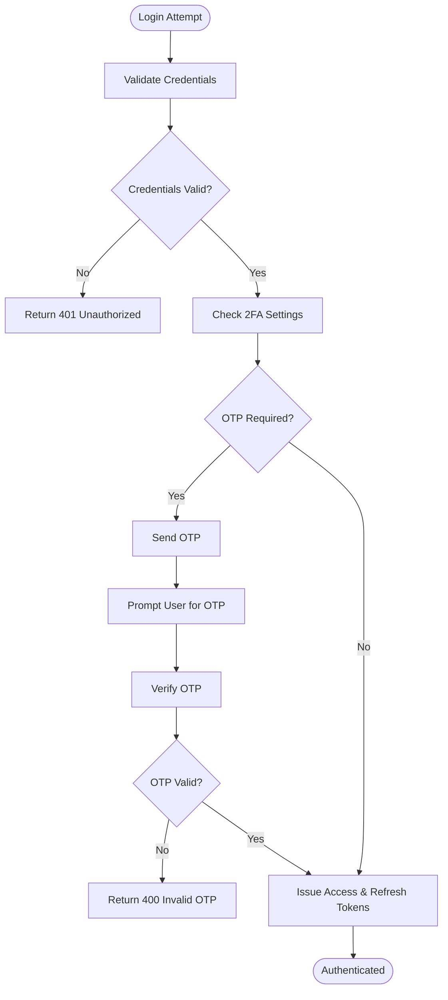
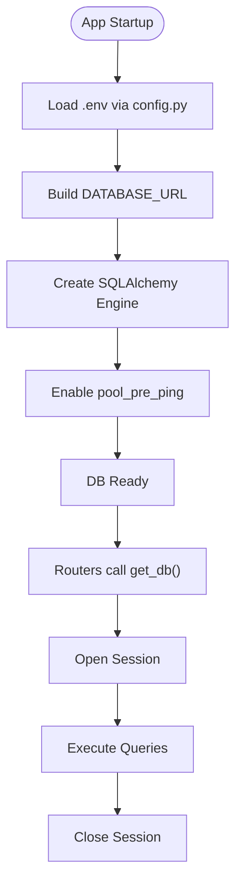
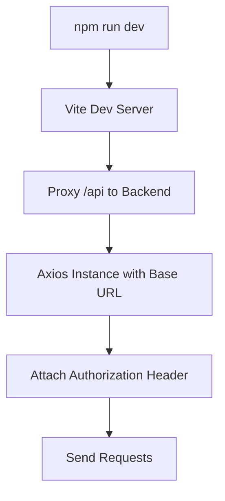
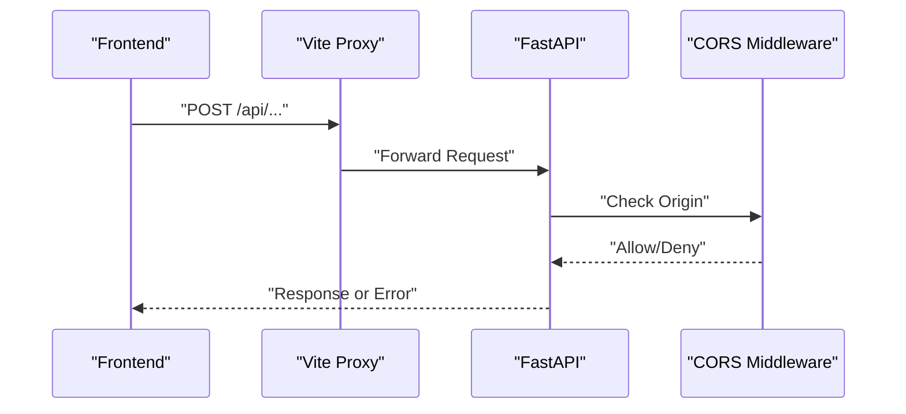
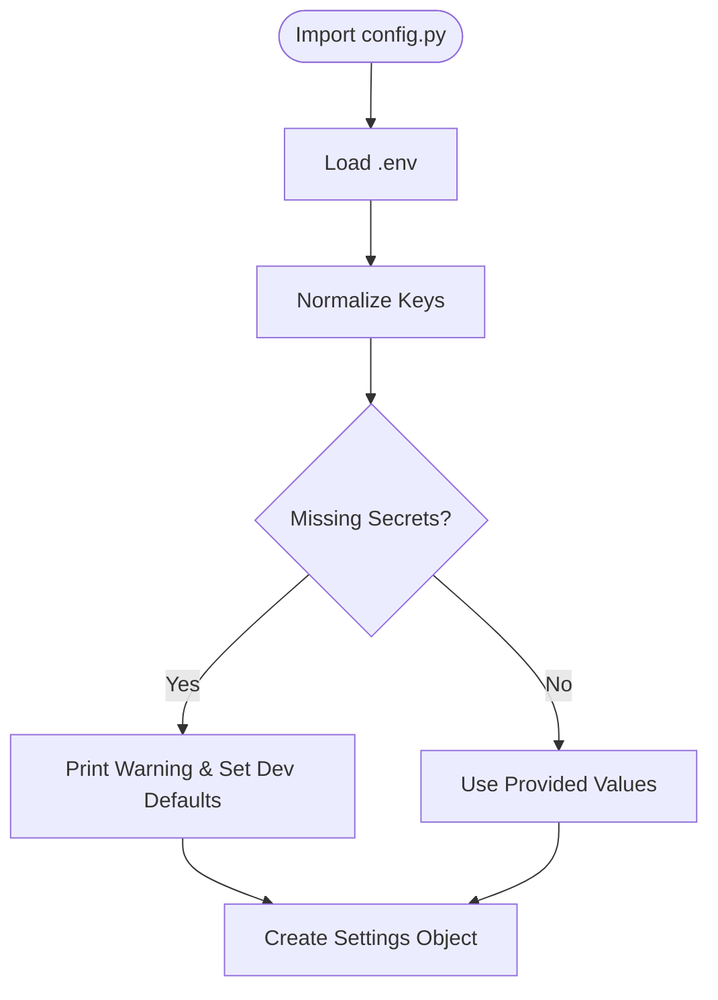
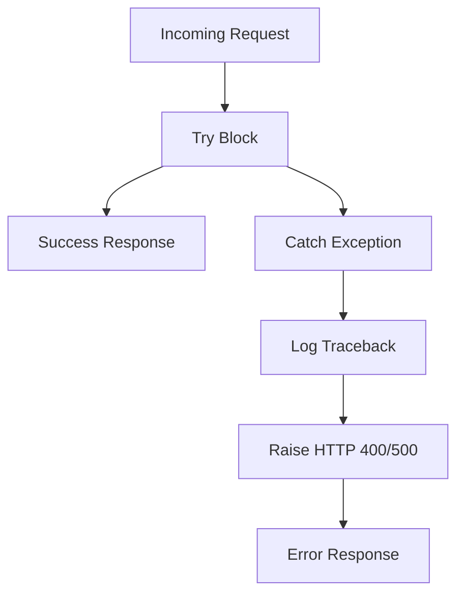
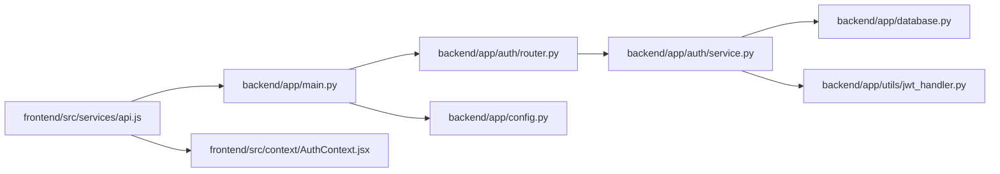

# Troubleshooting

<cite>
**Referenced Files in This Document**
- [README.md](file://README.md)
- [backend/README.md](file://backend/README.md)
- [frontend/README.md](file://frontend/README.md)
- [backend/app/main.py](file://backend/app/main.py)
- [backend/app/config.py](file://backend/app/config.py)
- [backend/app/database.py](file://backend/app/database.py)
- [backend/app/auth/router.py](file://backend/app/auth/router.py)
- [backend/app/auth/service.py](file://backend/app/auth/service.py)
- [backend/app/utils/jwt_handler.py](file://backend/app/utils/jwt_handler.py)
- [backend/app/routers/auth.py](file://backend/app/routers/auth.py)
- [backend/app/schemas/auth_schema.py](file://backend/app/schemas/auth_schema.py)
- [frontend/src/services/api.js](file://frontend/src/services/api.js)
- [frontend/src/context/AuthContext.jsx](file://frontend/src/context/AuthContext.jsx)
- [frontend/vite.config.js](file://frontend/vite.config.js)
- [frontend/package.json](file://frontend/package.json)
- [backend/alembic/versions/e4b6b665cae9_add_is_admin_to_users.py](file://backend/alembic/versions/e4b6b665cae9_add_is_admin_to_users.py)
- [backend/alembic/versions/f3c553c21ca8_initial_schema.py](file://backend/alembic/versions/f3c553c21ca8_initial_schema.py)
- [backend/alembic/env.py](file://backend/alembic/env.py)
- [backend/alembic/script.py.mako](file://backend/alembic/script.py.mako)
- [backend/alembic.ini](file://backend/alembic.ini)
</cite>

## Table of Contents
1. [Introduction](#introduction)
2. [Project Structure](#project-structure)
3. [Core Components](#core-components)
4. [Architecture Overview](#architecture-overview)
5. [Detailed Component Analysis](#detailed-component-analysis)
6. [Dependency Analysis](#dependency-analysis)
7. [Performance Considerations](#performance-considerations)
8. [Troubleshooting Guide](#troubleshooting-guide)
9. [Conclusion](#conclusion)
10. [Appendices](#appendices)

## Introduction
This document provides a comprehensive troubleshooting guide for the Modern Digital Banking Dashboard. It covers common issues across authentication, database connectivity, frontend build and runtime behavior, API communication, environment configuration, and runtime errors. It also includes debugging techniques, log analysis tips, performance optimization strategies, and monitoring approaches for both development and production environments.

## Project Structure
The application is a full-stack system:
- Frontend: React + Vite with Axios for API calls and Firebase for push notifications.
- Backend: FastAPI with PostgreSQL (via SQLAlchemy), Alembic migrations, JWT-based authentication, and CORS configuration.
- DevOps: Vite proxy configuration for development, and deployment targets for frontend and backend.

**Diagram sources**
- [backend/app/main.py:56-89](file://backend/app/main.py#L56-L89)
- [backend/app/database.py:29-50](file://backend/app/database.py#L29-L50)
- [backend/app/config.py:57-71](file://backend/app/config.py#L57-L71)
- [backend/app/auth/router.py:21-22](file://backend/app/auth/router.py#L21-L22)
- [backend/app/auth/service.py:20-25](file://backend/app/auth/service.py#L20-L25)
- [backend/app/utils/jwt_handler.py:1-79](file://backend/app/utils/jwt_handler.py#L1-L79)
- [frontend/src/services/api.js:19-31](file://frontend/src/services/api.js#L19-L31)
- [frontend/src/context/AuthContext.jsx:23-42](file://frontend/src/context/AuthContext.jsx#L23-L42)
- [frontend/vite.config.js:22-31](file://frontend/vite.config.js#L22-L31)

**Section sources**
- [README.md:24-73](file://README.md#L24-L73)
- [backend/README.md:27-44](file://backend/README.md#L27-L44)
- [frontend/README.md:37-49](file://frontend/README.md#L37-L49)

## Core Components
- Backend entrypoint and CORS: FastAPI app initialization, router registration, and CORS middleware configuration.
- Database layer: Engine creation, session factory, and dependency provider.
- Configuration: Environment variable loading and Pydantic settings with safe development fallbacks.
- Authentication: Registration, login, OTP handling, token issuance, and cookie policies.
- Frontend API client: Axios instance with base URL and automatic Authorization header injection.
- Auth context: Token refresh orchestration and protected route gating.

**Section sources**
- [backend/app/main.py:56-109](file://backend/app/main.py#L56-L109)
- [backend/app/database.py:29-50](file://backend/app/database.py#L29-L50)
- [backend/app/config.py:57-71](file://backend/app/config.py#L57-L71)
- [backend/app/auth/router.py:75-120](file://backend/app/auth/router.py#L75-L120)
- [backend/app/auth/service.py:205-225](file://backend/app/auth/service.py#L205-L225)
- [frontend/src/services/api.js:19-31](file://frontend/src/services/api.js#L19-L31)
- [frontend/src/context/AuthContext.jsx:23-42](file://frontend/src/context/AuthContext.jsx#L23-L42)

## Architecture Overview
High-level API flow from frontend to backend and database.

**Diagram sources**
- [frontend/src/context/AuthContext.jsx:26-38](file://frontend/src/context/AuthContext.jsx#L26-L38)
- [frontend/src/services/api.js:19-31](file://frontend/src/services/api.js#L19-L31)
- [backend/app/main.py:64-85](file://backend/app/main.py#L64-L85)
- [backend/app/auth/router.py:122-139](file://backend/app/auth/router.py#L122-L139)
- [backend/app/auth/service.py:205-225](file://backend/app/auth/service.py#L205-L225)
- [backend/app/database.py:45-50](file://backend/app/database.py#L45-L50)

## Detailed Component Analysis

### Authentication Flow and Common Issues
Common authentication problems include invalid credentials, missing tokens, OTP verification failures, and cookie policy mismatches. The backend enforces strict validation and logs exceptions, while the frontend attaches Authorization headers automatically and attempts token refresh.

**Diagram sources**
- [backend/app/auth/router.py:104-139](file://backend/app/auth/router.py#L104-L139)
- [backend/app/auth/service.py:205-225](file://backend/app/auth/service.py#L205-L225)
- [backend/app/utils/jwt_handler.py:45-61](file://backend/app/utils/jwt_handler.py#L45-L61)

**Section sources**
- [backend/app/auth/router.py:104-139](file://backend/app/auth/router.py#L104-L139)
- [backend/app/auth/service.py:205-225](file://backend/app/auth/service.py#L205-L225)
- [backend/app/utils/jwt_handler.py:45-61](file://backend/app/utils/jwt_handler.py#L45-L61)
- [frontend/src/services/api.js:23-29](file://frontend/src/services/api.js#L23-L29)
- [frontend/src/context/AuthContext.jsx:26-38](file://frontend/src/context/AuthContext.jsx#L26-L38)

### Database Connectivity and Migrations
Database connectivity issues commonly stem from incorrect DATABASE_URL, network restrictions, or unapplied migrations. The database layer sets up the engine with pre-ping and provides a dependency for routers.

**Diagram sources**
- [backend/app/config.py:57-71](file://backend/app/config.py#L57-L71)
- [backend/app/database.py:29-50](file://backend/app/database.py#L29-L50)

**Section sources**
- [backend/app/config.py:57-71](file://backend/app/config.py#L57-L71)
- [backend/app/database.py:29-50](file://backend/app/database.py#L29-L50)

### Frontend Build and Runtime Behavior
Frontend uses Vite with a proxy to the backend and an Axios instance that injects Authorization headers. Common issues include misconfigured base URL, missing environment variables, and proxy misconfiguration.

**Diagram sources**
- [frontend/vite.config.js:22-31](file://frontend/vite.config.js#L22-L31)
- [frontend/src/services/api.js:19-31](file://frontend/src/services/api.js#L19-L31)
- [frontend/package.json:6-11](file://frontend/package.json#L6-L11)

**Section sources**
- [frontend/vite.config.js:22-31](file://frontend/vite.config.js#L22-L31)
- [frontend/src/services/api.js:19-31](file://frontend/src/services/api.js#L19-L31)
- [frontend/package.json:6-11](file://frontend/package.json#L6-L11)

### API Communication Failures
API failures often arise from CORS misconfiguration, missing tokens, or backend exceptions. The backend registers CORS origins dynamically from environment variables and logs stack traces for unhandled exceptions.

**Diagram sources**
- [backend/app/main.py:99-108](file://backend/app/main.py#L99-L108)
- [frontend/vite.config.js:23-29](file://frontend/vite.config.js#L23-L29)

**Section sources**
- [backend/app/main.py:99-108](file://backend/app/main.py#L99-L108)
- [frontend/vite.config.js:23-29](file://frontend/vite.config.js#L23-L29)

### Environment Configuration Problems
Environment variables are loaded early in the backend and normalized. Missing variables trigger warnings and fallbacks suitable for development but unsuitable for production.

**Diagram sources**
- [backend/app/config.py:32-56](file://backend/app/config.py#L32-L56)
- [backend/app/config.py:57-71](file://backend/app/config.py#L57-L71)

**Section sources**
- [backend/app/config.py:32-56](file://backend/app/config.py#L32-L56)
- [backend/app/config.py:57-71](file://backend/app/config.py#L57-L71)

### Runtime Errors and Logging
Backend routes catch exceptions and log stack traces. Authentication routes specifically handle integrity errors and invalid credentials. Frontend requests rely on Axios interceptors and centralized API functions.

**Diagram sources**
- [backend/app/auth/router.py:96-101](file://backend/app/auth/router.py#L96-L101)
- [backend/app/routers/auth.py:158-162](file://backend/app/routers/auth.py#L158-L162)

**Section sources**
- [backend/app/auth/router.py:96-101](file://backend/app/auth/router.py#L96-L101)
- [backend/app/routers/auth.py:158-162](file://backend/app/routers/auth.py#L158-L162)

## Dependency Analysis
- Frontend depends on Axios and environment variables for base URL.
- Backend depends on environment variables for database and JWT configuration.
- Authentication depends on hashing utilities and JWT utilities.
- Database layer depends on SQLAlchemy and environment-driven URL.

**Diagram sources**
- [frontend/src/services/api.js:19-31](file://frontend/src/services/api.js#L19-L31)
- [frontend/src/context/AuthContext.jsx:23-42](file://frontend/src/context/AuthContext.jsx#L23-L42)
- [backend/app/main.py:64-85](file://backend/app/main.py#L64-L85)
- [backend/app/auth/router.py:21-22](file://backend/app/auth/router.py#L21-L22)
- [backend/app/auth/service.py:20-25](file://backend/app/auth/service.py#L20-L25)
- [backend/app/database.py:29-50](file://backend/app/database.py#L29-L50)
- [backend/app/config.py:57-71](file://backend/app/config.py#L57-L71)
- [backend/app/utils/jwt_handler.py:1-79](file://backend/app/utils/jwt_handler.py#L1-L79)

**Section sources**
- [frontend/src/services/api.js:19-31](file://frontend/src/services/api.js#L19-L31)
- [frontend/src/context/AuthContext.jsx:23-42](file://frontend/src/context/AuthContext.jsx#L23-L42)
- [backend/app/main.py:64-85](file://backend/app/main.py#L64-L85)
- [backend/app/auth/router.py:21-22](file://backend/app/auth/router.py#L21-L22)
- [backend/app/auth/service.py:20-25](file://backend/app/auth/service.py#L20-L25)
- [backend/app/database.py:29-50](file://backend/app/database.py#L29-L50)
- [backend/app/config.py:57-71](file://backend/app/config.py#L57-L71)
- [backend/app/utils/jwt_handler.py:1-79](file://backend/app/utils/jwt_handler.py#L1-L79)

## Performance Considerations
- Database pooling: Enable pre-ping to detect stale connections.
- Token lifecycle: Optimize access token expiration and refresh strategies to reduce re-auth frequency.
- Frontend caching: Cache non-sensitive data where appropriate and invalidate on state changes.
- Network efficiency: Minimize unnecessary requests and batch operations when possible.
- Monitoring: Instrument backend endpoints and frontend API calls for latency and error rates.

[No sources needed since this section provides general guidance]

## Troubleshooting Guide

### Authentication Problems
Symptoms:
- Login fails with invalid credentials.
- OTP not received or rejected.
- Token refresh fails.

Resolution steps:
- Verify credentials and ensure the user exists.
- Confirm SMTP settings for OTP delivery.
- Check JWT secrets and algorithm configuration.
- Inspect cookie security attributes (SameSite, Secure) for cross-origin environments.
- Validate that the frontend Authorization header is attached.

Diagnostics:
- Backend logs around authentication routes for stack traces.
- Frontend console for network errors and 401 responses.
- Verify environment variables for JWT and email services.

Preventive measures:
- Use strong, non-default secrets in production.
- Enforce 2FA where applicable.
- Implement rate limiting for OTP resend endpoints.

**Section sources**
- [backend/app/auth/router.py:104-139](file://backend/app/auth/router.py#L104-L139)
- [backend/app/auth/service.py:140-158](file://backend/app/auth/service.py#L140-L158)
- [backend/app/utils/jwt_handler.py:45-61](file://backend/app/utils/jwt_handler.py#L45-L61)
- [frontend/src/services/api.js:23-29](file://frontend/src/services/api.js#L23-L29)
- [frontend/src/context/AuthContext.jsx:26-38](file://frontend/src/context/AuthContext.jsx#L26-L38)

### Database Connection Issues
Symptoms:
- Application startup fails with database errors.
- Queries timeout or fail intermittently.

Resolution steps:
- Confirm DATABASE_URL correctness and connectivity.
- Ensure the database is reachable from the host.
- Apply migrations using Alembic.
- Enable pre-ping and tune pool settings.

Diagnostics:
- Backend logs for SQLAlchemy errors.
- Test connectivity with a standalone SQL client.
- Verify migration status and versions.

Preventive measures:
- Use managed databases (e.g., Neon) in production.
- Monitor connection pool exhaustion.
- Automate migrations in CI/CD.

**Section sources**
- [backend/app/config.py:57-71](file://backend/app/config.py#L57-L71)
- [backend/app/database.py:29-50](file://backend/app/database.py#L29-L50)
- [backend/alembic/env.py](file://backend/alembic/env.py)
- [backend/alembic/script.py.mako](file://backend/alembic/script.py.mako)
- [backend/alembic/versions/f3c553c21ca8_initial_schema.py](file://backend/alembic/versions/f3c553c21ca8_initial_schema.py)
- [backend/alembic/versions/e4b6b665cae9_add_is_admin_to_users.py](file://backend/alembic/versions/e4b6b665cae9_add_is_admin_to_users.py)

### Frontend Build Errors
Symptoms:
- Vite dev server fails to start.
- Build fails due to missing environment variables.
- Proxy not forwarding API requests.

Resolution steps:
- Install dependencies and run the dev server.
- Ensure VITE_API_BASE_URL is set in the frontend environment.
- Verify Vite proxy target matches backend deployment.

Diagnostics:
- npm/yarn logs for dependency issues.
- Console/network tab for proxy errors.
- Check environment variable injection in the browser.

Preventive measures:
- Pin dependency versions.
- Use a dedicated .env file for local development.
- Validate proxy configuration for different environments.

**Section sources**
- [frontend/package.json:6-11](file://frontend/package.json#L6-L11)
- [frontend/vite.config.js:22-31](file://frontend/vite.config.js#L22-L31)
- [README.md:319-327](file://README.md#L319-L327)

### API Communication Failures
Symptoms:
- CORS errors in the browser console.
- 403/401 responses despite correct credentials.
- Requests blocked by proxy.

Resolution steps:
- Configure allowed origins in CORS settings.
- Ensure Authorization header is present.
- Adjust proxy settings for development vs. production.

Diagnostics:
- Browser network tab for CORS and status codes.
- Backend logs for origin checks.
- Verify proxy target and changeOrigin settings.

Preventive measures:
- Maintain a strict allowlist of origins.
- Use HTTPS and secure cookies in production.
- Add health checks for upstream services.

**Section sources**
- [backend/app/main.py:99-108](file://backend/app/main.py#L99-L108)
- [frontend/vite.config.js:23-29](file://frontend/vite.config.js#L23-L29)
- [frontend/src/services/api.js:23-29](file://frontend/src/services/api.js#L23-L29)

### Environment Configuration Problems
Symptoms:
- Unexpected fallback values for secrets.
- Missing environment variables cause warnings.

Resolution steps:
- Define all required environment variables.
- Load .env explicitly in backend.
- Avoid using development fallbacks in production.

Diagnostics:
- Backend startup logs for missing variable warnings.
- Validate environment files for typos.

Preventive measures:
- Use CI/CD to enforce environment variables.
- Document required variables in README.
- Add environment validation in startup.

**Section sources**
- [backend/app/config.py:32-56](file://backend/app/config.py#L32-L56)
- [backend/app/config.py:57-71](file://backend/app/config.py#L57-L71)
- [README.md:278-314](file://README.md#L278-L314)

### Runtime Errors
Symptoms:
- Internal server errors (500).
- Integrity constraint violations.
- Unhandled exceptions.

Resolution steps:
- Review backend stack traces.
- Handle IntegrityError gracefully.
- Validate input schemas and return meaningful error messages.

Diagnostics:
- Backend logs for exceptions and tracebacks.
- Frontend error boundaries for UI-level errors.
- Add structured logging and correlation IDs.

Preventive measures:
- Centralize error handling.
- Add input validation and schema checks.
- Instrument endpoints with metrics and alerts.

**Section sources**
- [backend/app/auth/router.py:96-101](file://backend/app/auth/router.py#L96-L101)
- [backend/app/routers/auth.py:158-162](file://backend/app/routers/auth.py#L158-L162)

### Debugging Techniques
- Backend: Enable verbose logging, inspect stack traces, and add request/response logging.
- Frontend: Use browser dev tools, check network tab, and verify Authorization header presence.
- Database: Monitor slow queries, connection counts, and apply EXPLAIN plans.
- Environment: Print effective settings at startup and validate secrets.

[No sources needed since this section provides general guidance]

### Log Analysis
- Backend: Look for authentication failures, CORS denials, and database connection errors.
- Frontend: Capture failed requests and token refresh attempts.
- Database: Track slow queries and deadlocks.

[No sources needed since this section provides general guidance]

### Performance Optimization Strategies
- Backend: Tune token lifetimes, optimize queries, and cache non-sensitive data.
- Frontend: Debounce inputs, lazy-load heavy components, and minimize re-renders.
- Database: Use indexes, connection pooling, and background jobs for heavy tasks.

[No sources needed since this section provides general guidance]

### System Monitoring Approaches
- Endpoint health checks and latency metrics.
- Error rate and saturation monitoring.
- Database query performance and pool utilization.
- Frontend bundle size and runtime errors.

[No sources needed since this section provides general guidance]

## Conclusion
This guide consolidates actionable troubleshooting steps for the Modern Digital Banking Dashboard across authentication, database, frontend, API communication, environment configuration, and runtime errors. By following the diagnostics and preventive measures outlined here, teams can quickly isolate and resolve issues in both development and production environments.

## Appendices

### Environment Variables Reference
- Backend (.env): DATABASE_URL, JWT_SECRET_KEY, JWT_REFRESH_SECRET_KEY, JWT_ALGORITHM, ACCESS_TOKEN_EXPIRE_MINUTES, refresh_token_expire_days, SMTP_SERVER, SMTP_PORT, SMTP_EMAIL, SMTP_PASSWORD, FIREBASE_CREDENTIALS_JSON, SEED_ADMIN_*.
- Frontend (.env): VITE_API_BASE_URL.

**Section sources**
- [README.md:278-314](file://README.md#L278-L314)
- [backend/app/config.py:57-71](file://backend/app/config.py#L57-L71)